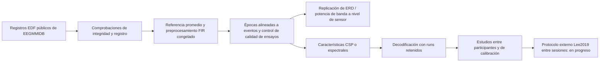

# Análisis y decodificación reproducible de EEG de imaginación motora

[English version](README_EN.md) · [Citación](CITATION.cff) · [Resumen del proyecto](docs/project_overview_es.md)

Proyecto independiente de investigación y software sobre EEG público de imaginación motora, en la intersección del procesamiento de señales, la neurociencia computacional y los métodos de interfaz cerebro-computadora (BCI). El trabajo terminado usa registros de la base de datos PhysioNet EEG Motor Movement/Imagery para replicar efectos espectrales relacionados con la tarea a nivel de sensor y evaluar decodificadores clásicos con diseños de *runs* retenidos y entre participantes. No hace afirmaciones clínicas, causales ni de BCI en línea. Un protocolo externo independiente Lee2019/OpenBMI entre sesiones está congelado y adquiriendo datos, y permanece **EN PROGRESO**; aún no tiene resultados.

## Preguntas científicas

1. ¿Se replican, en la cohorte de PhysioNet predefinida, los cambios espectrales a nivel de sensores asociados con la imaginación motora?
2. ¿Con qué precisión pueden decodificadores clásicos fijos distinguir imaginación de puños frente a pies en diseños de *runs* retenidos, entre participantes y con calibración limitada?
3. ¿Siguen siendo creíbles los resultados bajo verificaciones explícitas de control de calidad, procedencia y ausencia de fuga de datos, y se transferirán a sesiones de registro independientes?

## Estado del proyecto

| Componente | Estado | Evidencia |
| --- | --- | --- |
| Replicación fisiológica de PhysioNet | **COMPLETA / CONGELADA** | [informe de cohorte completa](docs/full_cohort_replication.md) |
| Fiabilidad de mu individual y comparación con datos retenidos | **SECUNDARIO / COMPLETO** | [informe](docs/individual_mu_reliability.md) |
| Decodificación intra-participante con *runs* retenidos | **COMPLETA / CONGELADA** | [informe](docs/within_subject_decoding.md) |
| Estudios entre participantes, de calibración, espaciales y riemannianos | **SECUNDARIO / COMPLETO** | [informe final](docs/final_scientific_report.md) |
| Validación externa Lee2019/OpenBMI entre sesiones | **EN PROGRESO — AÚN NO EVALUADA** | [protocolo congelado](docs/external_cross_session_lee2019.md) |

## Evidencia principal completada

Estos valores se leen del resumen congelado del proyecto [`docs/assets/final_results_summary.csv`](docs/assets/final_results_summary.csv). Describen únicamente este conjunto de datos y estos diseños de evaluación.

| Hallazgo | Cohorte / diseño | Resultado |
| --- | --- | --- |
| Reducción relacionada con puños de 12–13 Hz, tarea frente a reposo, en C4 | Participantes de replicación PhysioNet 2–109 | 87/105 estimaciones por participante negativas |
| Mismo efecto en C3 | Participantes de replicación PhysioNet 2–109 | 91/105 estimaciones por participante negativas |
| CSP+LDA específico por participante | 86 participantes elegibles; *runs* retenidos | mediana de exactitud balanceada 0.658 |
| CSP estrictamente *zero-shot* | Misma cohorte de evaluación; personas retenidas | mediana de exactitud balanceada 0.570 |
| Curva congelada de calibración objetivo con 28 etiquetas | Misma cohorte de evaluación | mediana de exactitud balanceada 0.650 |

El resultado fisiológico es una asociación a nivel de sensor, no una medición directa de neuronas individuales ni una explicación causal de la imaginación motora. El rendimiento de decodificación es un resultado predictivo *offline*, no evidencia de control BCI desplegable.

Los artefactos públicos congelados usan procedencia portátil relativa a la raíz de datos; los resultados completados de PhysioNet no cambiaron durante esta migración exclusivamente de procedencia. El estudio externo entre sesiones sigue en progreso.


*Exactitud balanceada por participante en el análisis completado de generalización unilateral con *runs* retenidos. Generada por [`scripts/evaluate_unilateral_motor_imagery_generalization.py`](scripts/evaluate_unilateral_motor_imagery_generalization.py).*

## Flujo de análisis



## Reproducir un análisis completado

Python 3.14 se usó en el entorno actual. Cree un entorno virtual limpio e instale las dependencias fijadas:

```bash
python -m venv .venv
source .venv/bin/activate  # use `source .venv/bin/activate.fish` in fish
python -m pip install --upgrade pip
python -m pip install -r requirements.txt
python -m unittest discover -s tests
```

Para un flujo pequeño ya completado:

```bash
python scripts/inspect_raw_data.py
python scripts/preprocess_eeg.py
python scripts/create_epochs.py
python scripts/analyze_event_related_spectrum.py
```

Consulte la [guía de reproducibilidad](docs/reproducibility.md) para comandos de cohorte completa, ubicaciones de datos, comprobaciones de artefactos congelados y el alcance de lo que se ha vuelto a ejecutar o no. El EEG crudo pertenece a sus proveedores originales, se descarga en `data/` y se excluye intencionalmente de Git.

## Salvaguardas científicas

- Las configuraciones congeladas y los artefactos vinculados mediante *hashes* documentan las etapas de análisis completadas.
- Los *runs* retenidos y las auditorías explícitas de ajuste separan el ajuste de CSP, escalado y LDA de los ensayos de evaluación cuando el estudio correspondiente incluye decodificación.
- Las exclusiones técnicas se registran como incompatibilidades de datos o formato, no como exclusiones por rendimiento.
- La agregación por participante y la inferencia predefinida evitan tratar ensayos o *runs* repetidos como personas independientes.
- Las pruebas automatizadas comprueban esquemas de artefactos, *hashes*, procedencia y contratos de ausencia de fuga de datos.

Los detalles y el alcance están en la [estrategia de validación](docs/validation_strategy.md) y las [limitaciones](docs/limitations.md).

## Mapa de documentación

- [Resumen científico y cronología](docs/project_overview_es.md)
- [Métodos](docs/methods.md) y [decisiones científicas](docs/scientific_decisions.md)
- [Índice de resultados](docs/results_es.md) e [informe científico final](docs/final_scientific_report.md)
- [Conjuntos de datos y procedencia](docs/datasets.md)
- [Reproducibilidad](docs/reproducibility.md), [guía del repositorio](docs/repository_guide.md) y [procedencia pública](docs/public_provenance.md)
- [Estado de la validación externa](docs/external_validation_es.md)
- [Colaboración](docs/collaboration_es.md)

## Citación y discusión

Use [CITATION.cff](CITATION.cff) al comentar o citar el software. Se reciben con interés la crítica científica, la revisión de reproducibilidad y la colaboración sobre metodología EEG/BCI; consulte [Colaboración](docs/collaboration_es.md).

## Límites importantes

Este repositorio informa análisis *offline* de un conjunto de datos público histórico. Sus resultados no establecen utilidad clínica, mecanismos neuronales causales, utilidad de BCI en tiempo real ni generalización universal entre sesiones o laboratorios. La validación independiente Lee2019/OpenBMI no se interpretará hasta que esté disponible su cohorte fuente completa y validada por *hashes*.
