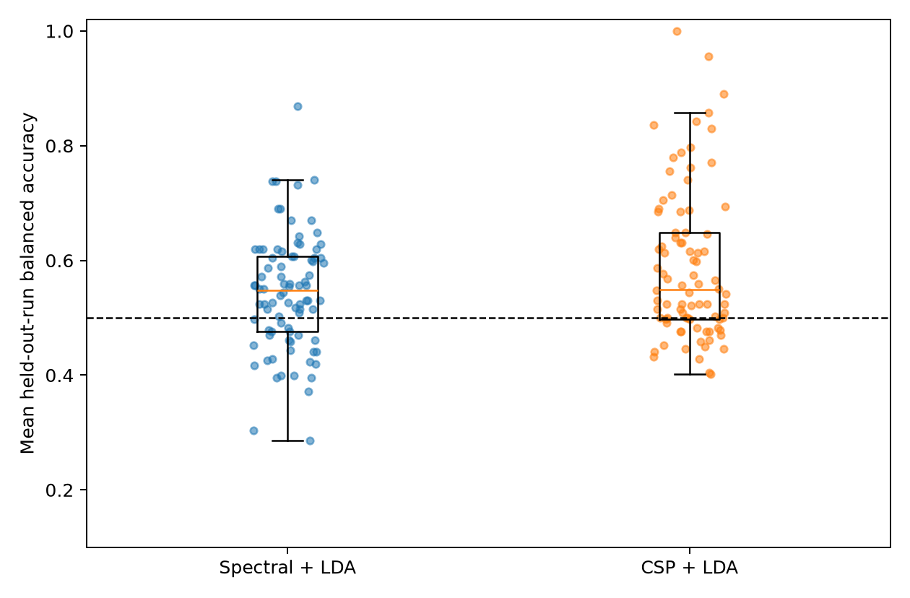
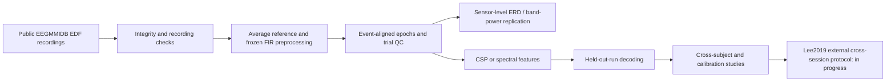

# Reproducible Motor-Imagery EEG Analysis and Decoding

[Versión en español](README.md) · [Citation](CITATION.cff) · [Project overview](docs/project_overview.md)

An independent research/software project on public motor-imagery EEG at the intersection of signal processing, computational neuroscience, and BCI methods. The completed work uses PhysioNet EEG Motor Movement/Imagery Database recordings to replicate sensor-level task-related spectral effects and evaluate classical decoding under held-out-run and cross-participant designs. It does **not** make clinical, causal, or online-BCI claims. A separately frozen Lee2019/OpenBMI external cross-session protocol is acquiring data and is **IN PROGRESS**; it has no results yet.

## Scientific questions

1. Do central sensor-level spectral changes associated with motor imagery replicate across the predeclared PhysioNet cohort?
2. How well do fixed classical decoders distinguish fists from feet under held-out-run, cross-participant, and limited-calibration designs?
3. Do findings remain credible under explicit quality-control, provenance, and leakage checks—and will they transfer across independent recording sessions?

## Project status

| Component | Status | Evidence |
| --- | --- | --- |
| PhysioNet physiological replication | **COMPLETE / FROZEN** | [full-cohort report](docs/full_cohort_replication.md) |
| Individualized-mu reliability and held-out comparison | **SECONDARY / COMPLETE** | [report](docs/individual_mu_reliability.md) |
| Within-subject held-out-run decoding | **COMPLETE / FROZEN** | [report](docs/within_subject_decoding.md) |
| Cross-subject, calibration, spatial, and Riemannian studies | **SECONDARY / COMPLETE** | [final report](docs/final_scientific_report.md) |
| Lee2019/OpenBMI external cross-session validation | **IN PROGRESS — NOT YET EVALUATED** | [frozen protocol](docs/external_cross_session_lee2019.md) |

## Completed headline evidence

These values are read from the frozen project summary [`docs/assets/final_results_summary.csv`](docs/assets/final_results_summary.csv). They describe this dataset and these evaluation designs only.

| Finding | Cohort / design | Result |
| --- | --- | --- |
| Fists-related 12–13 Hz task-versus-rest reduction at C4 | PhysioNet replication participants 2–109 | 87/105 negative participant estimates |
| Same effect at C3 | PhysioNet replication participants 2–109 | 91/105 negative participant estimates |
| Participant-specific CSP+LDA | 86 eligible evaluation participants; held-out runs | median balanced accuracy 0.658 |
| Strict zero-shot CSP | Same evaluation cohort; held-out people | median balanced accuracy 0.570 |
| Frozen 28-label target-calibration curve | Same evaluation cohort | median balanced accuracy 0.650 |

The physiological result is a sensor-level association, not direct measurement of individual neurons or a causal account of motor imagery. Decoding performance is an offline predictive result, not evidence of deployable BCI control.

Frozen public artifacts use portable data-root-relative provenance; the completed PhysioNet results survived this provenance-only migration unchanged. The external cross-session study remains ongoing.



*Participant-level held-out-run balanced accuracy for the completed unilateral generalization analysis. Generated by [`scripts/evaluate_unilateral_motor_imagery_generalization.py`](scripts/evaluate_unilateral_motor_imagery_generalization.py).*

## Analysis flow



## Reproduce a completed analysis

Python 3.14 was used for the current environment. Create a clean virtual environment and install the pinned dependencies:

```bash
python -m venv .venv
source .venv/bin/activate  # use `source .venv/bin/activate.fish` in fish
python -m pip install --upgrade pip
python -m pip install -r requirements.txt
python -m unittest discover -s tests
```

For a small completed workflow:

```bash
python scripts/inspect_raw_data.py
python scripts/preprocess_eeg.py
python scripts/create_epochs.py
python scripts/analyze_event_related_spectrum.py
```

See the [reproducibility guide](docs/reproducibility.md) for full-cohort commands, data locations, frozen-artifact checks, and the scope of what has and has not been rerun. Raw EEG belongs to its original providers, is downloaded into `data/`, and is intentionally excluded from Git.

## Scientific safeguards

- Frozen configurations and hash-linked artifacts record completed analysis stages.
- Held-out runs and explicit fit audits keep CSP, scaling, and LDA fitting separate from evaluation trials where the corresponding study supports decoding.
- Technical exclusions are recorded as data/format incompatibilities rather than performance exclusions.
- Participant-level aggregation and predeclared inference avoid treating repeated trials or runs as independent people.
- Automated tests check artifact schemas, hashes, provenance, and leakage contracts.

Details and scope are in the [validation strategy](docs/validation_strategy.md) and [limitations](docs/limitations.md).

## Documentation map

- [Scientific overview and chronology](docs/project_overview.md)
- [Methods](docs/methods.md) and [scientific decisions](docs/scientific_decisions.md)
- [Results index](docs/results.md) and [final integrated report](docs/final_scientific_report.md)
- [Datasets and provenance](docs/datasets.md)
- [Reproducibility](docs/reproducibility.md), [repository guide](docs/repository_guide.md), and [public provenance](docs/public_provenance.md)
- [External validation status](docs/external_validation.md)
- [Collaboration](docs/collaboration.md)

## Citation and discussion

Please use [CITATION.cff](CITATION.cff) when discussing or citing the software. Scientific criticism, reproducibility review, and collaboration on EEG/BCI methodology are welcome; see [Collaboration](docs/collaboration.md).

## Important limits

This repository reports offline analyses of a public historical dataset. Its results do not establish clinical utility, causal neural mechanisms, real-time BCI utility, or universal cross-session/cross-laboratory generalization. The independent Lee2019/OpenBMI validation is intentionally not interpreted until its complete, hash-validated source cohort is available.
