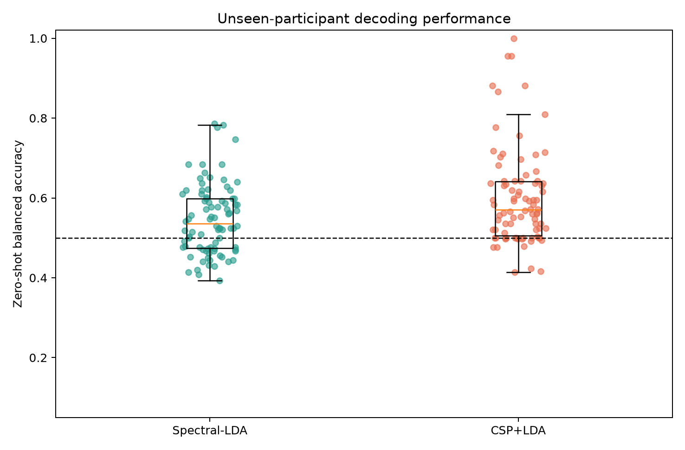
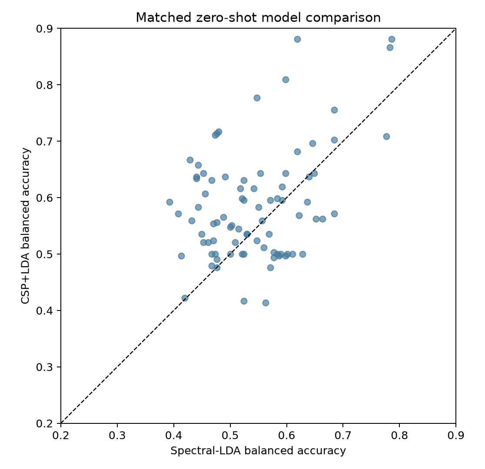
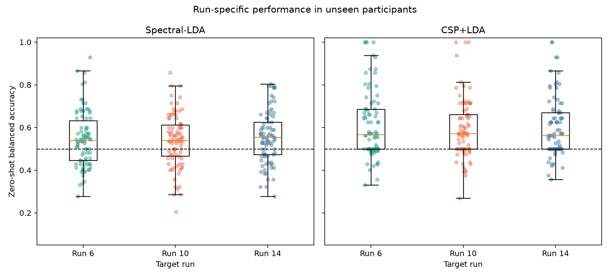
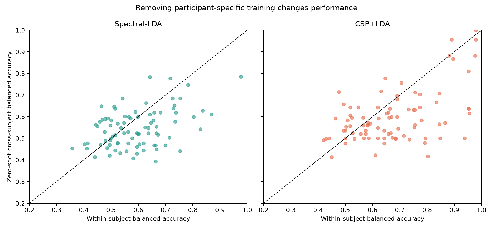

# Leakage-safe zero-shot cross-subject decoding

[Back to the project README](../README.md) ·
[Within-subject decoder](within_subject_decoding.md) ·
[Reliability analysis](decoding_reliability.md)

## Initial methodology freeze

This study starts from the completed reliability milestone at commit `c52dd77` and
asks a new predictive question:

> Can a model trained only on other people distinguish both-fists from both-feet
> imagery in a completely unseen participant without calibration?

The machine-readable initial policy is
[`config/cross_subject_decoding.json`](../config/cross_subject_decoding.json). It was
written before calculating any new cross-subject classifier outcome. Subjects 1–20
are method-development data. The 86 technically eligible subjects 21–109 are final
evaluation data; subjects 88, 92, and 100 retain their historical protocol-based
exclusion. Evaluation classifier performance remains locked until development is
finished and the final method is committed.

The completed within-subject CSP+LDA median of 0.658, spectral-LDA median of 0.585,
and every historical prediction remain immutable evidence. Cross-subject results
cannot revise them.

## What zero-shot changes

Within-subject decoding learns from two runs belonging to the person it later tests.
Zero-shot cross-subject decoding instead has this boundary:

```text
training participants' EEG and labels
→ fit CSP when applicable
→ fit StandardScaler
→ fit LDA
→ apply the already-fitted pipeline to one unseen participant
```

No EEG from the unseen participant may estimate a mean, variance, covariance,
spatial filter, class boundary, feature choice, or hyperparameter. This includes
unlabeled target EEG: target centering, scaling, covariance alignment, CSP adaptation,
and transductive normalization are all forms of target-participant adaptation and
are outside this zero-shot question. The project's fixed, participant-independent
preprocessing remains allowed because it does not learn parameters from the target
cohort.

## Why cross-participant CSP is harder

CSP learns sensor weights from class-specific covariance matrices. Within one person,
those matrices reflect one anatomy, cap placement, electrode coupling, amplitude
scale, and recording state. Across people, all of those can vary. A pooled CSP learns
one fists-versus-feet covariance contrast from many participants and assumes that the
contrast transfers to a new participant. That is a hypothesis to test, not a
guarantee. CSP remains supervised, so the held-out participant must be absent from
its class covariance estimates.

## Frozen development design

Development uses leave-one-subject-out cross-validation over subjects 1–20. Each of
20 folds trains on all three runs from 19 participants and predicts all three runs
from the twentieth. Every learned operation sees only the 19 training participants.
Each held-out participant contributes one primary value: the unweighted mean of
their run 6, 10, and 14 balanced accuracies. Trial pooling is used to fit a model,
not to pretend that trials are independent participants in group summaries.

The candidate family contains exactly the two pre-existing selected methods:

- six C3/Cz/C4 mu/beta log-PSD features, training-only scaling, and equal-prior
  shrinkage LDA;
- continuous 8–30 Hz EEG, four empirical-CSP log-power features, training-only
  scaling, and the same LDA.

There is no hyperparameter grid and no new classifier family. Both methods advance
to final evaluation by design; development tests the implementation and describes
whether either representation transfers in subjects 1–20. All development subjects
have equal 45-trial contributions, so equal trial weighting is also equal participant
weighting during fitting. The evaluation criteria, participant-level group tests,
fixed-seed bootstrap, and CSP-versus-spectral categories are already specified in
the initial policy and may not change after outcomes.

## Development LOSO evidence

After the initial policy and participant-isolated implementation were committed,
development ran on subjects 1–20 only. Each score is one held-out participant's
unweighted mean of their three run balanced accuracies.

| Frozen family | Median | 95% bootstrap median CI | IQR | Participants >0.50 | Participants ≥0.60 | Fists/feet median recall |
| --- | ---: | ---: | ---: | ---: | ---: | ---: |
| Spectral-LDA | **0.565** | 0.518–0.606 | 0.506–0.617 | 15/20 | 7/20 | 0.600 / 0.643 |
| CSP+LDA | **0.568** | 0.530–0.661 | 0.523–0.673 | 18/20 | 8/20 | 0.718 / 0.696 |

The participant-matched CSP-minus-spectral difference has median +0.028 (IQR −0.071
to +0.129). CSP is better in 11/20 participants and spectral features in 9/20; the
supporting paired Wilcoxon test gives `p = 0.261`. Development therefore suggests
modest transfer for both representations but does not establish a clear family
advantage. Both exact preselected methods advance by design; nothing was tuned or
added after seeing these results.

The compact [model summary](assets/cross_subject_decoder_development_model_summary.csv),
[participant scores](assets/cross_subject_decoder_development_subject_scores.csv),
[predictions](assets/cross_subject_decoder_development_predictions.csv), and
[fit audit](assets/cross_subject_decoder_development_fit_audit.csv) preserve the
development evidence. The audit records 19 training participants at every CSP,
scaler, and LDA fit and confirms that the twentieth participant was prediction-only.
No EEG or classifier outcome from subjects 21–109 was loaded.

## Final method freeze before evaluation

The final machine-readable method is
[`config/cross_subject_decoding_final.json`](../config/cross_subject_decoding_final.json).
It retains both inherited models because the candidate family contained one fixed
member per representation and development showed no clear family advantage. No
feature or hyperparameter changed.

For each model, final evaluation will fit exactly once on 900 trials: 45 trials from
each of subjects 1–20. Equal trial weighting is therefore also equal participant
weighting. The fitted CSP when applicable, scaler, and LDA are then reused to predict
each eligible participant 21–109 independently. The target participant supplies no
calibration or distribution estimate. The primary participant score remains the
unweighted mean of the three run balanced accuracies; group inference uses 86 such
participant values.

The final freeze hashes the initial protocol, cross-subject implementation, and every
development artifact. Its success rules and post-primary comparisons are unchanged.
At this freeze, no evaluation-subject EEG or cross-subject classifier performance has
been opened.

## Final held-out evaluation

The final freeze was committed at `f66b299`. Each frozen model was then fitted once
on the same 900 development trials from subjects 1–20 and applied, unchanged, to the
86 eligible subjects 21–109. Subjects 88, 92, and 100 remain excluded for their
historical protocol incompatibility. The evaluation contains 3,840 retained target
trials per model; every trial has exactly one zero-shot prediction with subject, run,
trial, source-file, and source-hash provenance.

| Frozen model | N | Median (95% bootstrap CI) | IQR | Range | >0.50 | ≥0.60 | ≥0.70 | Median fists/feet recall |
| --- | ---: | ---: | ---: | ---: | ---: | ---: | ---: | ---: |
| Spectral-LDA | 86 | **0.536** (0.516–0.568) | 0.474–0.598 | 0.393–0.786 | 55/86 (64.0%) | 21/86 (24.4%) | 4/86 (4.7%) | 0.542 / 0.571 |
| CSP+LDA | 86 | **0.570** (0.549–0.597) | 0.505–0.641 | 0.414–1.000 | 65/86 (75.6%) | 32/86 (37.2%) | 14/86 (16.3%) | 0.762 / 0.600 |

The one-sided exact participant sign tests give `p = 0.00302` for spectral-LDA
(55 above, 29 below, 2 tied at 0.50) and `p = 9.06 × 10⁻11` for CSP+LDA (65 above,
11 below, 10 tied). These tests support above-chance signal at the group level, but
they do not override the more demanding frozen practical criteria.

Spectral-LDA misses the frozen modest-transfer median threshold of 0.55. CSP+LDA
passes the median and prevalence thresholds, but its participant-median recall is
asymmetric: 0.762 for fists and 0.600 for feet, an absolute difference of 0.162,
above the frozen 0.15 limit. Both therefore receive the exact pre-specified category
**no convincing zero-shot transfer**. This is not the same as “no information”: 65
participants exceed 0.50 with CSP and 32 reach at least 0.60, but performance and
class balance are not sufficiently reliable for the frozen transfer claim.

At the pooled-trial descriptive level, spectral-LDA correctly classifies 993/1,923
fists and 1,098/1,917 feet (recalls 0.516 and 0.573). CSP+LDA correctly classifies
1,198/1,923 fists and 1,103/1,917 feet (recalls 0.623 and 0.575). Participant medians
and pooled ratios answer different questions; all group decisions use participants.



## Does pooled CSP add transferable information?

Yes, relative to the frozen spectral comparator. On the same 86 participants, the
median CSP-minus-spectral difference is **+0.039** (IQR −0.023 to +0.105). CSP is
better for 59 participants, spectral-LDA for 26, and they tie for one. The supporting
two-sided Wilcoxon test gives `p = 0.000393`. This meets both frozen conditions for
**CSP transfers better**: median gain at least 0.03 and CSP better in at least 60% of
participants (observed 68.6%). Pooled covariance structure therefore transfers more
successfully than these six fixed sensor-band features, even though it does not meet
the overall convincing-transfer rule.



## Run diagnostics

| Model | Run 6 median (IQR) | Run 10 median (IQR) | Run 14 median (IQR) | Participants >0.50 by run 6/10/14 |
| --- | ---: | ---: | ---: | ---: |
| Spectral-LDA | 0.540 (0.446–0.632) | 0.540 (0.467–0.612) | 0.554 (0.473–0.625) | 53 / 54 / 57 |
| CSP+LDA | 0.567 (0.500–0.685) | 0.571 (0.500–0.661) | 0.562 (0.500–0.670) | 52 / 54 / 53 |

The zero-shot run medians are close; the within-subject study's descriptive run-10
weakness does not recur here. No formal between-run inference was frozen for this
milestone, so this table is diagnostic rather than a new hypothesis test.



## Removing personal training

Only after finalizing the primary results, each subject's historical within-subject
score was matched to their zero-shot score. For CSP+LDA, the median paired
cross-minus-within difference is **−0.042** (IQR −0.147 to +0.017): 61/86 participants
perform worse without personal training, 23 improve, and two tie (`p = 8.37 × 10⁻6`,
supporting paired Wilcoxon). The separate cohort medians are 0.658 within subject and
0.570 cross subject, a difference of 0.088; this difference of medians should not be
confused with the median paired loss.

For spectral-LDA, the paired median loss is similarly **−0.043** (IQR −0.118 to
+0.035): 53/86 worsen, 30 improve, and three tie (`p = 0.000678`). The corresponding
cohort medians are 0.585 within subject and 0.536 cross subject. Personal training
therefore provides measurable subject-specific calibration for both representations.



## Post-primary relationships

These pre-listed analyses are exploratory, unadjusted, and were not used as model
features or selection criteria. Stronger historical fists-versus-rest 12–13 Hz ERD
(more negative values) relates moderately to higher zero-shot accuracy: Spearman
`ρ = −0.447` at C3 and `−0.474` at C4 for CSP, and `−0.420` and `−0.491` for
spectral-LDA (all unadjusted `p < 0.00006`). Historical within-subject accuracy also
relates modestly to zero-shot accuracy (`ρ = 0.386` CSP; `0.391` spectral), as does
the number of historical runs above chance (`ρ = 0.276`; `0.294`). Historical
within-participant run range does not (`ρ = −0.074`; `−0.024`).

The strongest explanation supported by this evidence is that a common spatial
covariance contrast transfers partly—consistent with CSP outperforming the fixed
spectral baseline—but the predictive representation and class boundary remain
substantially participant-specific. Underlying task-signal strength appears relevant;
existing QC and the previously tested run-shift measure do not explain the losses.
These associations cannot identify a biological mechanism or prove that calibration
is the only remedy.

## Decision gate

The result selects **B: cross-subject decoding is clearly weaker than within-subject;
study minimal target-participant calibration**. CSP retains useful information for a
substantial subgroup, so abandoning transfer is premature, but it fails the frozen
convincing-transfer rule and is worse than personal training for 61/86 participants.
Any calibration study must be a new, separately frozen milestone. No adaptation is
implemented here.

That next study is now complete without reopening this zero-shot analysis. The
[minimal target-participant calibration study](minimal_target_calibration.md) froze
threshold calibration before evaluating subjects 21–109. Although calibrated cohort
medians exceeded 0.60, participant-matched median gains were only +0.002 to +0.007
and no label burden met the frozen convincing-benefit rule. Its decision gate is to
investigate representation/generalization limits.

## Reproduction and artifacts

From the activated project environment:

```bash
python scripts/develop_cross_subject_decoder.py
python scripts/evaluate_cross_subject_decoding.py
python -m unittest tests.test_cross_subject_decoding tests.test_cross_subject_development_artifacts tests.test_cross_subject_final_freeze tests.test_cross_subject_evaluation tests.test_cross_subject_evaluation_artifacts -v
python -m unittest discover -s tests -v
python -m compileall -q eeg_project scripts tests
```

The evaluator accepts a checkpoint only when its completion marker, subject, frozen
configuration hash, frozen core hash, 60 training EDF hashes, and three target EDF
hashes agree. A checkpoint-only rerun reused all 86 records and regenerated all 17
report files byte-for-byte identically in the verified environment. Historical
within-subject files remain unchanged.

Compact machine-readable entry points are the [group summary](assets/cross_subject_decoder_evaluation_group_summary.csv),
[participant scores](assets/cross_subject_decoder_evaluation_subject_scores.csv),
[trial predictions](assets/cross_subject_decoder_evaluation_predictions.csv),
[fit audit](assets/cross_subject_decoder_evaluation_fit_audit.csv),
[paired model comparison](assets/cross_subject_decoder_evaluation_paired_summary.csv),
[within-versus-cross comparison](assets/cross_subject_decoder_evaluation_within_cross_summary.csv),
[run summary](assets/cross_subject_decoder_evaluation_run_summary.csv), and
[metadata](assets/cross_subject_decoder_evaluation_metadata.json). Checkpoints under
`outputs/cross_subject_decoder_checkpoints/` are reproducible and excluded from Git.

## Limitations

- This is transfer within one public dataset and recording protocol, not evidence of
  generalization to another session, device, laboratory, or population.
- The development cohort contains only 20 participants, and both candidate families
  were inherited rather than broadly optimized for cross-participant decoding.
- Zero-shot intentionally forbids even unlabeled target-distribution alignment. The
  subsequent calibration study estimates only a small labeled threshold adjustment,
  not target spatial adaptation or broader domain alignment.
- The CSP result is heterogeneous and class-asymmetric. Above-chance group evidence
  does not imply dependable decoding for every unseen participant.
- ERD and reliability relationships are post-primary, unadjusted associations and
  cannot be used to revise the frozen model or infer causality.

## What you should understand now

- Zero-shot evaluation means that no EEG—not even unlabeled EEG—from the target
  participant estimates CSP, scaling, covariance alignment, or the class boundary.
- One participant, rather than one trial, is the group observational unit; otherwise
  thousands of correlated trials would exaggerate the evidence.
- Pooled CSP captures some transferable covariance structure, but its 0.570 median
  and fists/feet asymmetry do not meet the pre-frozen convincing-transfer criteria.
- Removing personal training costs about 0.042 median paired balanced-accuracy points
  for CSP, with 61/86 participants worsening.
- The completed minimal held-out calibration study found no convincing matched
  benefit; these opened outcomes cannot support post-hoc spatial-method selection.
