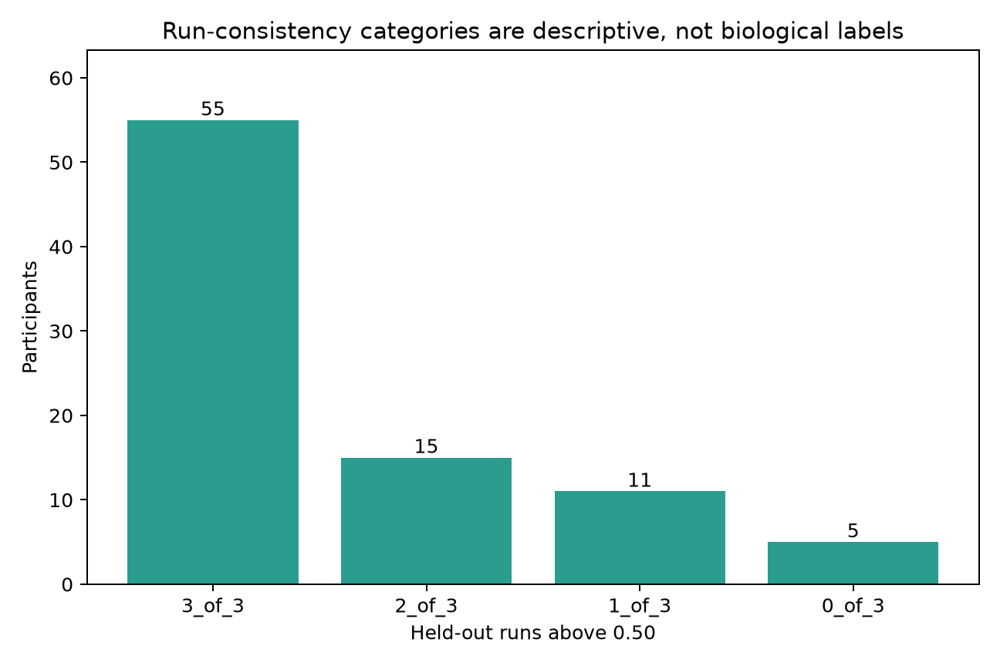
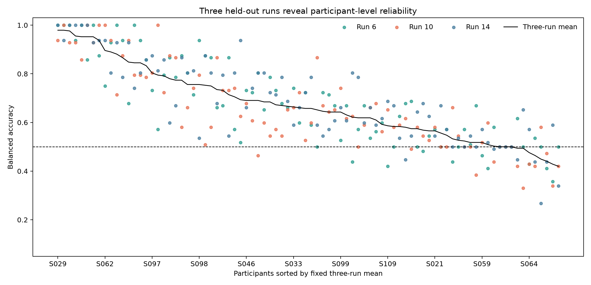
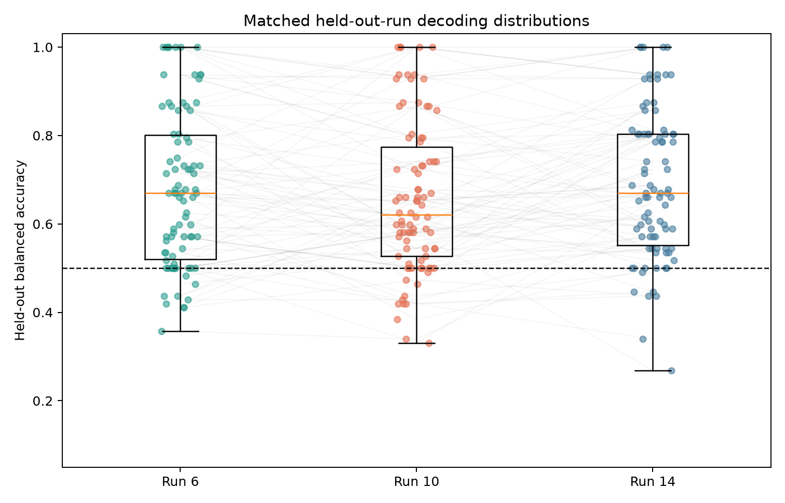
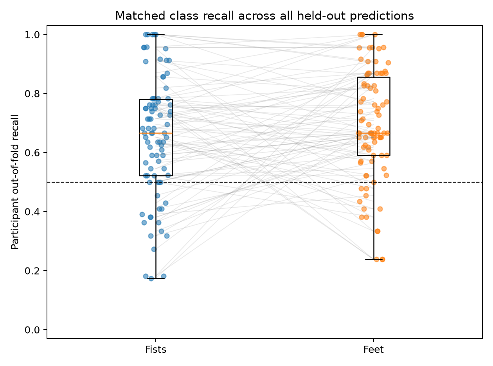
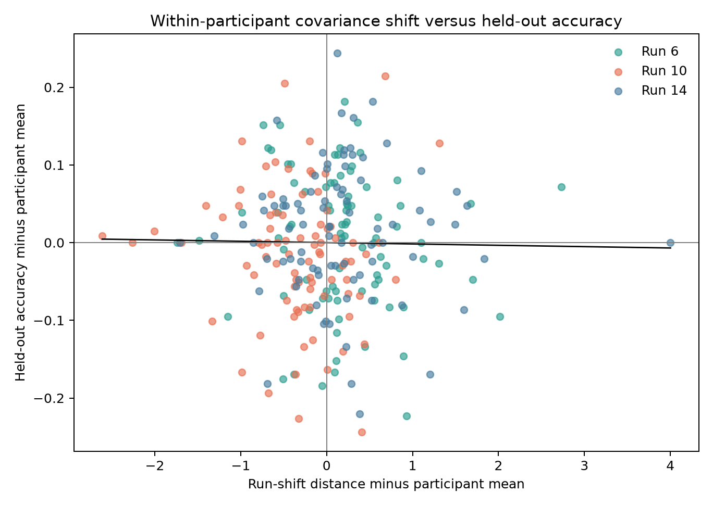

# Within-subject decoding reliability and run heterogeneity

[Back to the project README](../README.md) ·
[Completed decoder study](within_subject_decoding.md)

## Scope and frozen boundary

This is a post-hoc explanation of the completed held-out decoder at commit `4a39b4f`,
not a second classifier evaluation. The historical CSP+LDA median balanced accuracy
remains **0.658** for the same 86 participants, same folds, and same 3,840 trials.
Preprocessing, epochs, 8–30 Hz CSP input, four components, empirical CSP covariance,
scaling, LDA, +1 to +3 s interval, QC policy, and balanced-accuracy definition were
not changed. No classifier was refitted.

The diagnostic policy was committed at `68a75a6` before the new run-shift result was
calculated. It is recorded in
[`config/decoding_reliability.json`](../config/decoding_reliability.json). Reliability,
class recall, and QC summaries reuse the immutable prediction/fold/subject tables.
Only the label-independent covariance-shift measure required loading the existing
8–30 Hz trial representation again.

## Reliability across the three held-out runs

Each participant retains one balanced accuracy for test runs 6, 10, and 14. The
three-run mean is the completed study's historical subject score; the minimum,
maximum, range, population SD, and above-chance run count are new descriptions.

| Runs above 0.50 | Participants | Fraction |
| ---: | ---: | ---: |
| 3/3 | **55** | 64.0% |
| 2/3 | **15** | 17.4% |
| 1/3 | **11** | 12.8% |
| 0/3 | **5** | 5.8% |

Thus 70/86 participants exceed 0.50 in at least two runs, while 16/86 do so in at
most one. These are descriptive reliability categories, not stable biological types
or evidence that a person is inherently “good” or “bad” at BCI.



The median within-participant run range is **0.147** balanced-accuracy points (IQR
0.092–0.241; range 0.000–0.429). The median population SD across three folds is 0.067
(IQR 0.038–0.101), and 21/86 participants have the predeclared descriptive range of
at least 0.25. Conversely, 28/86 reach at least 0.60 in all three runs.



## Is run 10 harder?

| Held-out run | Median balanced accuracy | IQR | Range | Median fists recall | Median feet recall |
| ---: | ---: | ---: | ---: | ---: | ---: |
| 6 | **0.670** | 0.520–0.801 | 0.357–1.000 | 0.750 | 0.750 |
| 10 | **0.621** | 0.527–0.775 | 0.330–1.000 | 0.732 | 0.714 |
| 14 | **0.670** | 0.551–0.804 | 0.268–1.000 | 0.732 | 0.750 |

Run 10 is descriptively 0.049 below each other run's cohort median. The matched
effect is smaller: its participant-level median is 0.018 below run 6 and 0.031 below
run 14. The predeclared Friedman test does not establish an overall run difference
(`p = 0.103`). None of the three paired Wilcoxon contrasts survives Holm correction:
adjusted `p = 0.335` for run 6 versus 10, `0.404` for 6 versus 14, and `0.147` for 10
versus 14.

Run 10 is below the mean of runs 6/14 for 46 participants, above it for 32, and tied
for 8; it is strictly the lowest run for 33/86. Its median paired deficit relative to
the mean of the other runs is only 0.020 (IQR −0.096 to +0.046). Therefore the
lower cohort median is broad enough to notice but neither uniform nor inferentially
clear after the planned multiplicity correction.



## Are low scores one-run failures?

No. Eleven participants have a historical three-run mean at or below 0.50. Five are
above 0.50 in none of the runs and six are above in only one. **Zero** have two
above-chance runs plus one disastrous run. Low overall scores therefore reflect
persistent weak performance across these three runs more often than a single-run
collapse.

That pattern still does not identify a cause. Near-chance balanced accuracy can
arise from weak fists/feet separation, finite training data, unstable learned CSP
directions, nonstationarity not captured by the chosen distance, noise, or several of
these together.

## Class asymmetry

Participant-level median out-of-fold recall is 0.667 for both fists and feet. The
median paired feet-minus-fists difference is +0.039, but the matched Wilcoxon test is
not convincing (`p = 0.170`): fists recall is higher for 38 participants, feet recall
for 46, with 2 ties.

Run 10 does not show a single-class collapse. Its median fists/feet recalls are
0.732/0.714, versus 0.750/0.750 in run 6 and 0.732/0.750 in run 14. Pooled recalls
are lower for both classes in run 10 than run 14. Among the 11 low-overall-score
participants, median fists/feet recalls are 0.409/0.455; two are at or below 0.50 for
both classes, five only for fists, and four only for feet. Poor performance is not
dominated by one universal difficult condition.



## Does existing QC burden explain heterogeneity?

No material relationship appears. The participant task-QC candidate fraction has
Spearman ρ = +0.08 with mean accuracy (`p = 0.451`) and ρ = −0.05 with run range
(`p = 0.632`). After removing participant means, the descriptive run-QC-fraction
versus fold-accuracy correlation is only +0.13. The already completed, fully refitted
QC sensitivity has a median participant change of +0.003, and the median change is
zero in each held-out run.

The decoder uses task data only, so paired-rest QC does not enter its predictions and
was not promoted into a new exclusion rule. Misclassification was never treated as
artifact evidence, and no additional trial was removed.

## Label-independent covariance shift

A covariance matrix summarizes how every pair of sensors varies together. For one
fold, the existing 8–30 Hz array has shape approximately `(30 training trials, 64
channels, 320 samples)` versus `(14–15 test trials, 64 channels, 320 samples)`. Class
labels are not accepted by the run-shift function. Each trial is channel-wise
demeaned, its time samples become observations, and separate Ledoit–Wolf covariances
are estimated for the pooled training runs and held-out run. Shrinkage makes the
average-referenced covariance positive definite rather than singular
([scikit-learn LedoitWolf documentation](https://scikit-learn.org/stable/modules/generated/sklearn.covariance.LedoitWolf.html)).

Positive-definite covariance matrices form curved rather than ordinary Euclidean
space. The affine-invariant distance used here is

\[
d(C_{train}, C_{test}) =
\sqrt{\sum_i \log^2 \lambda_i(C_{test}, C_{train})},
\]

where the \(\lambda_i\) are generalized covariance eigenvalues. The distance is
symmetric and unchanged by applying the same invertible sensor-coordinate transform
to both matrices; this geometry is described by Pennec, Fillard, and Ayache
([2006](https://doi.org/10.1007/s11263-005-3222-z)). The measure includes overall
8–30 Hz scale and spatial covariance changes; it does not claim to capture every form
of EEG nonstationarity.

Median distances are 4.328 for held-out run 6, 3.999 for run 10, and 4.183 for run
14. Run 10 therefore does not look more shifted by this measure. More importantly,
the participant-centered distance/accuracy association is essentially zero:
**r = −0.015**, with `p = 0.819` from 10,000 fixed-seed accuracy permutations within
participant. Across participants, mean shift versus mean accuracy is weakly negative
(Spearman ρ = −0.19, `p = 0.078`). These exploratory results do not support covariance
shift as the main explanation for fold failures, and an association would not by
itself have established causality.



## Predefined historical physiology relationships

These joins occurred only after reliability and shift methods were frozen. Stronger
negative historical fists-versus-rest 12–13 Hz ERD is associated with higher decoder
accuracy: Spearman ρ = −0.59 at C3 and −0.54 at C4 (unadjusted `p = 2.45 × 10⁻9`
and `1.07 × 10⁻7`). This is the strongest measured correlate of between-participant
heterogeneity, but it remains an explanatory association. Fists-versus-rest ERD is
not the fists-versus-feet separation used by the classifier and cannot establish a
mechanism.

Historical central peak frequency has ρ = +0.38 among 69 available participants.
Median accuracy is 0.661 when a historical peak is available and 0.565 when it is
unavailable (69 versus 17 participants). Among 43 available held-out IMF estimates,
larger three-fold peak span—less stable frequency estimation—is associated with lower
accuracy (ρ = −0.46). These unadjusted post-evaluation results are hypothesis-
generating only; missing peak values remain legitimate missing data.

## CSP stability decision

Fold-specific fitted CSP models were intentionally not persisted. Refitting them now
would produce three strongly overlapping training solutions per participant, and
raw filter matrices have sign, order, scale, and component-subspace ambiguities.
Element-wise correlations would therefore be invalid, while a three-fold subspace
analysis would be difficult to interpret as independent reliability evidence. CSP
stability is explicitly deferred rather than forced into this milestone.

## Interpretation and decision gate

The heterogeneity is not well explained by one difficult run, one difficult class,
existing QC burden, or the frozen label-independent covariance-distance measure.
The strongest available explanation is participant-specific strength/stability of
task-related signal and fists/feet separability, combined with finite-data estimation
noise. The moderate historical ERD relationships support that interpretation, but do
not prove it.

The decision gate was **A: cross-subject decoding**. Within-subject evidence is
sufficiently repeatable for most participants (55/86 above chance in all three runs;
70/86 in at least two), while matched run tests and covariance shift do not identify
run heterogeneity as the dominant unresolved failure. That subsequent study was
separately frozen, used participant-held-out evaluation, and preserved the 0.658
within-subject result as a fixed comparator. Its completed zero-shot result and next
gate are reported in [cross-subject decoding](cross_subject_decoding.md).

## Reproduction and artifacts

From the activated environment:

```bash
python scripts/analyze_decoding_reliability.py
python -m unittest tests.test_decoding_reliability tests.test_decoding_reliability_artifacts -v
python -m unittest discover -s tests -v
python -m compileall -q eeg_project scripts tests
```

The shortest machine-readable entry points are the
[subject reliability table](assets/decoding_reliability_subject_reliability.csv),
[run summary](assets/decoding_reliability_run_summary.csv),
[matched run tests](assets/decoding_reliability_run_comparisons.csv),
[class recalls](assets/decoding_reliability_class_recalls.csv),
[QC relationships](assets/decoding_reliability_quality_relationships.csv),
[run-shift relationships](assets/decoding_reliability_run_shift_relationships.csv),
[historical relationships](assets/decoding_reliability_historical_relationships.csv),
and [metadata](assets/decoding_reliability_metadata.json). Compact run-shift
checkpoints are regenerable and excluded from Git.

## What you should understand now

- Most participants decode above chance in multiple runs, but group success is not
  universal participant reliability.
- Run 10 is descriptively lower, yet matched evidence does not establish a general
  run-10 penalty after multiplicity correction.
- Low overall performers usually remain weak across runs; one disastrous run is not
  the dominant explanation.
- Neither existing QC burden nor class-blind covariance shift materially explains
  the observed fold variability.
- Historical ERD/peak relationships suggest signal-strength hypotheses, not causal
  mechanisms or permission to retune the completed decoder.
