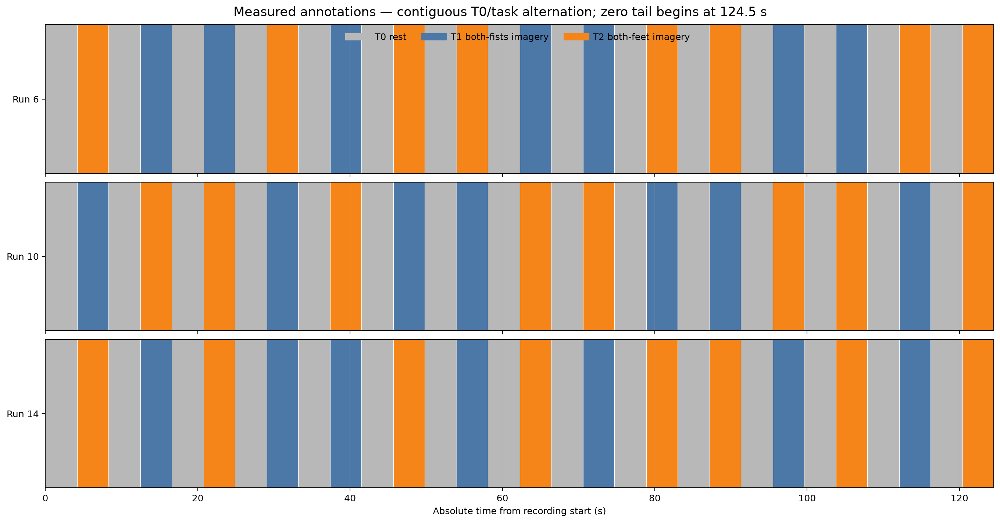
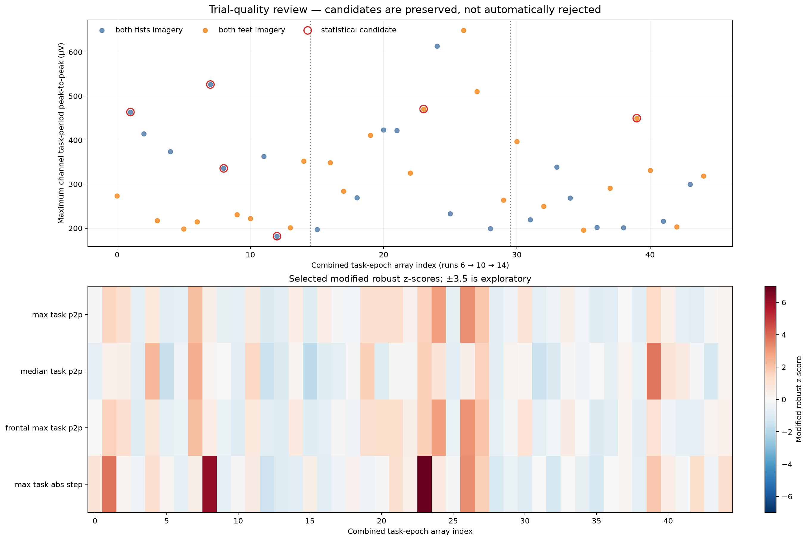
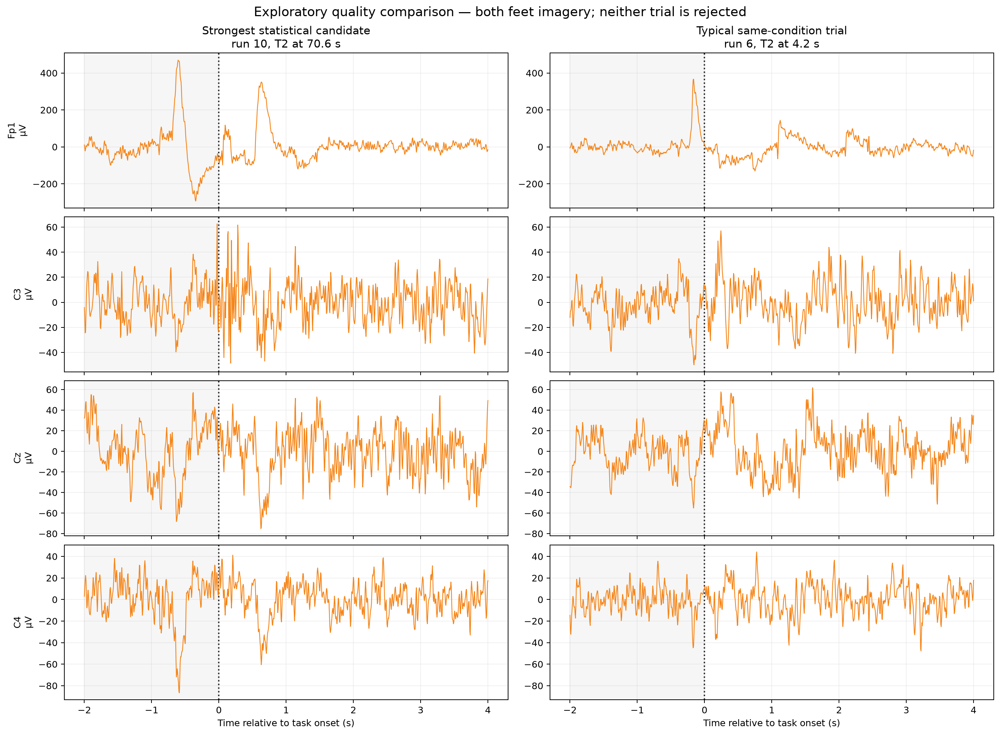
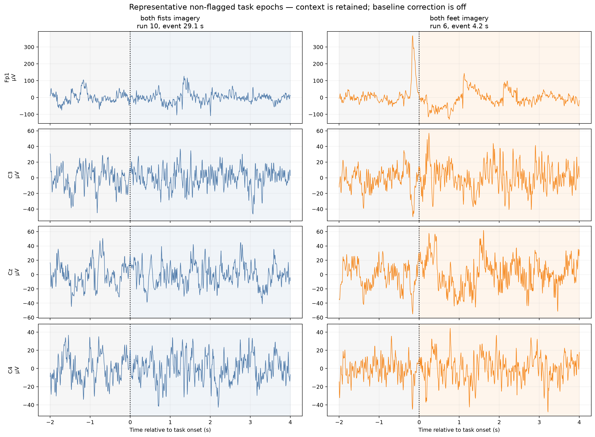
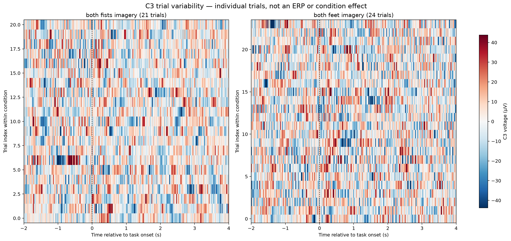

# Event extraction, epoching, and trial-quality assessment

[Back to the project README](../README.md)

This chapter documents the verified transformation from three preprocessed
continuous EEG recordings into individually traceable motor-imagery trials. It
does not perform event-related spectral analysis, feature extraction, artifact
rejection, or machine learning.

## From continuous recordings to trials

One continuous run is a matrix shaped `(channels, continuous_samples)`. After
the invalid tail is removed, each project run has shape `(64, 19,920)`: 64
simultaneous voltage time series spanning 124.5 seconds.

Epoching adds a trial dimension:

```text
(channels, continuous_samples)
             ↓ event-aligned slicing
(epochs, channels, samples_per_epoch)
```

The final task array has shape `(45, 64, 961)`. The dimensions mean 45
experimental task trials, 64 EEG channels in each trial, and 961 event-relative
samples per channel and trial. Epoching reorganizes measured samples; it does
not prove that a task effect is present.

## Annotation, event, and epoch are different objects

- An **annotation** is metadata attached to an interval or point in continuous
  recording time. In these EDF files it supplies a description, onset, and
  duration.
- An **event** is a discrete integer sample location plus an event code. It is
  the anchor analysis software uses to locate an experimental occurrence.
- An **epoch** is a fixed segment of continuous EEG selected relative to an
  event.

The implemented relationship is:

```text
EDF annotation → event onset → integer continuous sample → epoch around sample
```

After extraction, `t = 0 s` is the task-event sample. Negative times precede
that event and positive times follow it; they are not absolute times from the
start of the EDF. The original absolute onset and sample remain in trial
metadata.

## Verified protocol semantics

The authoritative PhysioNet protocol assigns runs 6, 10, and 14 to Task 4:
imagined opening and closing of both fists or both feet. For this run family,
the meanings are:

| Annotation | Meaning in runs 6, 10, and 14 | Role here |
| --- | --- | --- |
| `T0` | Rest | Separate rest/context collection |
| `T1` | Both-fists imagery | Primary task condition |
| `T2` | Both-feet imagery | Primary task condition |

This mapping is not universal. For example, `T1` and `T2` refer to different
body sides in unilateral run families. The reusable code therefore accepts
only the explicitly configured bilateral imagery runs and raises an error for
an unsupported run instead of silently attaching the wrong scientific label.

## Measured annotation structure

The report command audited all 90 annotations, including neighboring labels,
onset, duration, end time, event sample, gap/overlap state, and valid-recording
membership.

| Run | `T0` | `T1` | `T2` | Rest duration | Task duration |
| ---: | ---: | ---: | ---: | ---: | ---: |
| 6 | 15 | 7 | 8 | 4.2 s | 4.1 s |
| 10 | 15 | 7 | 8 | 4.2 s | 4.1 s |
| 14 | 15 | 7 | 8 | 4.2 s | 4.1 s |

Every run has exactly 30 annotations. Each sequence starts with `T0`, alternates
perfectly between rest and a task, and ends with a task. All measured rest
durations are 4.2 seconds and all measured task durations are 4.1 seconds.
Adjacent annotations are contiguous: computed gaps are zero apart from
floating-point representations as small as approximately
$1.42\times10^{-14}$ seconds. No real gap or overlap was found.

The final task begins at 120.4 seconds and its annotation ends at 124.5
seconds, exactly where the excluded all-channel zero tail begins. It is wholly
inside the 124.5-second valid-data interval, and its stored task epoch ends at
124.4 seconds. No annotation or epoch includes samples 19,920–19,999.



The complete numerical audit is available in
[`annotation_structure.csv`](assets/subject01_runs06-10-14_annotation_structure.csv).

## Exact annotation-to-sample conversion

At 160 Hz, an onset in seconds is converted independently as

\[
s_{\text{event}} = \operatorname{round}(t_{\text{onset}} f_s)
                   + \texttt{raw.first\_samp}.
\]

MNE's `events_from_annotations(..., use_rounding=True)` is used, and every
result is checked against this equation. In the inspected data,
`raw.first_samp = 0`; annotation `orig_time` equals the recording measurement
date, so no additional origin offset appears. This is a measured property of
these files, not a universal MNE assumption.

Examples verified in every selected run are:

| Task position | Onset | Calculation | Event sample |
| --- | ---: | --- | ---: |
| First | 4.2 s | `round(4.2 × 160)` | 672 |
| Middle (index 7) | 62.3 s | `round(62.3 × 160)` | 9,968 |
| Final | 120.4 s | `round(120.4 × 160)` | 19,264 |

Rounding is explicit because floating-point onset values need not always land
on an exact integer sample. The event table stores both MNE's sample and the
independent result and fails if they differ.

## Task and rest epoch decisions

### Stored task window

Each `T1` or `T2` task trial is stored from `−2.0` through `+4.0` seconds
relative to task onset. This retains two seconds of the immediately preceding
`T0` interval as context and four seconds of the measured 4.1-second task
annotation. It uses a fixed window across every trial and stops 0.1 seconds
before the annotation ends.

The wide stored representation is not automatically the interval from which a
later spectral feature will be computed. A provisional `+1.0…+3.0 s` task
analysis interval is recorded in configuration so the next milestone can test
it, but it has not been applied or declared final.

### Separate rest collection

Each `T0` onset also produces a separate `0…4.0 s` rest/context epoch. The
resulting rest array has shape `(45, 64, 641)`. Rest is not encoded as an equal
third primary classification condition. Keeping it separate preserves future
options for task-versus-rest or spectral-normalization analyses without
changing the present both-fists-versus-both-feet question.

### Baseline decision

Time-domain baseline correction estimates a channel-specific mean over a
selected interval and subtracts it:

\[
x_{\text{corrected}}(t)=x(t)-\operatorname{mean}(x_{\text{baseline}}).
\]

It shifts the voltage offset of an epoch; it does not remove artifacts, make
trials independent, or normalize frequency-band power. Baseline subtraction is
common in event-related-potential analysis, where a pre-event voltage level is
used as a reference. Motor-imagery analysis will focus on oscillatory power, for
which a later ratio or log-power comparison with a scientifically defined rest
interval is a different operation.

Therefore both collections use `baseline=None`. The preceding `T0` context is
preserved, but experimental rest is not treated as if it were automatically a
mathematical baseline.

## Inclusive endpoints and verified timing

MNE includes both requested time endpoints. For the task window,

\[
N=(4-(-2))\times160+1=961\ \text{samples}.
\]

The `+1` prevents an off-by-one error. Event-relative zero is array time index
320 because two seconds correspond to 320 samples. The independently audited
continuous-sample bounds are:

```text
epoch_start = event_sample - 320
epoch_stop_inclusive = event_sample + 640
```

For example, the first task uses samples 352–1,312, the middle task uses
9,648–10,608, and the final task uses 18,944–19,904. Each interval contains 961
samples and remains inside valid samples 0–19,919.

## Zero-phase filter support near transitions

The 529-coefficient FIR has half-support of 264 samples:

\[
264/160 = 1.65\ \text{s}.
\]

Because it is applied continuously with compensated zero phase, each filtered
sample depends on surrounding raw samples on both sides. An abrupt transition
can therefore influence approximately 1.65 seconds before and after itself:

```text
raw transition → symmetric FIR convolution → pre- and post-transition spreading
```

Consequently, task samples near `t=0` are not independent of preceding rest,
and samples near the end are not independent of the following boundary. Even
the provisional `1…3 s` interval is only transition-reduced: its theoretical
raw-data support spans about `−0.65…4.65 s`, crossing both task boundaries. A
window completely inside a 4.1-second task after accounting for full support
would be only about `1.65…2.45 s`, too short to adopt blindly for spectral
estimation. The next milestone must evaluate this resolution-versus-transition
tradeoff quantitatively.

## Final task counts and representation

| Run | Both-fists (`T1`) | Both-feet (`T2`) | Boundary-invalid | Retained |
| ---: | ---: | ---: | ---: | ---: |
| 6 | 7 | 8 | 0 | 15 |
| 10 | 7 | 8 | 0 | 15 |
| 14 | 7 | 8 | 0 | 15 |
| **Total** | **21** | **24** | **0** | **45** |

No balancing, duplication, or deletion was performed. The task array and its
row-aligned provenance are:

```text
X.shape = (45, 64, 961)
task_metadata rows = 45
task time = -2.0 ... +4.0 s at 160 Hz
```

These `7/8` counts describe subject 1. The subjects 1–20 audit also finds valid
counterbalanced `8/7` runs. Portable validation therefore requires 15 total task
events with each condition appearing 7 or 8 times, while preserving the actual
per-subject counts in provenance and summaries.

`X[12]` is not anonymous: it is subject 1, run 6, `T1`, both-fists imagery,
event sample 16,608 at 103.8 seconds, spanning continuous samples
16,288–17,248. Its quality heuristic flags unusually large peak-to-peak
amplitude in the pre-task context, but it remains in `X` because that evidence
is exploratory rather than a confirmed reason to reject the trial.

The primary provenance table is
[`task_trials.csv`](assets/subject01_runs06-10-14_task_trials.csv); the separate
rest table is
[`rest_context_epochs.csv`](assets/subject01_runs06-10-14_rest_context_epochs.csv).

## Trial-quality assessment

For each retained task epoch, the implementation computes a deliberately small
set of interpretable indicators in microvolts:

- maximum full-epoch, task-period, and pre-context peak-to-peak amplitude;
- median channel task-period peak-to-peak amplitude;
- maximum frontal task-period peak-to-peak amplitude;
- largest adjacent-sample step during the task;
- minimum and median channel standard deviation during the task.

Each scalar indicator is compared across the 45 trials with a modified robust
z-score,

\[
z_i^*=0.6745\frac{x_i-\operatorname{median}(x)}
                     {\operatorname{median}(|x-\operatorname{median}(x)|)}.
\]

An absolute directional threshold of 3.5 is exploratory. High values flag the
amplitude/step metrics; unusually low minimum variance can flag a flat-looking
trial. Channel-wise peak-to-peak scores are retained only as supporting
evidence when a scalar metric already flags the trial. They do not independently
trigger candidacy because testing 64 channels simultaneously would inflate the
number of exploratory flags.

Six trials are statistical candidates and all six remain retained:

| Run | Run trial index (0-based) | Condition | Event time | Main scalar evidence |
| ---: | ---: | --- | ---: | --- |
| 6 | 1 | Both fists | 12.5 s | Task maximum step, $z^*=3.82$ |
| 6 | 7 | Both fists | 62.3 s | Median task channel SD, $z^*=3.64$ |
| 6 | 8 | Both fists | 70.6 s | Task maximum step, $z^*=6.16$ |
| 6 | 12 | Both fists | 103.8 s | Pre-context maximum peak-to-peak, $z^*=3.70$ |
| 10 | 8 | Both feet | 70.6 s | Pre-context peak-to-peak $z^*=4.34$; task step $z^*=6.92$ |
| 14 | 9 | Both feet | 78.9 s | Median task peak-to-peak, $z^*=3.73$ |

There are 39 non-flagged trials, 6 statistical candidates, 0 confirmed artifact
exclusions, and 0 deterministic boundary exclusions. “Candidate” means inspect
more closely; it does not mean bad data.





The complete metrics and reasons are in
[`trial_quality.csv`](assets/subject01_runs06-10-14_trial_quality.csv).

## How to read the epoch figures

The representative figure shows one deterministic non-flagged trial per
condition. Gray shading is retained preceding context, `t=0` is task onset, and
colored shading is the task interval. It is a visualization of individual
voltage traces, not a condition average or proof of motor-imagery physiology.



The C3 heat map shows all 21 fists and 24 feet trials separately. It emphasizes
trial-to-trial variability without assuming that oscillations are phase locked
to cue onset. A simple voltage average could cancel non-phase-locked rhythmic
activity, which is why this milestone does not use an ERP average as its main
motor-imagery analysis.



## Provenance and future leakage control

Every task record preserves the chain:

```text
source EDF + SHA-256
→ subject and run
→ annotation and semantic condition
→ event sample and absolute onset
→ continuous preprocessed sample bounds
→ row in the epoch array
```

Run identity is permanent metadata. Later, a naive random epoch split could mix
closely related trials from the same recording context across training and test
sets. Subject 1's runs are repeated recordings from one person, and continuous
zero-phase filtering also creates local temporal dependence before slicing.
This is acquisition dependence, not automatically “label leakage,” but future
validation must respect run/session/subject structure and fit any learned
preprocessing only inside training folds.

## Implementation and persistence

The machine-readable policy is
[`config/epoching.json`](../config/epoching.json). Reusable event conversion,
semantic validation, epoch extraction, provenance, boundary checks, and trial QC
live in [`eeg_project/epoching.py`](../eeg_project/epoching.py). The report CLI
is [`scripts/create_epochs.py`](../scripts/create_epochs.py), and focused tests
are in [`tests/test_epoching.py`](../tests/test_epoching.py).

Epoch arrays are regenerated deterministically in memory rather than saved as
large FIF files. For only three short runs, recomputation is inexpensive; this
avoids stale derived binaries while the scientific policy is still evolving.
Small provenance, metrics, metadata, and figures are persisted as report
artifacts.

Run the complete report:

```bash
python scripts/create_epochs.py --subject 1 --runs 6 10 14
```

Inspect options or isolate one run outside tracked report artifacts:

```bash
python scripts/create_epochs.py --help
python scripts/create_epochs.py --runs 10 --output-dir outputs/run10_epoching
```

## Generated artifacts

| Artifact | Content |
| --- | --- |
| [`annotation_structure.csv`](assets/subject01_runs06-10-14_annotation_structure.csv) | 90 audited annotations |
| [`task_trials.csv`](assets/subject01_runs06-10-14_task_trials.csv) | 45 traceable task trials |
| [`rest_context_epochs.csv`](assets/subject01_runs06-10-14_rest_context_epochs.csv) | 45 separate rest/context trials |
| [`trial_quality.csv`](assets/subject01_runs06-10-14_trial_quality.csv) | 45 task-level metric records |
| [`epoching_metadata.json`](assets/subject01_runs06-10-14_epoching_metadata.json) | Shapes, policy, versions, hashes, counts, and artifact inventory |

## Limitations and next step

- One participant and three short runs cannot establish population
  generalization.
- The 21/24 class imbalance is preserved and must be handled honestly later.
- The annotations describe instructed conditions; they do not independently
  verify the participant's mental strategy.
- Six statistical candidates have now received systematic matched review and
  sensitivity analysis; none is proven artifactual or rejected.
- No EOG channel or automated component correction is available here.
- Zero-phase filtering creates transition dependence and is acausal.
- The provisional interior interval has not been validated for spectral
  resolution or physiological sensitivity.
- Individual voltage traces do not establish a fists-versus-feet neural effect.

The next milestones were completed in [Event-related spectral analysis](event_related_spectral_analysis.md) and [Artifact policy and spectral feature stability](trial_quality_and_feature_stability.md). The latter formalizes retention, paired-reference QC, and anti-circularity rules. All 45 master epochs remain unchanged; CSP and classification remain later stages.

## Sources

- Schalk, G. (2009). [EEG Motor Movement/Imagery Dataset](https://physionet.org/content/eegmmidb/1.0.0/) (version 1.0.0). PhysioNet. <https://doi.org/10.13026/C28G6P>
- MNE-Python contributors. [`mne.events_from_annotations`](https://mne.tools/stable/generated/mne.events_from_annotations.html): annotation conversion and rounding behavior.
- MNE-Python contributors. [`mne.Epochs`](https://mne.tools/stable/generated/mne.Epochs.html): event-relative extraction, inclusive timing, rejection, and baseline parameters.
- MNE-Python contributors. [Baseline correction tutorial](https://mne.tools/stable/auto_tutorials/epochs/15_baseline_regression.html): conventional baseline subtraction and alternatives.
