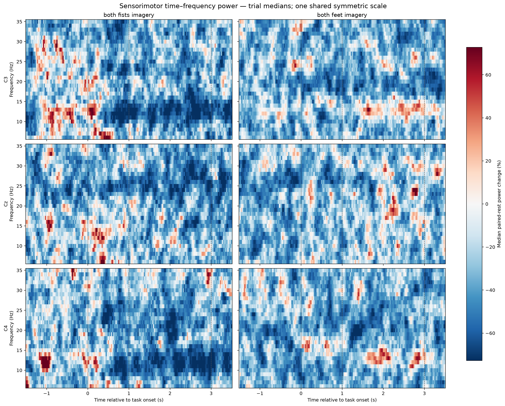
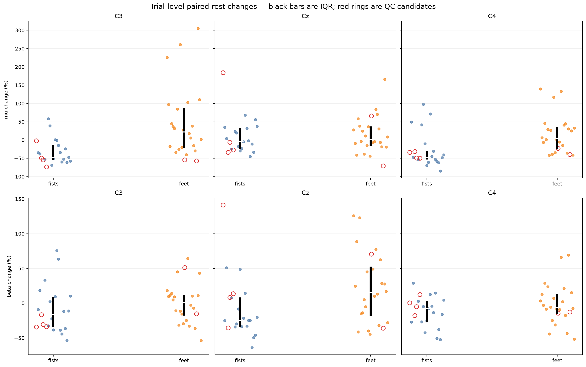
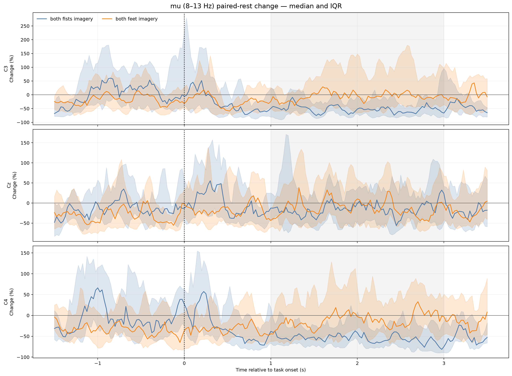
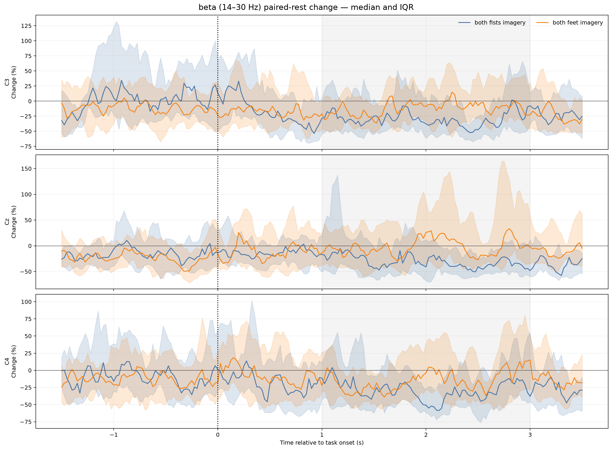
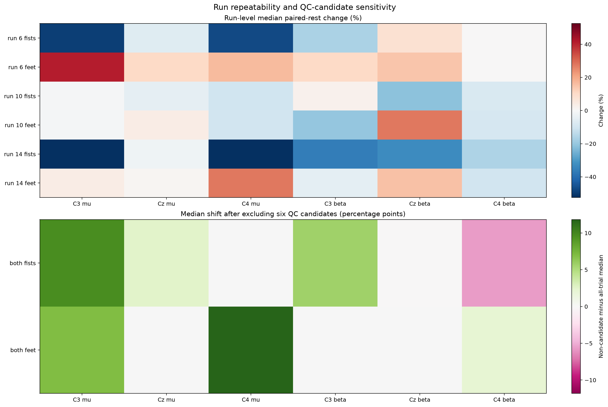
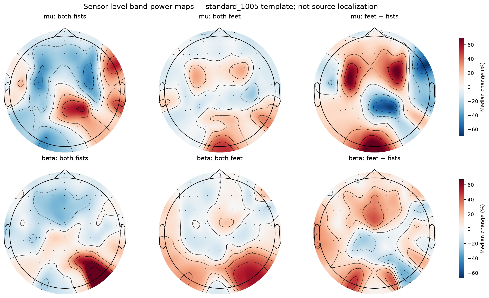

# Event-related spectral analysis

[Back to the project README](../README.md)

This chapter asks whether oscillatory power changes within subject 1's
individual motor-imagery trials and whether the descriptive patterns differ
between both-fists and both-feet imagery. It does not implement CSP, feature
optimization, classification, or population-level inference.

## Why continuous PSD was insufficient

Whole-run Welch PSD established that the recordings contain central 12–13 Hz
structure, but it pooled rest, both tasks, artifacts, and 124.5 seconds of time.
It could not say when that structure changed relative to a task cue.

The event-related representation is:

```text
epoch (channel × sampled time)
  → localized Morlet transform
  → channel × frequency × event-relative time power
  → paired-rest normalization
  → trial-level mu/beta/12–13 Hz measurements
```

The task TFR has shape `(45, 64, 30, 241)`: 45 trials, 64 channels,
30 frequency centers from 6–35 Hz, and 241 times from −2 to +4 seconds at
25-ms spacing. The full array remains in memory; only compact scientific tables
and condition summaries are persisted.

## Time–frequency method

A single FFT over six seconds has frequency information but loses when power
changed. A spectrogram instead repeats a short spectral estimate along time.
Morlet analysis follows the same localized principle using a sinusoidal
oscillation under a Gaussian envelope and convolving it with EEG. Squared
transform magnitude is wavelet power.

Longer wavelets contain more cycles and distinguish nearby frequencies better,
but blur event timing. Shorter wavelets localize time better but broaden
frequency resolution. Multitaper analysis could reduce variance with several
orthogonal tapers, but its additional spectral-smoothing bandwidth is not needed
for this first interpretability-focused analysis.

The project uses 1-Hz centers from 6–35 Hz and
`n_cycles = frequency / 2`. MNE therefore creates a constant 127-sample
wavelet at every frequency: 0.794 seconds total, or ±0.394 seconds. Power is
computed at 160 Hz and retained every fourth output sample. Decimation occurs
after convolution; the 25-ms grid is adequate for the slowly varying summary,
but post-transform decimation remains a documented aliasing limitation.

## ERD/ERS definition

Each task trial is normalized only to its immediately preceding `T0` interval:

\[
\Delta P(\%)=100\frac{P_{task}-P_{paired\ rest}}{P_{paired\ rest}}.
\]

Negative change follows the event-related desynchronization (ERD) convention:
lower oscillatory power than reference. Positive change follows the
event-related synchronization (ERS) convention. “Desynchronization” describes
reduced sensor-level rhythmic power; it does not mean neurons literally become
random and does not prove a mental state was detected.

## Paired reference and timing decision

The annotation audit shows an exact one-to-one structure in every run:

```text
T0 trial j, 4.2 s → task trial j, 4.1 s
```

The selected rest reference is `1.1…3.1 s` after the paired T0 onset, centered
within rest. The selected task summary is `1.0…3.0 s`, nearly centered within
the task and long enough to summarize mu/beta power. Rest is not randomly
pooled, and time-domain baseline subtraction remains off.

This is not an uncontaminated physiological baseline. The FIR contributes
±1.65 seconds of support and the wavelet contributes ±0.394 seconds. A reported
estimate can therefore depend on raw data approximately ±2.044 seconds around
its nominal time. With contiguous 4.1/4.2-second blocks, no useful central
interval is completely independent of both transitions. The chosen intervals
are matched and transition-reduced, not transition-free.

The first T0 in each run also differs because its left-side FIR context comes
from recording-edge reflection rather than a previous task. Excluding those
three task/rest pairs is reported as a sensitivity analysis.

## Frequency and channel definitions

| Name | Included frequency centers | Interpretation boundary |
| --- | --- | --- |
| Mu/sensorimotor alpha | 8–13 Hz | Project convention; definitions vary |
| Beta | 14–30 Hz | Starts at 14 so the discrete 13-Hz bin is not counted twice |
| Central peak check | 12–13 Hz | Tests the earlier continuous-PSD observation |

`C3`, `Cz`, and `C4` are primary sensor-level channels over left central,
midline central, and right central scalp regions. Both-fists imagery is
bilateral, so a simplistic right-hand→C3/left-hand→C4 rule is inappropriate.
Midline relevance for feet imagery is a hypothesis, not an assumption.

## Primary trial-level findings

The primary analysis retains all 45 trials, including all six statistical QC
candidates. Values below are median percent changes with the interquartile
range in parentheses.

| Condition | Channel | Mu 8–13 Hz | Beta 14–30 Hz | 12–13 Hz |
| --- | --- | ---: | ---: | ---: |
| Both fists | C3 | −47.33% (−54.48, −14.67) | −16.68% (−34.32, +9.55) | −55.57% (−69.55, −30.86) |
| Both fists | Cz | −4.80% (−24.78, +32.43) | −24.81% (−33.81, +8.19) | +6.60% (−28.34, +30.27) |
| Both fists | C4 | −47.19% (−53.28, −30.44) | −7.85% (−26.79, +2.75) | −52.28% (−65.16, +0.12) |
| Both feet | C3 | +22.40% (−21.19, +87.73) | +1.06% (−17.93, +12.19) | +30.29% (−16.31, +98.54) |
| Both feet | Cz | +2.25% (−16.06, +37.21) | +15.18% (−18.48, +52.51) | +5.61% (−8.29, +34.93) |
| Both feet | C4 | +3.79% (−25.74, +34.89) | −6.49% (−15.25, +13.51) | +22.31% (−25.84, +94.97) |

The clearest subject-specific pattern is lower fists-trial 8–13 Hz power at C3
and C4 relative to paired rest. Its especially strong 12–13 Hz component is
consistent with event-related attenuation of the continuous central peak.
Feet-trial medians are generally small-to-positive, but their IQRs are wide and
often cross zero. Cz does not show a clear fists/feet mu separation. Beta is
weaker and mixed; it should not be summarized as a uniform beta ERD.





These are within-subject trial distributions, not 45 independent people. No
p-values are reported: testing every channel/frequency/time pixel would create
severe multiplicity, and this milestone prioritizes effect size, variability,
run repetition, and sensitivity.

## Time-course interpretation

The median/IQR curves show that the C3/C4 fists reduction persists through much
of the selected `1…3 s` task interval. Large IQRs, particularly for feet,
demonstrate that grand means would hide substantial trial variability. Every
time point is a localized estimate with ±0.394-second wavelet support, not an
instantaneous measurement.





## Run, window, and QC sensitivity

The 12–13 Hz fists decrease at C3/C4 has the strongest run repetition:

| Run | C3 fists 12–13 Hz | C4 fists 12–13 Hz |
| ---: | ---: | ---: |
| 6 | −55.57% | −51.15% |
| 10 | −24.31% | −54.56% |
| 14 | −61.36% | −52.28% |

Broad mu reduction is strong in runs 6 and 14 but weak in run 10 at C3
(−0.67%) and C4 (−10.47%). Feet patterns and beta patterns vary substantially
by run. Therefore the pooled C3/C4 fists result has a repeated narrow-band
component, but the broader condition contrast is not uniformly stable.

Across 12 combinations of four task windows and three rest windows, fists
medians remain negative in every combination for C3/C4 mu, all C3/C4 beta, and
C3/C4 12–13 Hz. Feet estimates are less stable. This supports the direction of
the fists pattern while showing that its exact magnitude depends on timing.

Removing the six QC candidates changes the pooled medians without changing the
main fists C3/C4 direction: C3 mu shifts from −47.33% to −37.69%, C4 mu remains
−47.19%, and C3/C4 12–13 Hz become −50.43%/−52.28%. The largest primary-channel
shift is about 12.43 percentage points for feet C4 12–13 Hz. Candidates are
therefore influential for some magnitudes, especially variable feet results,
but do not create the central fists observation. They remain retained.

Excluding the first rest pair per run also preserves fists C3/C4 mu and
12–13 Hz directions. Cz feet mu changes sign from +2.25% to −3.90%, reinforcing
that small near-zero effects are not stable.



## Spatial view

The topographies display median sensor values using `standard_1005` template
coordinates. They help inspect whether patterns are focal or widespread, but
they are not participant-digitized locations, cortical activation maps, or
source localization. Posterior and peripheral structure also cautions against
reducing the full data to a simple motor-cortex narrative.



## Reproducible implementation

- Policy: [`config/event_related_spectral.json`](../config/event_related_spectral.json)
- Reusable computation: [`eeg_project/time_frequency.py`](../eeg_project/time_frequency.py)
- Report CLI: [`scripts/analyze_event_related_spectrum.py`](../scripts/analyze_event_related_spectrum.py)
- Tests: [`tests/test_time_frequency.py`](../tests/test_time_frequency.py)

Run:

```bash
python scripts/analyze_event_related_spectrum.py --subject 1 --runs 6 10 14
```

The principal tables preserve trial/run/condition/QC/source provenance:

- [`event_trial_band_power.csv`](assets/subject01_runs06-10-14_event_trial_band_power.csv): 8,640 trial×channel×band rows;
- [`event_condition_band_summary.csv`](assets/subject01_runs06-10-14_event_condition_band_summary.csv): condition distributions and four sensitivity sets;
- [`event_run_band_summary.csv`](assets/subject01_runs06-10-14_event_run_band_summary.csv): run-specific all/QC summaries;
- [`event_window_sensitivity.csv`](assets/subject01_runs06-10-14_event_window_sensitivity.csv): 216 window-comparison rows;
- [`event_sensorimotor_tfr.csv`](assets/subject01_runs06-10-14_event_sensorimotor_tfr.csv): plotted C3/Cz/C4 time–frequency summaries;
- [`event_spectral_metadata.json`](assets/subject01_runs06-10-14_event_spectral_metadata.json): exact shapes, coordinates, support, versions, and policy.

Mean wavelet power over equally spaced band centers is used consistently. It
is transform power in V², not Welch power spectral density. Because the same
frequency count and transform are used for paired task/rest values, a sum would
differ from the mean only by a constant that cancels in the percent ratio.

## Scientific boundary and completed stability decision

The analysis supports a subject-specific, trial-level association: both-fists
imagery trials have lower paired-rest 12–13 Hz power at C3/C4 in all three runs.
It does not demonstrate thought detection, cortical activation, causal
physiology, generalization to other people, or classifier performance.

The subsequent [artifact-policy and feature-stability study](trial_quality_and_feature_stability.md)
is complete. It retains all 45 master task/rest pairs, separately flags five
paired-rest candidates, compares percent and dB normalization, and applies seven
criteria defined before report generation. C4 fists 12–13 Hz passes 7/7; C3
passes 6/7 because of a reference-power-rank association. Feet and beta findings
remain less defensible as fixed scientific features. The decision gate therefore
chooses additional subjects before serious classification; CSP remains deferred.

That next step is now complete for subjects 2–20. With all settings frozen, the
12–13 Hz fists direction is negative in 17/19 replication subjects at C4 and 16/19
at C3. Both meet all five predefined strong-replication criteria, including QC and
leave-one-subject-out sensitivity. Subject 1 is directionally representative but
unusually strong in magnitude. See [Multi-subject replication and pipeline
generalization](multi_subject_replication.md) for the audit, subject-level analysis,
uncertainty, secondary findings, and limits.

## Sources

- MNE-Python contributors. [`tfr_array_morlet`](https://mne.tools/stable/generated/mne.time_frequency.tfr_array_morlet.html): single-trial dimensions, cycles, wavelet support, and decimation.
- MNE-Python contributors. [Sensor-level ERDS maps](https://mne.tools/stable/auto_examples/time_frequency/time_frequency_erds.html): event-related power workflows and interpretation.
- Pfurtscheller, G., & Lopes da Silva, F. H. (1999). [Event-related EEG/MEG synchronization and desynchronization: basic principles](https://doi.org/10.1016/S1388-2457(99)00141-8). *Clinical Neurophysiology*, 110, 1842–1857.
- Tallon-Baudry, C., Bertrand, O., Delpuech, C., & Pernier, J. (1997). [Oscillatory gamma-band activity induced by a visual search task in humans](https://doi.org/10.1523/JNEUROSCI.17-02-00722.1997). *Journal of Neuroscience*, 17, 722–734.
