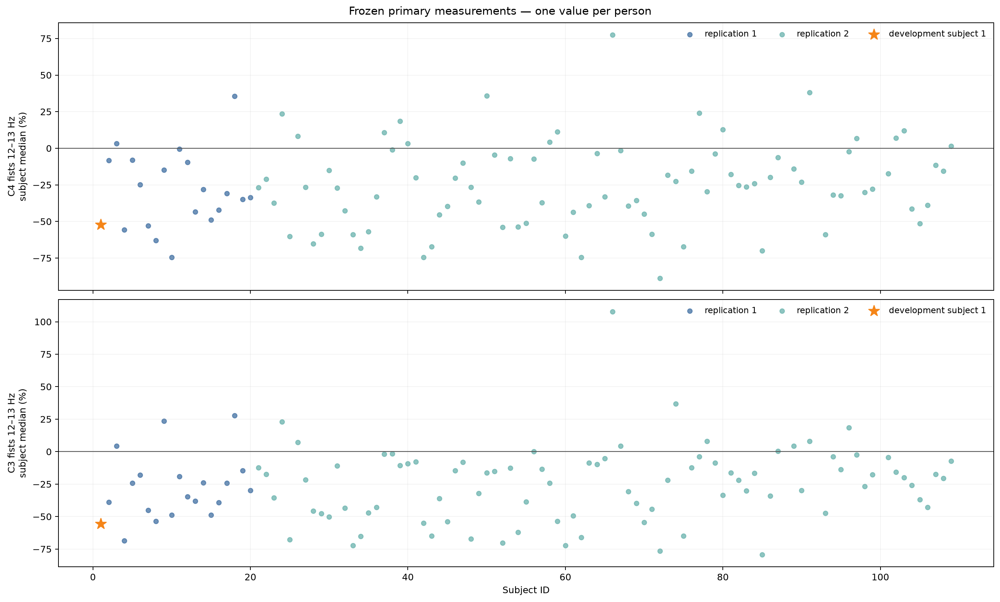
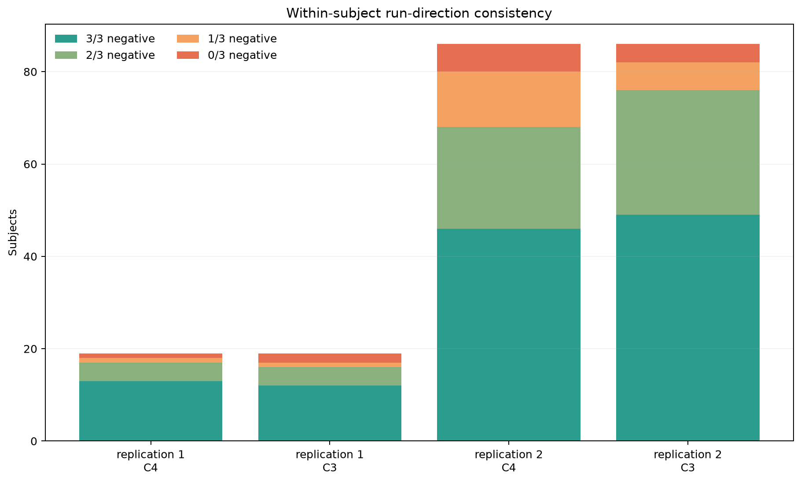
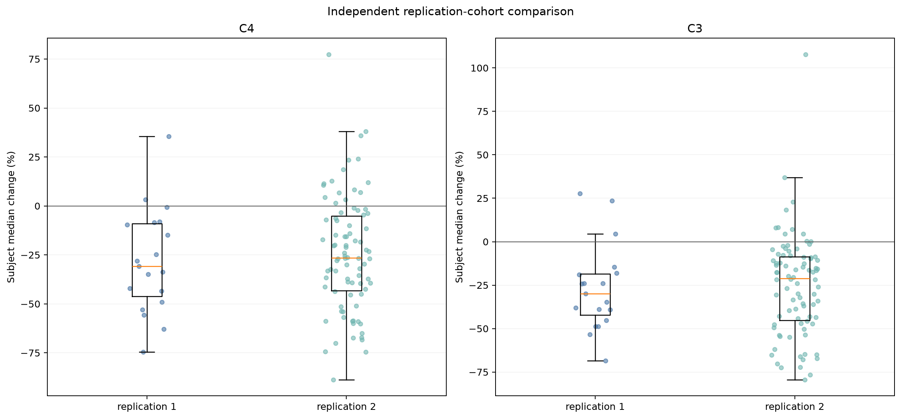
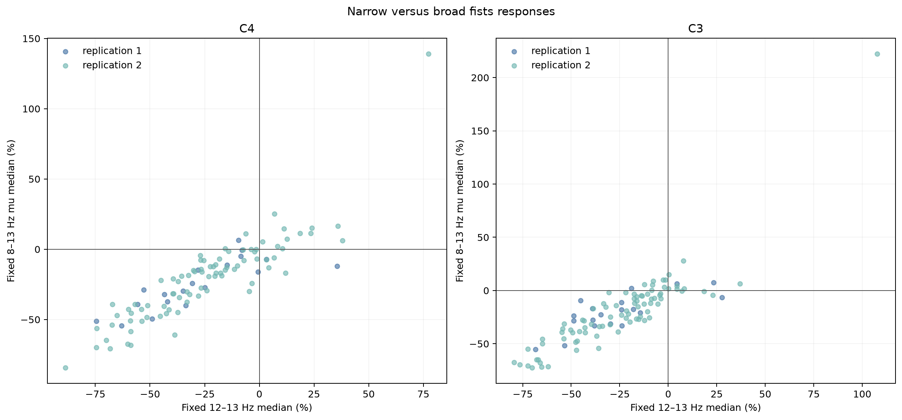
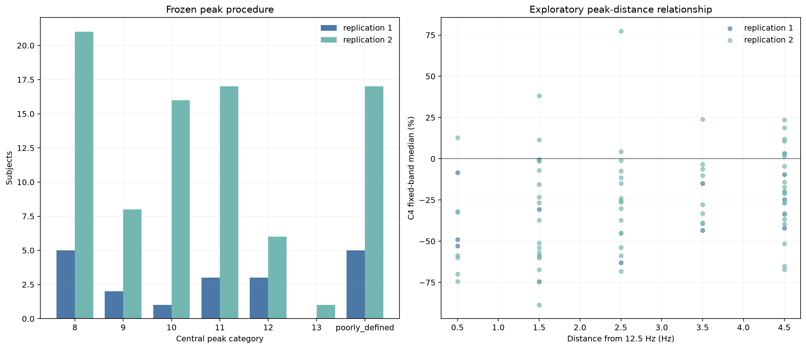

# Full-cohort EEG replication

[Back to the project README](../README.md)

## Purpose and scientific sequence

This milestone tests whether the two sensor-level findings developed in subject 1
and independently reproduced in subjects 2–20 persist in a much larger untouched
cohort. The sequence was deliberately preserved:

```text
subject 1                  development
    ↓
subjects 2–20             independent replication 1
    ↓
subjects 21–109           independent replication 2
    ↓
eligible subjects 2–109  combined replication evidence
```

Subject 1 never contributes to confirmatory group inference. Replication cohort 2
was audited and its eligibility recorded before its ERD outcomes were calculated.
The combined 2–109 summaries were produced only after cohort 2 was finalized.

The scientific method was frozen at commit `395df8e`, the pre-outcome protocol was
recorded at `dda2ab0`, and the resumable subject-at-a-time executor was committed at
`eb2a14c`. Later commits added code-aware checkpoint invalidation, locked technical
eligibility, and corrected an annotation-pairing assertion without changing a
scientific parameter. The complete freeze and correction history is in
[the pre-outcome record](full_cohort_freeze.md).

## What remained frozen

The following choices were not retuned after viewing cohort-2 outcomes:

- runs 6, 10, and 14, with `T0` rest, `T1` both fists, and `T2` both feet;
- deterministic all-channel-zero-tail detection rather than a universal crop;
- 64 standardized EEGBCI channels, average reference, and 1–40 Hz zero-phase FIR;
- task epochs `−2…+4 s`, paired-rest epochs `0…4 s`, and no time-domain baseline;
- task interval `1…3 s` and paired-rest interval `1.1…3.1 s`;
- Morlet centers 6–35 Hz, `n_cycles=f/2`, and decimation by 4;
- fixed 8–13 Hz mu, 14–30 Hz beta, and 12–13 Hz narrow bands;
- label-independent QC, with candidates retained in the primary analysis;
- C4 and C3 both-fists 12–13 Hz paired-rest percent change as the two primary
  subject-level measurements;
- the five frozen strong/mixed/failed replication rules.

No CSP, classifier, individualized primary band, all-channel outcome search, or
outcome-based exclusion was introduced.

## Technical audit before outcomes

The audit accounts for all 89 requested cohort-2 participants and all 267 requested
files. It loads each EDF with MNE and checks only data/protocol properties—not C3,
C4, ERD direction, or effect magnitude.

| Audit item | Cohort-2 result |
| --- | ---: |
| Requested subjects | 89 (21–109) |
| Technically eligible subjects | 86 |
| Requested runs | 267 |
| Compatible/usable runs | 258 |
| Loaded files | 267 |
| Compatible runs with 8/7 task order | 131 |
| Compatible runs with 7/8 task order | 127 |
| Confirmed flat or non-finite sensors | 0 |
| Outcome-based exclusions | 0 |

Subjects 88, 92, and 100 are technically incompatible under the frozen 160 Hz and
annotation protocol. Each of their three files loads and has 64 standardizable
channels, but is sampled at 128 Hz and has nonstandard annotation counts. Subjects
88 and 92 contain 19 rest plus 19 task annotations per run; subject 100 contains 12
plus 12. They were recorded as exclusions without replacements and before outcomes.
This is not evidence that their physiology is unusual—it only means the frozen
processing contract does not apply without a methodological change.

Stored file lengths and deterministic tails also vary. Across all 267 requested
runs, original sample counts are 19,680 (188 runs), 20,000 (57), 19,840 (13),
15,872 (6), and 15,744 (3). Detected all-channel-zero tails are 0 samples (191
runs), 80 (57), 144 (13), and 64 (6). Only the detected invalid tail is removed.

The machine-readable evidence is the
[run audit](assets/subjects01-109_full_replication_replication2_audit.csv) and
[eligibility table](assets/subjects01-109_full_replication_replication2_eligibility.csv).

## Trials, shapes, and independent units

The 86 eligible cohort-2 participants contribute 258 runs and 3,840 valid task/rest
pairs: 1,923 fists and 1,917 feet trials. Seventy-six people contribute 45 task
trials. Ten contribute 42 because one deterministic boundary-invalid task epoch per
run cannot provide the complete frozen analysis window. Those 30 epochs are omitted
by geometry, not by condition outcome; their paired rest epochs remain valid but are
not used without a valid task partner.

For one ordinary 45-trial subject, the selected-sensor TFR arrays have approximate
shapes `(45 trials, 3 channels, 30 frequencies, 241 task times)` and
`(45, 3, 30, 161 rest times)`. They exist only in memory. Compact trial and
subject summaries are checkpointed, so memory does not grow with cohort size.

Trials are nested inside runs and people. The pipeline therefore reduces trials to
one primary median per person before group analysis:

```text
trial spectral values → run summaries → one subject median → cohort distribution
```

The group sample size is 86 people, not 3,840 trials. Treating correlated trials as
independent people would be pseudoreplication.

## Meaning of the primary measurement

For task power \(P_{task}\) and the immediately preceding rest power \(P_{rest}\),
the trial value is

\[
100\times\frac{P_{task}-P_{rest}}{P_{rest}}.
\]

A negative value means less measured band power during the task interval than during
its paired rest interval; it is commonly described as ERD. It is a relative
sensor-level association, not direct neuronal activity, source localization, or a
causal statement. Medians reduce the influence of extreme trial values. The IQR is
the 25th-to-75th-percentile interval, and the MAD is a robust measure of spread around
the median.

## Independent replication cohort 2



### C4 primary result

| Quantity | Result |
| --- | ---: |
| Eligible subjects | 86 |
| Negative / positive / zero | 70 / 16 / 0 |
| Negative fraction | 81.40% (Wilson 95%: 71.89–88.21%) |
| Median of subject medians | −26.51% |
| IQR | −43.31 to −5.03% |
| Range | −88.71 to +77.38% |
| MAD | 19.29 percentage points |
| Bootstrap median 95% interval | −32.52 to −19.09% |
| 3/3, 2/3, 1/3, 0/3 negative runs | 46, 22, 12, 6 |
| Subjects with at least 2/3 negative runs | 68/86 (79.07%) |
| QC-sensitivity median | −26.68%; direction preserved |
| Leave-one-subject-out median range | −26.63 to −26.39%; direction preserved |
| One-sided exact sign test | \(p=1.60\times10^{-9}\) |
| Holm-adjusted across two primaries | \(p=1.60\times10^{-9}\) |
| Frozen category | **strong replication (5/5 criteria)** |

### C3 primary result

| Quantity | Result |
| --- | ---: |
| Eligible subjects | 86 |
| Negative / positive / zero | 75 / 11 / 0 |
| Negative fraction | 87.21% (Wilson 95%: 78.53–92.71%) |
| Median of subject medians | −21.07% |
| IQR | −45.29 to −8.62% |
| Range | −79.40 to +107.79% |
| MAD | 17.18 percentage points |
| Bootstrap median 95% interval | −31.38 to −15.43% |
| 3/3, 2/3, 1/3, 0/3 negative runs | 49, 27, 6, 4 |
| Subjects with at least 2/3 negative runs | 76/86 (88.37%) |
| QC-sensitivity median | −23.45%; direction preserved |
| Leave-one-subject-out median range | −21.57 to −20.56%; direction preserved |
| One-sided exact sign test | \(p=3.69\times10^{-13}\) |
| Holm-adjusted across two primaries | \(p=7.37\times10^{-13}\) |
| Frozen category | **strong replication (5/5 criteria)** |

The exact sign test asks whether negative and positive subject medians are equally
probable under a simple null. It uses signs, not magnitudes, and the two primary
p-values are Holm-adjusted. It is supporting inference rather than the definition of
replication: both conclusions come from the five criteria frozen in advance.

The within-subject negative-trial fraction is also heterogeneous. Its median is
68.18% at C4 (range 25.00–95.83%) and 66.67% at C3 (13.64–95.24%). A negative
subject median does not imply that every trial or run is negative.



## Replication 1 versus replication 2



| Sensor | Replication 1: negative, median, IQR | Replication 2: negative, median, IQR | Change |
| --- | --- | --- | --- |
| C4 | 17/19 (89.47%), −30.73%, −46.23 to −8.96% | 70/86 (81.40%), −26.51%, −43.31 to −5.03% | median 4.23 points less negative; negative fraction 8.08 points lower |
| C3 | 16/19 (84.21%), −29.83%, −42.18 to −18.50% | 75/86 (87.21%), −21.07%, −45.29 to −8.62% | median 8.76 points less negative; negative fraction 3.00 points higher |

The central result persists: C3 and C4 independently achieve strong replication in
the much larger untouched cohort. Magnitudes are less negative, especially at C3,
showing why subject 1 and the first small cohort should not define the expected
population effect size. C4's IQR width is similar across cohorts, but its total range
is wider in cohort 2. C3 is more heterogeneous by IQR, MAD, and total range; one C3
participant reaches +107.79%. Positive and mixed people remain included.

QC sensitivity preserves both directions in both cohorts. At least two of three run
medians support the direction in 89.47% versus 79.07% of people at C4, and 84.21%
versus 88.37% at C3.

## Combined replication evidence: eligible subjects 2–109

These summaries combine the 19 first-replication and 86 second-replication subjects
only after cohort 2 was independently finalized. They are not a third independent
replication.

| Primary feature | Negative subjects | Median | IQR | Range | 3/3, 2/3, 1/3, 0/3 runs |
| --- | ---: | ---: | ---: | ---: | ---: |
| C4 fists 12–13 Hz | 87/105 (82.86%) | −26.67% | −43.57 to −7.03% | −88.71 to +77.38% | 59, 26, 13, 7 |
| C3 fists 12–13 Hz | 91/105 (86.67%) | −23.90% | −45.23 to −9.13% | −79.40 to +107.79% | 61, 31, 7, 6 |

At least two runs support the direction in 85/105 (80.95%) at C4 and 92/105
(87.62%) at C3. QC-candidate exclusion leaves medians of −27.82% and −24.57%, and
every leave-one-subject-out cohort median remains negative. Subject 1 remains
excluded from these statistics.

## Development subject 1 in context

Subject 1 is −52.28% at C4 and −55.57% at C3. Both are more negative than the
combined replication IQRs. Relative to cohort 2, subject 1 ranks 18th-most-negative
of 87 displayed C4 values when subject 1 is included, and 13th-most-negative at C3;
80.2% and 86.0% of cohort-2 values, respectively, are less negative. Relative to the
105 combined replication subjects, its magnitude exceeds 80.0% at C4 and 87.6% at
C3.

Subject 1 therefore remains unusually strong relative to the middle half of the
replication distributions, especially at C3, but is no longer an extreme outlier in
the large cohort. Its role remains development, not confirmatory evidence.

## Label-independent QC robustness

Cohort 2 contains 493 task-candidate and 300 paired-rest-candidate flags among 3,840
pairs. It has no confirmed channel failure and no permanent artifact-trial exclusion.
Candidate status is based on signal properties without using condition labels or
ERD direction. Primary data retain every technically valid candidate; sensitivity
medians are calculated from copies.

Candidate burden is weakly related to absolute primary magnitude: Spearman ρ is
−0.134 at C4 and −0.012 at C3 in cohort 2 (combined: −0.071 and −0.026). These
exploratory values do not suggest that statistical candidates manufacture the group
effect, but they are not proof that artifacts are absent.

## Secondary frozen analyses

### Broad fists mu



| Cohort | Feature | Negative subjects | Median | IQR | Range |
| --- | --- | ---: | ---: | ---: | ---: |
| Replication 2 | C4 fists 8–13 Hz | 71/86 (82.56%) | −18.66% | −40.37 to −6.78% | −84.39 to +139.04% |
| Replication 2 | C3 fists 8–13 Hz | 71/86 (82.56%) | −20.80% | −38.76 to −3.62% | −72.62 to +222.28% |
| Combined | C4 fists 8–13 Hz | 89/105 (84.76%) | −18.99% | −40.04 to −7.23% | −84.39 to +139.04% |
| Combined | C3 fists 8–13 Hz | 87/105 (82.86%) | −20.89% | −35.76 to −4.35% | −72.62 to +222.28% |

Broad mu supports a frequent fists-related reduction, but the positive extremes and
weaker typical magnitude emphasize heterogeneity. It remains secondary because the
narrow band was the frozen primary endpoint.

### Feet

Feet responses remain heterogeneous. In cohort 2, narrow 12–13 Hz is negative in
61/86 at C3 (median −12.72%, IQR −24.46 to +3.95%) and 55/86 at C4 (−12.75%,
−26.86 to +6.50%). Broad mu IQRs also cross zero at C3, Cz, and C4. Combined results
show the same pattern: 73/105 negative at narrow C3 and 70/105 at narrow C4, with
both IQRs crossing zero. This is descriptive evidence, not a newly invented feet
hypothesis.

### Beta

Cz beta is negative for 68/86 fists participants (79.07%; median −13.51%, IQR
−28.28 to −2.35%) and 67/86 feet participants (77.91%; median −11.59%, IQR
−26.93 to −1.08%). Combined fractions are 84/105 and 83/105. The directional
tendency is notable but ranges include large positive values, and beta was secondary
before cohort 2. It is not promoted to a primary claim.

## Frozen central-peak analysis

The peak procedure averages unfiltered continuous Welch power across C3/Cz/C4,
examines integer centers 8–13 Hz, and requires the maximum to be at least 1 dB above
the six-center band median. It was not altered after outcomes.



In cohort 2, 69/86 (80.23%) peaks are well defined and 17/86 are poorly defined.
Peak categories are 8 Hz (21), 9 Hz (8), 10 Hz (16), 11 Hz (17), 12 Hz (6), and
13 Hz (1). The large 8-Hz boundary count and the discrete 1-Hz grid are important
limitations: this is a simple candidate detector, not a final individualized-mu
estimator.

Among people with a well-defined peak, Spearman correlation between distance from
12.5 Hz and the fixed-band change is positive: farther peaks tend to accompany a
less-negative fixed-band result.

| Cohort | Defined peaks | C4 ρ | C3 ρ |
| --- | ---: | ---: | ---: |
| Replication 1 | 14 | +0.300 | +0.482 |
| Replication 2 | 69 | +0.325 | +0.336 |
| Combined replication | 83 | +0.313 | +0.351 |

The repetition of a modest association in cohort 2 is useful exploratory evidence,
but it is unadjusted, does not prove causality, and cannot redefine the completed
primary band. A rigorous individualized-frequency study would need its rule frozen
in advance, a principled treatment for poorly defined peaks and boundary peaks, and
separation between data used to estimate a peak and data used to evaluate it.

## Reproducible implementation and artifacts

The orchestration lives in [`eeg_project/full_cohort.py`](../eeg_project/full_cohort.py)
and [`eeg_project/cohort_processing.py`](../eeg_project/cohort_processing.py), with
the command [`scripts/analyze_full_cohort_replication.py`](../scripts/analyze_full_cohort_replication.py)
and frozen policy [`config/full_cohort_replication.json`](../config/full_cohort_replication.json).

Important report artifacts include:

| Artifact | Purpose |
| --- | --- |
| [metadata JSON](assets/subjects01-109_full_replication_metadata.json) | frozen commit, fingerprint, 327 EDF hashes, cohort IDs, counts, and output inventory |
| [cohort comparison](assets/subjects01-109_full_replication_cohort_comparison.csv) | primary and secondary subject-level cohort summaries |
| [primary subject table](assets/subjects01-109_full_replication_subject_primary_table.csv) | eligibility and one primary value per requested person |
| [run consistency](assets/subjects01-109_full_replication_run_consistency_summary.csv) | 3/3 through 0/3 directional counts |
| [trial summaries](assets/subjects01-109_full_replication_replication2_trial_spectral_measurements.csv) | traceable cohort-2 trial/channel/band measurements |
| [QC summary](assets/subjects01-109_full_replication_subject_qc_summary.csv) | trial, rest, sensor, tail, and exclusion evidence |
| [peak summary](assets/subjects01-109_full_replication_central_peak_summary.csv) | frozen central peak evidence per eligible person plus subject 1 |
| [peak relationship](assets/subjects01-109_full_replication_peak_relationship.csv) | exploratory peak/fixed-band associations by cohort |

Checkpoints under Git-ignored `outputs/full_cohort_checkpoints/` contain compact,
validated summaries—not full TFR arrays. Reuse requires matching subject ID,
completion status, frozen configuration hashes, code hashes, and EDF identities.

Reproduce from the activated environment:

```bash
python scripts/analyze_full_cohort_replication.py --audit-only
python scripts/analyze_full_cohort_replication.py
python scripts/analyze_full_cohort_replication.py --verify-subjects 21 65 109
python -m unittest discover -s tests -v
```

See [Reproducibility](reproducibility.md) for acquisition, expected files,
checkpoint behavior, and verification details.

## Limitations

- The dataset cohort is a fixed convenience collection, not a random population
  sample, and no demographic or behavioral-performance covariates are analyzed.
- Subjects 88, 92, and 100 require a separately frozen 128-Hz compatibility study;
  they cannot simply be resampled and inserted after this outcome is known.
- Subject medians protect against trial-level pseudoreplication but do not fit a full
  hierarchical model of trials, runs, and people.
- The sign test discards magnitude and assumes independence between participants.
- Paired `T0` is an experimental rest interval, not a guaranteed neutral baseline.
- Statistical QC candidates are not confirmed artifacts; no EOG-based correction,
  ICA, interpolation, or permanent trial rejection was performed.
- Sensor-level relative power does not localize a cortical generator and cannot be
  interpreted as direct measurement of individual neurons.
- Fixed bands improve confirmatory comparability but may miss individual rhythms;
  the peak detector is exploratory and coarse.
- No decoding, CSP, LDA, or predictive evaluation occurred, so this milestone makes
  no classification claim.

## Conclusions and next decision gate

### Independent replication cohort 2 conclusion

Both frozen primary directions independently achieve **strong replication** in the
86 eligible subjects 21–109. C4 is negative in 70/86 with median −26.51%; C3 is
negative in 75/86 with median −21.07%. Run, QC, and leave-one-subject-out checks
preserve both directions. The wide distributions and positive participants show that
the result is frequent, not universal.

### Overall evidence across replication cohorts

The strong result from subjects 2–20 persists in the larger untouched cohort and in
the combined 105 eligible replication subjects. The full cohort supports a robust
sensor-level both-fists paired-rest reduction in the fixed 12–13 Hz band, while also
showing smaller typical magnitudes and more heterogeneity than subject 1 suggested.
Feet, beta, and peak associations remain secondary or exploratory.

### Recommended next decision

The most evidence-based next milestone is a **pre-registered individualized
mu-frequency methodology study**, not immediate classification. The peak-distance
association repeated with similar modest magnitude at C3 and C4 in the larger cohort,
but the current detector has boundary and poorly-defined-peak problems. The next
study should first define a leakage-safe peak estimator, fallback behavior, bandwidth,
and held-out evaluation, then compare it with the already validated fixed band.

Leakage-safe CSP/LDA decoding remains a reasonable later path, but classification
would currently add model complexity before resolving whether subject-specific
frequency definition materially improves the signal representation. No next-stage
analysis is started in this milestone.

### Subsequent individualized-method outcome

The recommended study was subsequently completed without altering the full-cohort
results above. Its final method was frozen before the odd-ID individualized outcomes.
It achieved 50/54 complete-subject coverage, but individualized bands had lower
negative-subject fractions, lower ≥2/3-negative-run fractions, wider median run
ranges, and positive individualized-minus-fixed paired differences at both C4 and
C3. Both frozen channel categories and the overall category were **no improvement**.

Accordingly, the exploratory peak-distance association in this chapter did its proper
job: it motivated a prospective test, but did not itself prove that personalization
would help. The fixed 12–13 Hz result remains the validated primary measurement. See
[Individualized central alpha/mu-frequency methodology](individual_mu_frequency.md)
for the estimator, chronology, held-out numbers, figures, and decision gate.
