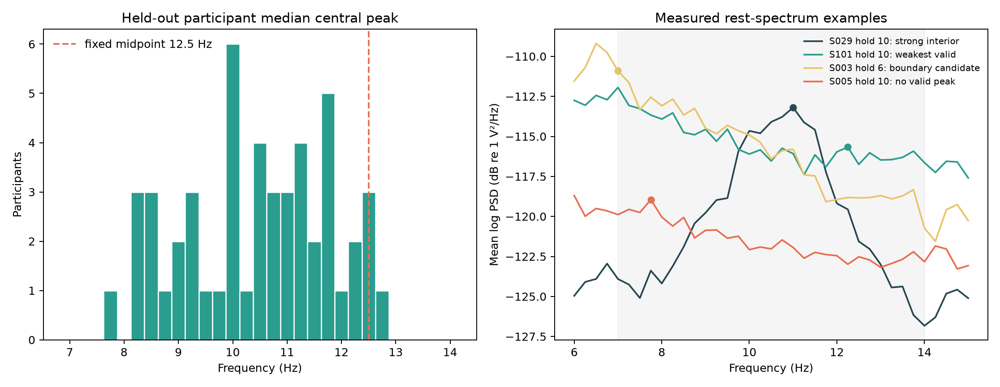
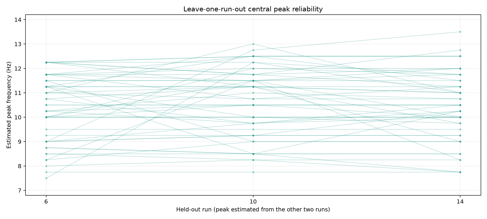
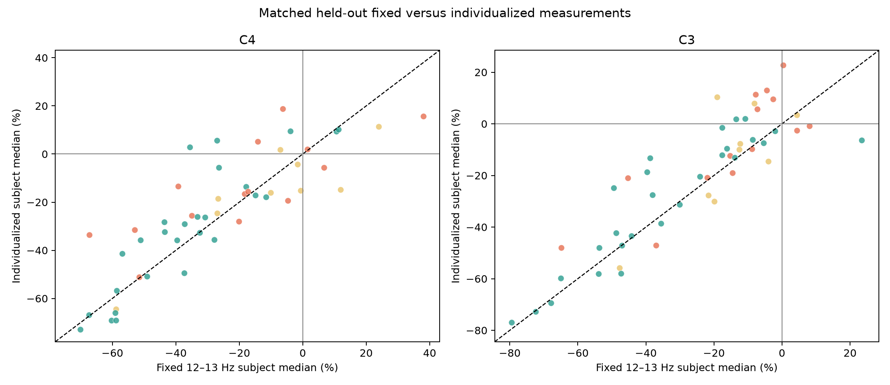
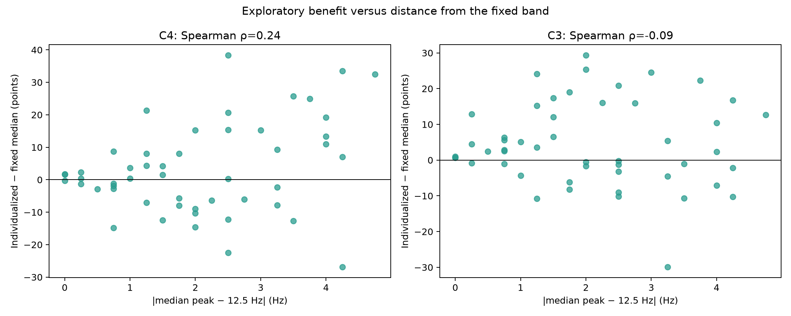

# Individualized central alpha/mu-frequency methodology study

[Back to the project README](../README.md)

## Initial pre-outcome freeze

This chapter begins at fixed-band milestone commit `d322c58`. No individualized
task/rest outcome had been calculated when the partition and candidate methodology
below were recorded. The validated fixed 12–13 Hz C3/C4 results remain unchanged
comparators; this study must earn any extra complexity rather than rewriting them.

The machine-readable initial freeze is
[`config/individual_mu_frequency.json`](../config/individual_mu_frequency.json).

## Alpha, mu, IAF, and IMF

Conventional posterior alpha is commonly strongest over parietal/occipital scalp and
is strongly related to visual state. Sensorimotor mu occupies a partly overlapping
alpha-range frequency region but is defined by central topography and sensorimotor
reactivity. A strong peak at Oz is therefore not automatically a sensorimotor mu
frequency.

Individual alpha frequency (IAF) is the broader idea of estimating a person's
dominant alpha-range spectral frequency. Here the target is narrower: an estimated
central alpha/mu-range peak derived from C3/Cz/C4 rest data. “Individual mu frequency”
is convenient shorthand, not a claim that every participant has one sharp, permanent,
or uniquely motor-specific oscillation.

Peaks can differ between people and recordings because of physiology, age, state,
recording conditions, reference, spectral resolution, broad or multiple oscillations,
aperiodic spectral background, and noise. A person's estimate can also vary between
runs. Reliability and failure-to-estimate are therefore methodological outcomes.

Primary studies distinguish central mu from posterior alpha by topography and
reactivity, and show that lower and upper central alpha-range components can behave
differently during movement ([Gastaut, 1978](https://doi.org/10.1016/0013-4694(78)90107-4);
[Pfurtscheller et al., 2000](https://doi.org/10.1016/S1388-2457(00)00428-4)).
Automated IAF research likewise shows that simple maximum-bin methods can be biased,
that spectra without clear peaks should remain unestimated, and that resting
estimates can be more reliable than task estimates
([Corcoran et al., 2018](https://doi.org/10.1111/psyp.13064);
[Mierau et al., 2022](https://doi.org/10.1111/ejn.15418)). These posterior-alpha
results motivate careful peak methodology but do not validate a central mu detector
for this dataset.

## Fixed versus individualized frequency

The fixed 12–13 Hz method applies one definition to everyone. It has clean
comparability, limited analytical freedom, complete technical-subject coverage, and
two independent replications. Its limitation is that it may not align with every
person's central rhythm.

An individualized band may align better with a person's rest spectrum, but introduces
peak noise, range boundaries, bandwidth choices, missing peaks, reduced comparability,
and opportunities for circular optimization. A larger negative number alone would
not establish a better method: low rest denominators, artifacts, or a narrow spectral
target can exaggerate percent change.

## Leakage rule

The following procedure is forbidden:

```text
inspect task ERD → select the frequency with strongest reduction → report that ERD
```

Peak estimation must never use fists/feet separation, ERD magnitude, or classifier
performance. Even label-independent estimation and evaluation on the same run would
share noise. Each held-out run is therefore evaluated using a peak estimated only
from T0 rest epochs in the other two runs:

```text
held-out 6  ← rest from 10 + 14
held-out 10 ← rest from 6 + 14
held-out 14 ← rest from 6 + 10
```

The hierarchy remains participant → held-out runs → trials. Runs are repeated
measurements, not independent people.

## Outcome-independent participant partition

All 105 technically eligible replication subjects from the completed full-cohort
report are partitioned by ID parity:

| IMF role | Rule | N |
| --- | --- | ---: |
| Method development | eligible even subject ID | 51 |
| Held-out method evaluation | eligible odd subject ID | 54 |

Subject 1 remains development history rather than part of this new comparison.
Subjects 88, 92, and 100 remain technically incompatible under the existing frozen
pipeline. Parity depends on neither fixed outcomes nor peak quality. Fixed-band
outcomes are already known for everyone, so the held-out group is untouched only with
respect to the new individualized task measurements—not the original physiology.

## Candidate method-development space

Only development-subset rest spectra may resolve the following limited choices:

- mean log PSD over the predefined C3/Cz/C4 ROI;
- 4-second Hann Welch segments at 160 Hz, giving 0.25 Hz resolution;
- candidate search intervals 7–14, 6–14, and 7–15 Hz;
- candidate prominence thresholds 0.5, 1.0, and 1.5 dB;
- quality classes `well_defined_interior`, `boundary_candidate`, and
  `poorly_defined_no_peak`;
- one candidate band half-width, ±1 Hz, evaluated later at 0.5-Hz Morlet centers.

Method selection may use coverage, boundary rate, cross-run frequency reliability,
and synthetic recovery. It may not use individualized task outcomes. A largest bin is
not automatically an oscillatory peak: a valid estimate must be an interior local
maximum with adequate prominence over its surrounding spectrum. A boundary maximum
is treated as ambiguous because the actual peak could lie outside the range.

No valid peak means the individualized measurement is unavailable. No frequency is
assigned manually. Fixed 12–13 Hz remains the complete-population result, while
direct method comparisons use the same matched subjects and require three valid
leave-one-run-out estimates.

## Questions frozen before development

The primary methodological questions are whether, in matched held-out subjects, the
individualized method improves or preserves (1) the negative-subject fraction and
(2) the fraction with at least two negative runs at C4 and C3. Coverage, peak
reliability, paired magnitude differences, QC sensitivity, dB sensitivity, broad-mu
comparison, and benefit versus distance from 12.5 Hz are also recorded before
evaluation.

No CSP or classifier is part of this study.

## Development-subset spectral evidence

The estimator implementation was committed before final method selection. It then
processed only the 51 even-ID development participants and only their T0 rest epochs.
No individualized task/rest outcome was calculated. The complete candidate evidence
is in the [development peak table](assets/individual_mu_method_development_peak_candidates.csv)
and [candidate summary](assets/individual_mu_method_development_candidate_summary.csv).

| Search and prominence | Valid folds | Complete 3-fold subjects | Median 3-fold span |
| --- | ---: | ---: | ---: |
| 6–14 Hz, 0.5 dB | 153/153 | 51/51 | 0.50 Hz |
| 6–14 Hz, 1.0 dB | 152/153 | 50/51 | 0.50 Hz |
| 6–14 Hz, 1.5 dB | 142/153 | 44/51 | 0.25 Hz |
| 7–14 Hz, 0.5 dB | 153/153 | 51/51 | 0.50 Hz |
| **7–14 Hz, 1.0 dB** | **151/153** | **49/51** | **0.50 Hz** |
| 7–14 Hz, 1.5 dB | 140/153 | 43/51 | 0.25 Hz |
| 7–15 Hz, 0.5 dB | 153/153 | 51/51 | 0.50 Hz |
| 7–15 Hz, 1.0 dB | 152/153 | 50/51 | 0.50 Hz |
| 7–15 Hz, 1.5 dB | 142/153 | 44/51 | 0.38 Hz |

The 7–14 Hz interval was selected because it covers the intended central alpha/mu
range without deliberately admitting more 6–7 Hz theta or 14–15 Hz beta candidates.
The 1 dB threshold avoids the permissive accept-everything behavior of 0.5 dB while
retaining substantially more complete participants than 1.5 dB. This choice used
coverage, boundary behavior, synthetic recovery, and frequency reliability—not task
effect magnitude.

Reliability remains an important limitation. Among 49 complete participants, 32 have
a three-fold peak span ≤0.5 Hz, four span 0.5–1.0 Hz, and 13 span more than 1 Hz.
The final method retains valid but unstable estimates and reports them explicitly;
it does not exclude a person because later individualized ERD is inconvenient.

## Final method freeze before held-out outcomes

The final method is:

```text
other two runs' T0 epochs
→ frozen 1–40 Hz average-reference preprocessing
→ one 4-s Hann Welch spectrum per epoch (0.25-Hz grid)
→ mean log PSD over epochs and C3/Cz/C4
→ 7–14 Hz interior local peak with ≥1 dB prominence
→ individualized band peak ±1 Hz at 0.5-Hz Morlet centers
→ evaluate fists task/rest change in the held-out run at C4 and C3
```

Boundary maxima and weak/no peaks are unavailable. Three valid held-out-fold peaks
are required for the primary matched comparison; no manual or task-derived fallback
is permitted. Peak span is classified as stable (≤0.5 Hz), moderate (>0.5–1 Hz), or
unstable (>1 Hz), but valid unstable cases remain included.

Percent change remains primary and dB is a sensitivity representation. Fixed narrow
12–13 Hz remains the validated primary comparator, broad 8–13 Hz remains secondary,
and all comparisons use the same matched evaluation subjects.

Before opening evaluation outcomes, clear improvement was defined to require at least
80% complete peak coverage, gains of at least five percentage points in both negative-
subject fraction and ≥2/3-negative-run fraction, a negative paired median difference,
and directionally concordant QC, dB, and leave-one-subject-out checks. Mixed results
require at least 60% coverage, a negative paired median difference, at least one
non-worse consistency metric, no loss larger than five points in the other metric,
and QC/dB agreement. Anything else is no improvement. A one-sided paired Wilcoxon
test with Holm adjustment for C4/C3 is supporting inference, not a category criterion.

At final-freeze commit `9eb3989`, held-out odd-ID individualized task outcomes
remained uninspected. The sections below report the subsequent evaluation; they do
not alter this historical statement or the frozen decision rule.

## Held-out evaluation: peak availability and frequency

The final method produced all three leave-one-run-out estimates for 50 of 54
technically eligible evaluation participants: **92.59% coverage**. Four participants
were unavailable because one required fold failed: subjects 3 and 49 had a boundary
maximum, while subjects 5 and 39 had no interior peak reaching 1 dB prominence. At
the fold level, 158/162 estimates were valid, 2/162 were boundary candidates, and
2/162 lacked a sufficiently prominent interior peak. Task outcomes played no role
in these decisions.

Among the 50 complete participants, the median of each person's three estimates had
a group median of **10.50 Hz**, IQR **9.31–11.50 Hz**, and range **7.75–12.75 Hz**.
These are estimated central alpha/mu-range peaks, not exact or permanent personal
frequencies.



Reliability was imperfect. The median three-fold span was **0.50 Hz** (IQR
0.25–1.25 Hz; range 0–4.75 Hz): 27/50 were stable, 9/50 moderate, and 14/50 unstable
under the frozen categories. Only 9/50 had exact agreement on the 0.25-Hz grid. The
separate single-run diagnostic was noisier still: 15 stable, 9 moderate, and 26
unstable. Pooling two training runs therefore improved stability, but did not make
the frequency invariant.



## Held-out fixed-versus-individualized comparison

The comparison includes only the 50 participants with three valid estimates and
uses exactly matched trials, channels, and EDF identities. A negative task-versus-
paired-rest change means lower band power during both-fists imagery. For a participant
and channel, the method difference is

\[
\Delta_{\mathrm{method}} =
\operatorname{median}(\mathrm{individualized\ percent\ change})-
\operatorname{median}(\mathrm{fixed\ 12\!\!-\!13\ Hz\ percent\ change}).
\]

Thus, a negative method difference would favor individualization; a positive value
favors the fixed band. The subject—not a trial or time-frequency pixel—is the group
observational unit.

| Frozen comparison | C4 | C3 |
| --- | ---: | ---: |
| Fixed 12–13 Hz negative subjects | 43/50 (86%) | 45/50 (90%) |
| Individualized negative subjects | 39/50 (78%) | 40/50 (80%) |
| Negative-fraction gain | −8 points | −10 points |
| Fixed group median | −27.39% | −18.29% |
| Individualized group median | −22.04% | −13.96% |
| Paired method-difference median (IQR) | +0.96 (−6.34 to +10.59) points | +2.44 (−2.02 to +12.80) points |
| Participants helped / worsened | 22 / 28 | 20 / 30 |
| Fixed with ≥2/3 negative runs | 41/50 (82%) | 46/50 (92%) |
| Individualized with ≥2/3 negative runs | 37/50 (74%) | 39/50 (78%) |
| Median fixed / individualized run range | 30.78 / 35.26 points | 33.61 / 39.11 points |
| QC-excluded paired difference | +1.44 points | +1.72 points |
| dB paired difference | +0.065 dB | +0.132 dB |
| Leave-one-subject-out median range | +0.38 to +1.54 points | +2.39 to +2.50 points |
| One-sided Wilcoxon, raw / Holm | 0.892 / 1.000 | 0.991 / 1.000 |
| Frozen category | **No improvement** | **No improvement** |

The p-values ask only whether individualized values tend to be lower than their
fixed counterparts. They are supporting checks, not evidence that the methods are
equivalent. More importantly, every pre-registered directional component opposes an
improvement claim: negative-subject fractions and run support decrease, run ranges
increase, and the paired, QC, dB, and leave-one-subject-out differences are positive.
The trimmed-mean differences are also positive (+2.38 C4; +4.18 C3), so the result is
not created by one extreme participant.



## Secondary comparisons

The individualized group median is more negative than broad 8–13 Hz at C4 (−22.04%
versus −18.96%) but less negative at C3 (−13.96% versus −14.82%). Because separate
group medians do not preserve pairing, the direct individualized-minus-broad subject
difference is more informative: median −1.95 points at C4 (29/50 helped) and −2.05
at C3 (30/50 helped). Thus the paired comparison modestly favors individualization
over the broad band, but not over the validated primary 12–13 Hz comparator. The
apparent C3 discrepancy is a normal consequence of taking a median of paired
differences rather than subtracting two separate medians.

Distance from the fixed midpoint did not identify a convincing benefit subgroup.
Spearman correlations between \(|\mathrm{peak}-12.5|\) and individualized-minus-fixed
change were **+0.24 at C4** and **−0.09 at C3**. A positive association at C4 means
that greater distance was, if anything, associated with a less favorable
individualized result. These are exploratory descriptive correlations, not subgroup
hypothesis tests.



Percent and dB representations agreed on the direction of the participant-level
method difference for all 50 matched participants at each channel. Seven of 2,250
trial/channel rows were flagged for unusually low individualized reference power,
but the predefined QC-exclusion sensitivity did not reverse either conclusion.

## Interpretation and decision

The method achieved good coverage and estimated heterogeneous central spectral
peaks, but it did **not** improve the validated both-fists measurement. It cannot be
said to improve physiological alignment merely because its band centers follow rest
spectra: the held-out functional comparison became less consistently negative at
both C4 and C3. The overall frozen category is **no improvement**.

The scientifically defensible decision is **A: retain the fixed bands and move
toward decoding methodology**. The fixed 12–13 Hz feature is simpler, covers all
technically eligible participants, has two independent replications, and performed
better in this prospective comparison. Individualized results remain useful as a
documented negative methodology study, not as a replacement or silently optimized
secondary feature.

If decoding is studied next, the first priority should be **within-subject decoding**.
Motor-imagery EEG patterns and covariance structure vary strongly between people;
within-subject cross-validation asks the attainable first question while keeping all
preprocessing and learned CSP transformations inside each training fold. Cross-
subject generalization is valuable but is a harder, distinct claim requiring explicit
alignment/domain-shift methods and a subject-held-out design.

## Limitations

- T0 is an experimental rest annotation, not a dedicated eyes-open/eyes-closed
  resting-state acquisition, and C3/Cz/C4 averaging does not prove a sensorimotor
  generator.
- A local-maximum/prominence rule on a 0.25-Hz grid simplifies broad, split, or
  aperiodic spectra. The ±1-Hz band and all thresholds are methodological choices.
- Leave-one-run-out separation prevents the evaluated run from selecting its own
  frequency, but estimates can still vary with state, noise, reference, and session.
- Fixed-band outcomes were historically known before the parity partition. The new
  individualized task outcomes were held out, but this is not a wholly untouched
  dataset in the broadest sense.
- The convenience cohort has no demographic or behavioral-performance analysis, and
  four technically eligible people lack a complete individualized measurement.
- Negative paired-rest power change is a sensor-level predictive association; it
  neither localizes a cortical cause nor measures individual neuronal activity.
- This milestone evaluates measurement methodology only. It contains no CSP, LDA,
  classification accuracy, or claim of clinical utility.

## Reproduction and report artifacts

From the activated environment, the development command is available for audit, but
the tracked candidate table should not be used to revise the already frozen method:

```bash
python scripts/analyze_individual_mu_frequency.py --develop-method
python scripts/evaluate_individual_mu_frequency.py
python -m unittest discover -s tests -v
python -m compileall -q eeg_project scripts tests
```

The evaluation script regenerates compact peak, spectrum, trial, subject, group,
relationship, metadata, and figure artifacts with prefix
`docs/assets/individual_mu_heldout_evaluation_`. It does not persist full TFR arrays.
The [group table](assets/individual_mu_heldout_evaluation_group_comparison.csv),
[subject table](assets/individual_mu_heldout_evaluation_subject_comparison.csv),
[peak summary](assets/individual_mu_heldout_evaluation_peak_subject_summary.csv), and
[metadata](assets/individual_mu_heldout_evaluation_metadata.json) are the shortest
machine-readable entry points.
