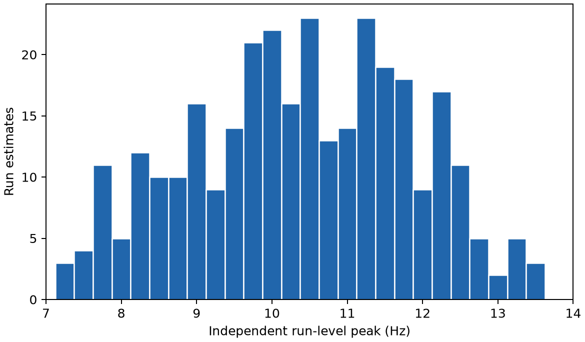
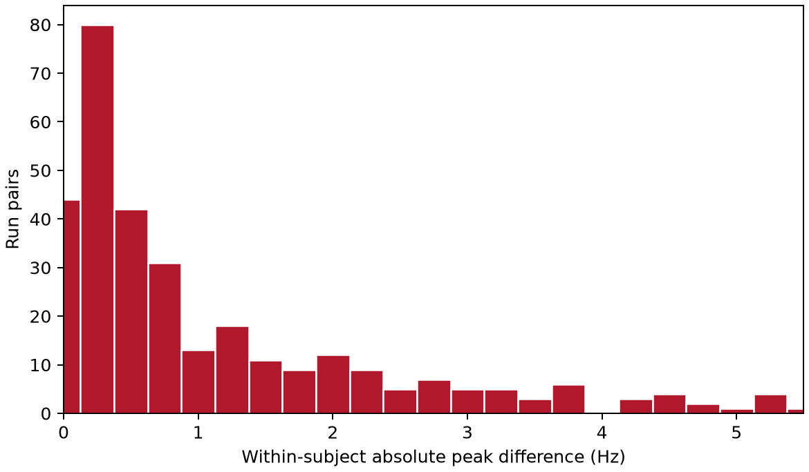
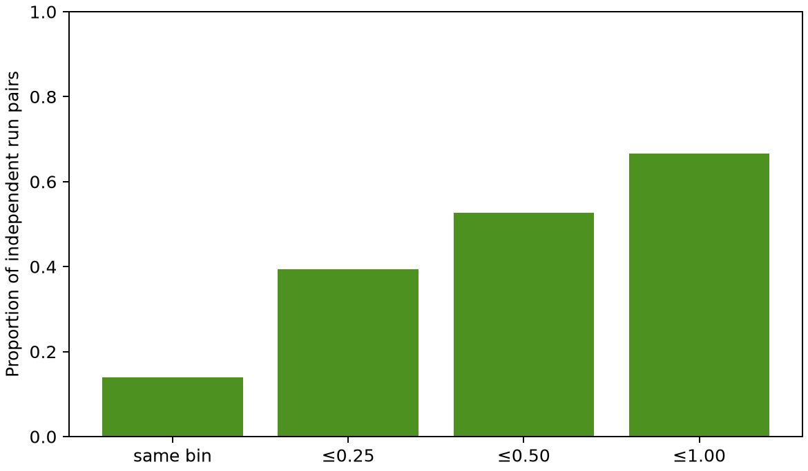

# v1.1 Individualized Mu Reliability Study

## Motivation and frozen scope

v1.0 tested whether a central rest-derived individualized frequency improved a
held-out task effect and concluded **no improvement**. That result, its 7–14 Hz
search, 1 dB prominence rule, and fixed 12–13 Hz comparator are historical and
unchanged. v1.1 is a `RELIABILITY` study: it asks whether the estimator itself is
stable across independent rest samples. It does not calculate a new task outcome,
and the 0.5 and 1.5 dB variants are pre-specified `ROBUSTNESS_DIAGNOSTIC`s only.

## Methods

All 105 technically eligible replication participants (subjects 2–109 excluding
88, 92, and 100) contribute runs 6, 10, and 14. Each run supplies only its own T0
rest epochs. The exact v1.0 algorithm averages C3/Cz/C4 single-epoch log Welch PSDs
(4-second Hann, 160 Hz, 0.25-Hz grid, no overlap and constant detrending), then
accepts only an interior 7–14 Hz local maximum with SciPy prominence at least 1 dB.
Boundary candidates and no/weak peaks are retained as unavailable, never imputed.

Every participant remains in the subject table. All unique independent run-pairs
contribute absolute differences; these pairs are clustered within people, so the
95% interval for their median uses 10,000 deterministic participant bootstraps
(seed 20260908), retaining all pairs for every resampled participant. Exact-grid,
0.25, 0.50, and 1.00 Hz agreement are reported with tolerant comparisons. The
machine-readable [summary](assets/individual_mu_reliability_summary.json),
[run table](assets/individual_mu_reliability_run_peaks.csv), [subject table](assets/individual_mu_reliability_subject_summary.csv),
and [provenance manifest](assets/individual_mu_reliability_provenance.json) are the
authoritative results.

## Results

At the frozen 1 dB threshold, all 105 participants had three available independent
run-level peaks (315/315 run estimates; Wilson 95% CI for complete availability
96.5–100%). The 315 within-subject pairs had median absolute disagreement **0.50 Hz**
(IQR 0.25–1.50; mean 1.09; SD 1.25; 90th percentile 3.00; maximum 5.50 Hz). The
participant-bootstrap 95% interval for the median was **0.50–0.75 Hz**. Agreement
was 14.0% in the same 0.25-Hz grid bin, 39.4% within 0.25 Hz, 52.7% within 0.50 Hz,
and 66.7% within 1 Hz. Exact-bin and ≤0.25-Hz agreement differ because a peak can
move by one grid step while still meeting the tolerance threshold.

The rest-only 0.5 dB sensitivity returned 315 valid estimates, identical median
disagreement (0.50 Hz), and 52.7%/66.7% agreement within 0.5/1 Hz. At 1.5 dB, 314
estimates were valid (99.7%), with the same 0.50-Hz median and 53.0%/67.1% agreement.
These descriptive variants were not joined to or optimized by task effects.

## Interpretation and limitations

The estimator was available in this dataset but was not invariant: one third of
independent pairs differ by more than 1 Hz, and the upper tail reaches 5.5 Hz. This
supports treating a rest-derived central peak as a state/run-dependent measurement,
not a permanent personal constant. It does not modify v1.0’s no-improvement finding.

The result is limited by short rest periods, 0.25-Hz spectral resolution, one session
per participant, a single sensor-level C3/Cz/C4 ROI, this PhysioNet cohort, and the
fact that a central spectral peak is not direct evidence of a unique neural generator.
It also deliberately measures fully independent one-run estimates; those are noisier
than v1.0's two-run leave-one-run-out estimates and answer a different question.

## Reproduction and verification

Run `python scripts/analyze_individual_mu_reliability.py` after acquiring the data.
It validates the frozen parent-config hash, reads raw EDF inputs without modifying
them, writes deterministic tables/figures, and records software/raw-source hashes.
The tests verify rest-only API design, invalid-peak preservation, pair arithmetic,
subject-level bootstrap determinism, stable schemas/order, and the unchanged v1.0
configuration and no-improvement metadata.
