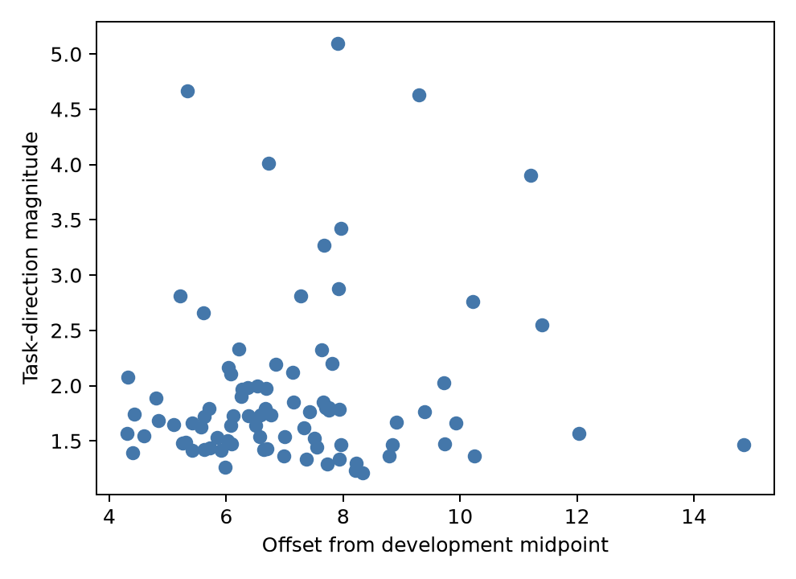
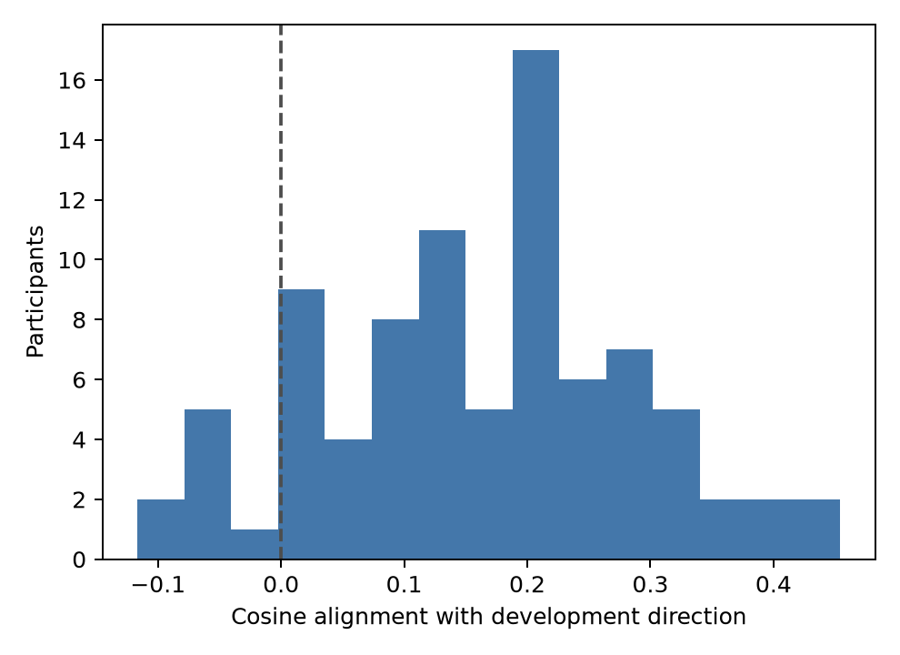
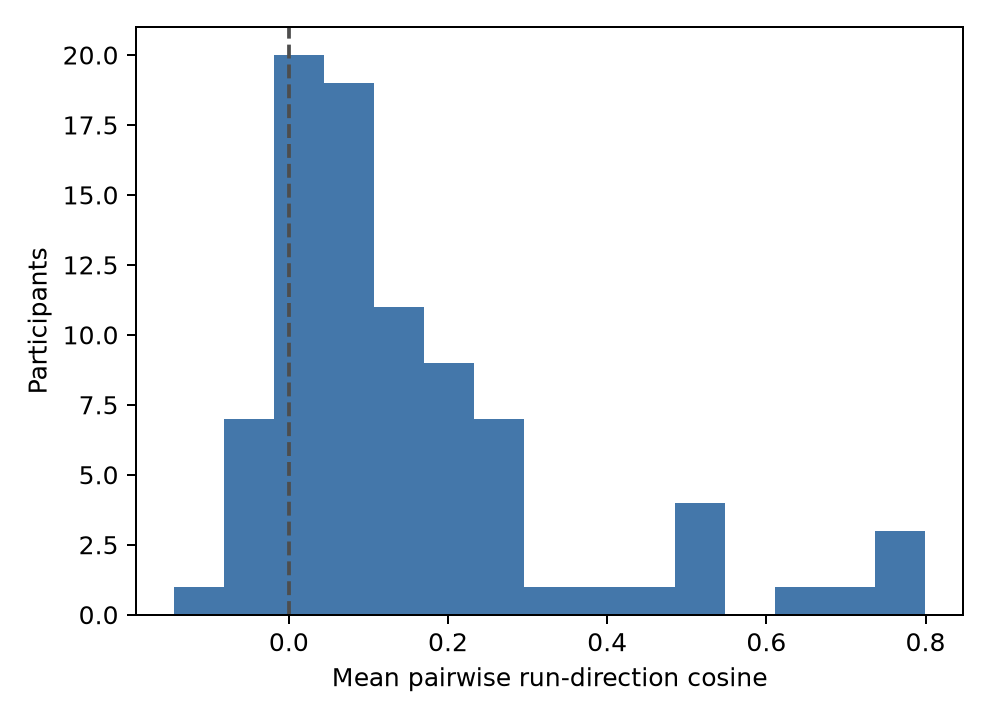
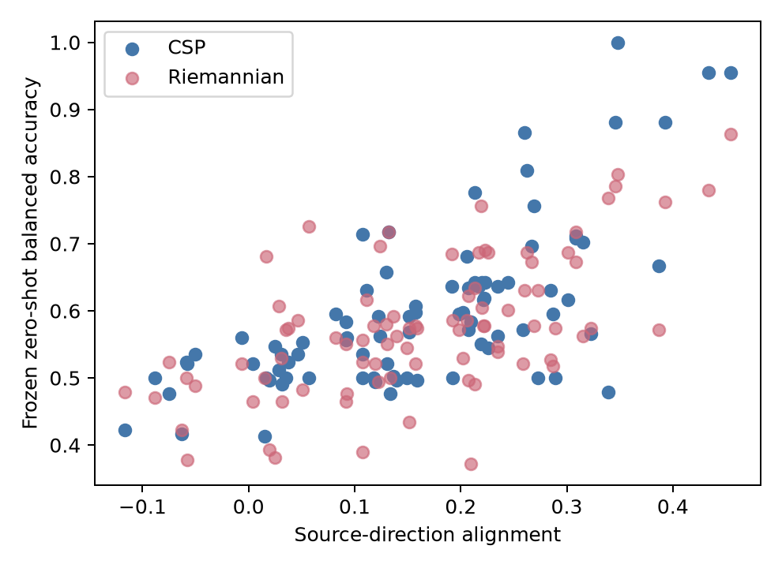

# Inter-participant/domain variability in motor-imagery covariance geometry

[Back to the project README](../README.md) · [Riemannian decoder](riemannian_decoding.md) · [Zero-shot CSP decoder](cross_subject_decoding.md)

## Initial analysis freeze

This study begins after the completed Riemannian decoding milestone at `d6102a6`.
It does **not** build, tune, or compare another decoder.  Its question is why the
already-frozen fists-versus-feet structure transfers better within a participant
than across participants.

The machine-readable policy is
[`config/inter_participant_domain_variability.json`](../config/inter_participant_domain_variability.json).
Subjects 1–20 define the geometry; the 86 eligible subjects 21–109 stay locked
until the geometry, summaries, correlations, and multiplicity family are frozen.

Each retained +1 to +3 s, 8–30 Hz trial is represented by the existing
trace-normalized Ledoit–Wolf 64×64 SPD covariance.  A single affine-invariant
Riemannian tangent reference is fit using development covariances only.  For each
participant and each of runs 6, 10, and 14, separate Riemannian means for fists and
feet are mapped into that fixed coordinate system.  With tangent vectors `f` and
`g`, respectively,

\[
m=(f+g)/2,\qquad d=f-g.
\]

`m` is a participant/domain location and `d` is a task-direction vector.  These are
covariance-pattern descriptions, not anatomical source localizations.

All group summaries first reduce observations to one value per participant.  The
pre-specified explanatory family contains only source-midpoint offset, source-task
direction alignment, and direction magnitude, each related by two-sided Spearman
correlation to the already-frozen zero-shot CSP and Riemannian balanced accuracies.
Holm correction covers all six correlations.  QC sensitivity only removes the
existing flagged trials; it cannot change the reference or the protocol.

## Frozen held-out geometry

The development reference and source vectors were committed at `8fb732f`; the final
analysis freeze was committed at `259c6e7` before the 86 evaluation participants
were mapped.  All evaluation prototypes reuse the resulting fixed reference.  The
evaluation script validates the existing covariance checkpoint, source, frozen
configuration, and historical-score hashes; it does not fit a classifier or alter a
historical prediction.

| Prototype-distance comparison | Participant-median tangent distance (IQR) |
| --- | ---: |
| Same participant, fists versus feet | 2.784 (2.425–3.065) |
| Same participant, same task across runs | 3.951 (3.391–4.525) |
| Different participants, same task | 9.705 (9.197–10.654) |
| Different participants, different task | 9.719 (9.209–10.703) |

The between-person same-task distance is 3.49 times the within-person task
separation.  Changing the task label across people barely changes that already-large
distance (9.719 versus 9.705).  This is direct evidence that participant/domain
location dominates condition identity in this fixed covariance geometry.



## Is the task direction shared?

The participant-average direction magnitude has median 1.724 (IQR 1.473–2.017), so
there is usually a non-zero covariance contrast.  But its median cosine alignment
with the development source direction is only 0.157 (IQR 0.084–0.242; range
−0.117–0.454).  The median participant's mean cosine to all other evaluation
participants is 0.052.  Thus strong direction magnitude does not imply a common
fists-versus-feet orientation: directions are weakly shared and substantially
heterogeneous.



## Run stability

The three within-person run directions have median mean pairwise cosine 0.094 (IQR
0.039–0.212; range −0.145–0.800); 52/86 (60.5%) have all three pairwise cosines
positive.  Same-task prototype distance across runs also exceeds the typical
within-run fists-feet separation.  This supports meaningful run instability rather
than a stable, uniformly oriented individual contrast.

The historical QC flags are not an additional outcome or selection rule here.  They
were already assessed in the decoder milestones; this descriptive geometry result
uses every retained trial so that it answers the frozen cohort question without
creating a second post-hoc analysis family.



## Pre-specified explanations of zero-shot performance

The six correlations below are participant-level, two-sided Spearman tests.  Holm
adjustment covers the complete three-predictor × two-decoder family.

| Geometry quantity | CSP BA ρ (Holm p) | Riemannian BA ρ (Holm p) |
| --- | ---: | ---: |
| Source-midpoint offset | −0.016 (0.884) | +0.113 (0.599) |
| Source-direction alignment | **+0.646 (<0.000001)** | **+0.578 (<0.000001)** |
| Task-direction magnitude | +0.258 (0.049) | +0.293 (0.025) |

Offsets alone do not explain failure.  Alignment with the frozen source contrast is
the largest association for both decoders, with smaller positive associations for
contrast magnitude.  The same geometric explanation therefore applies to CSP and
Riemannian failures despite their different representations; this is association,
not evidence of a cortical source mechanism or causal explanation.



The persistent poor-CSP subgroup (21 participants at CSP BA ≤0.50) has lower median
source alignment (0.107 versus 0.207), similar direction magnitude (1.685 versus
1.730), and similarly low run alignment (0.088 versus 0.100) compared with the
other 65.  It is therefore more consistent with mismatched task direction than with
simply absent task signal, although the subgroup is descriptive and was defined by
the outcome.

## Decision gate

The strongest evidence supports **D: multiple mechanisms matter**.  Large
participant/domain offsets establish why raw pooled geometry is difficult, while
weakly shared task directions and low run consistency explain why a simple global
alignment is unlikely to be enough.  The smallest next experiment should separate
domain alignment from task-direction calibration using a newly frozen protocol; none
is implemented here.

## Reproduction and verification

```bash
python scripts/develop_inter_participant_domain_variability.py
python scripts/evaluate_inter_participant_domain_variability.py
python -m unittest tests.test_inter_participant_domain_variability tests.test_inter_participant_domain_variability_artifacts -v
```

The compact [participant geometry](assets/inter_participant_domain_variability_evaluation_participant_geometry.csv),
[distance summary](assets/inter_participant_domain_variability_evaluation_distance_summary.csv),
[primary correlations](assets/inter_participant_domain_variability_evaluation_primary_correlations.csv),
and [metadata](assets/inter_participant_domain_variability_evaluation_metadata.json)
carry the reproducible values and source hashes.

## What you should understand now

- A shared tangent coordinate system lets us compare covariance contrasts across people, but it does not make their EEG domains identical.
- A midpoint measures location in this covariance representation; a task direction measures the fists-versus-feet contrast around that location.
- The much larger between-person distances show domain variation, whereas low direction cosine shows task-representation heterogeneity.
- Participant—not individual pair—remains the observational unit for these summaries and correlations.
- The associations explain why transfer may fail; they do not localize brain sources or prove a biological cause.
