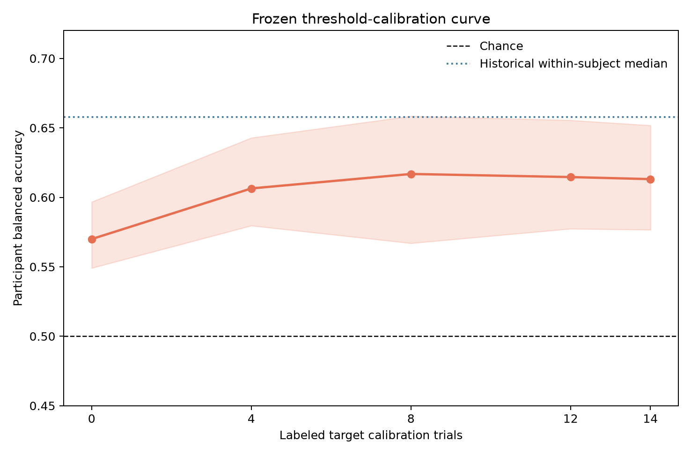
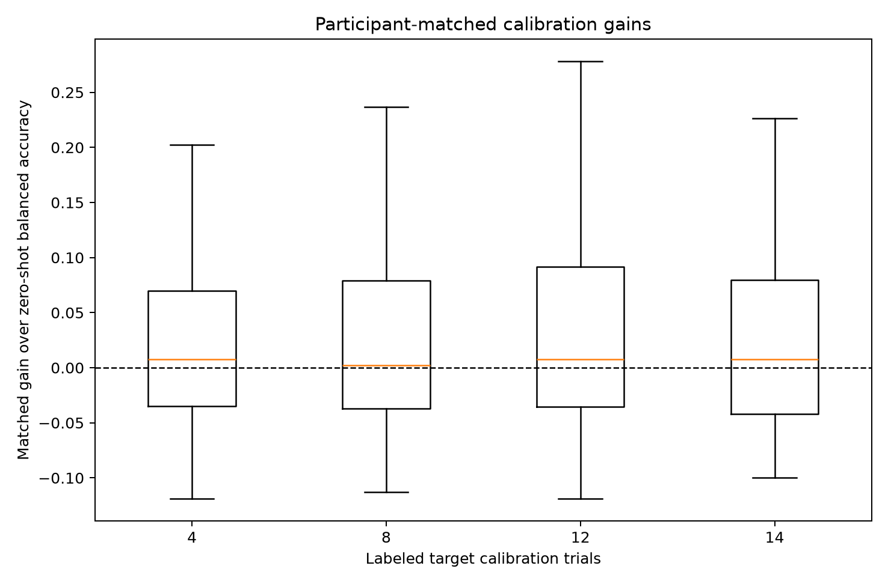
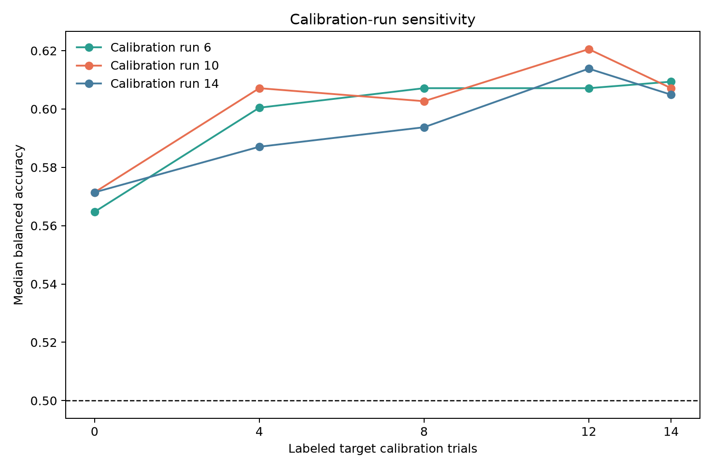

# Minimal supervised target-participant calibration

[Back to the project README](../README.md) ·
[Zero-shot cross-subject decoder](cross_subject_decoding.md) ·
[Within-subject decoder](within_subject_decoding.md)

## Initial methodology freeze

This new study starts from the completed zero-shot milestone at commit `6dca561`.
It does not revise the frozen zero-shot CSP median of 0.570, spectral median of
0.536, or historical within-subject CSP median of 0.658. Its question is narrower:

> How many labeled motor-imagery trials from a new participant are needed to improve
> the frozen cross-subject CSP decoder?

The complete pre-outcome policy is
[`config/minimal_target_calibration.json`](../config/minimal_target_calibration.json).
Subjects 1–20 develop one global calibration method. Calibration outcomes for the
86 eligible subjects 21–109 remain locked until that method and all success rules
are committed.

## What calibration changes

The source model still learns four 8–30 Hz CSP spatial features and feature scaling
from source participants only. Calibration supplies a small labeled target array
with shape `(calibration trials, 4 source-scaled CSP features)` and may modify only
the final decision rule:

```text
source participants → fit CSP → fit scaler → source feature space
target calibration run → frozen CSP/scaler → calibrate decision layer
other two target runs → frozen CSP/scaler → calibrated prediction
```

Threshold calibration retains the source LDA coefficients and changes the point on
its one-dimensional decision-score axis where predictions switch class. Target-LDA
instead fits a new equal-prior shrinkage-LDA head to the small labeled calibration
set, while the source CSP and scaler remain fixed. Neither method adapts spatial
filters, preprocessing, covariance alignment, or an unlabeled target distribution.

Calibration is supervised model adaptation, not evaluation. If a test run helped
choose the threshold, fit the head, or estimate scaling, its later accuracy would be
optimistically biased. Therefore one whole run calibrates and the other two runs are
strictly test-only, repeated for calibration runs 6, 10, and 14.

## Frozen calibration curve

Each calibration run contributes deterministic, nested, class-balanced subsets:

| Total labeled trials | Fists | Feet | Selection |
| ---: | ---: | ---: | --- |
| 0 | 0 | 0 | unchanged source LDA |
| 4 | 2 | 2 | first two of each class |
| 8 | 4 | 4 | first four of each class |
| 12 | 6 | 6 | first six of each class |
| 14 | 7 | 7 | first seven of each class |

“First” means annotation chronology within that run. No trial is selected because
it looks clean or produces a favorable outcome. The primary participant score at
each size is the unweighted mean of six balanced accuracies: two held-out test runs
under each of three calibration-run scenarios. Repeated appearances of a test run
are not independent observations; group summaries contain one value per participant.

## Development selection and evaluation success

Development compares threshold calibration and target-LDA using LOSO source models:
the other 19 subjects fit source CSP/scaling, and the twentieth supplies calibration
and test runs. Each method's participant utility is their mean score across the four
nonzero sizes. Target-LDA is selected only if its paired utility exceeds threshold
by a median of at least 0.02 and it is better for at least 60% of development
participants. Otherwise the simpler threshold adjustment is selected. Development
chooses one method, never a different size for each participant.

The final evaluation must report all five sizes. The smallest burden earns the
predefined **convincing benefit** designation only if it simultaneously reaches:

- median balanced accuracy at least 0.60;
- median matched gain at least 0.03 and improvement in at least 60% of participants;
- median recall of each class at least 0.55 with no more than 0.10 imbalance;
- one-sided exact participant sign-test `p ≤ 0.05` for positive gain;
- median QC-sensitivity change no worse than −0.02.

The QC diagnostic leaves the calibration set unchanged and excludes existing
statistical-candidate trials only from held-out scoring. It cannot change the method
or burden. Bootstrap confidence intervals use 10,000 resamples and seed `20260901`.

At this freeze, no calibration outcome has been calculated. Results, limitations,
reproduction instructions, and the final decision gate will be added only after the
development and evaluation boundaries have been respected.

## Development comparison

After the initial freeze was committed, subjects 1–20 were evaluated with LOSO
source models. For each target, the other 19 participants supplied 855 source trials;
the target supplied one calibration run and two strictly held-out test runs. Four
labeled trials were mathematically sufficient for the existing shrinkage-LDA head,
so both candidates were evaluated across the complete curve without fallback logic.

| Method | 0 trials | 4 trials | 8 trials | 12 trials | 14 trials |
| --- | ---: | ---: | ---: | ---: | ---: |
| Threshold median accuracy | 0.568 | 0.615 | 0.586 | 0.624 | 0.637 |
| Threshold median matched gain | 0.000 | −0.013 | −0.017 | −0.011 | −0.011 |
| Target-LDA median accuracy | 0.568 | 0.548 | 0.596 | 0.612 | 0.602 |
| Target-LDA median matched gain | 0.000 | −0.024 | +0.005 | −0.010 | −0.020 |

Separate cohort medians rise for threshold calibration at some sizes, yet the
participant-matched median gains are negative. This is possible because the median
participant at one size need not be the median participant at another; it is why the
pre-frozen decision uses matched changes rather than a difference of medians.

For each participant, utility was averaged over sizes 4, 8, 12, and 14. The median
target-LDA-minus-threshold utility was −0.010 (IQR −0.037 to +0.027): target-LDA was
better for 9/20 participants and threshold calibration for 11/20. Target-LDA
therefore fails both selection conditions (gain at least +0.02 and better in at least
60%). The selected global method is **threshold calibration**. Evaluation subjects
and their calibration outcomes remained unopened throughout this choice.

Development artifacts include the [curve summary](assets/target_calibration_development_curve_summary.csv),
[method selection](assets/target_calibration_development_method_selection.csv),
[participant scores](assets/target_calibration_development_participant_scores.csv),
[predictions](assets/target_calibration_development_predictions.csv), and
[fit audit](assets/target_calibration_development_fit_audit.csv). The fit audit
records exact nested calibration identities and confirms that target EEG entered
neither source CSP nor source scaling. A repeated development run regenerated all
eight artifacts byte-for-byte identically.

## Final held-out calibration curve

The final threshold method was committed at `80e5ebc` before any evaluation-subject
calibration outcome was calculated. One CSP/scaler/LDA source model was fitted on
900 trials from subjects 1–20. Its CSP, scaler, and LDA coefficients were then fixed;
only one threshold was selected from each labeled target calibration subset. All 86
eligible subjects completed all sizes and scenarios, contributing 3,840 unique task
trials and 38,400 traceable test-prediction appearances across five sizes and two
allowed calibration contexts per trial.

| Labeled trials | Median (95% bootstrap CI) | IQR | Median matched gain | Improved / worsened / tied | ≥0.60 | ≥0.70 | Median fists/feet recall |
| ---: | ---: | ---: | ---: | ---: | ---: | ---: | ---: |
| 0 | 0.570 (0.549–0.597) | 0.505–0.641 | 0.000 | 0 / 0 / 86 | 32/86 (37.2%) | 14/86 (16.3%) | 0.762 / 0.600 |
| 4 | 0.606 (0.580–0.643) | 0.528–0.687 | +0.007 | 46 / 39 / 1 | 47/86 (54.7%) | 20/86 (23.3%) | 0.636 / 0.611 |
| 8 | 0.617 (0.567–0.658) | 0.518–0.715 | +0.002 | 44 / 42 / 0 | 45/86 (52.3%) | 23/86 (26.7%) | 0.652 / 0.644 |
| 12 | 0.615 (0.577–0.656) | 0.513–0.721 | +0.007 | 45 / 39 / 2 | 46/86 (53.5%) | 26/86 (30.2%) | 0.659 / 0.651 |
| 14 | 0.613 (0.577–0.652) | 0.526–0.717 | +0.007 | 45 / 40 / 1 | 44/86 (51.2%) | 24/86 (27.9%) | 0.636 / 0.656 |



Threshold adjustment substantially reduces the zero-shot class-recall asymmetry,
but the participant-matched performance benefit is small. The one-sided sign-test
`p` values are 0.258, 0.457, 0.293, and 0.332 for sizes 4, 8, 12, and 14. No size
reaches the frozen median gain of +0.03 or 60% improved-participant thresholds.
Therefore **no calibration burden provides convincing benefit**, even though every
calibrated cohort median exceeds 0.60.

This distinction is important. A higher median at 8 trials does not mean that a
typical individual gained 0.047 over zero-shot. Different participants occupy the
middle of the distributions; the matched median gain is only +0.002.



## Saturation, run identity, and QC

The first four labels produce a +0.007 median incremental gain. Adding trials from
4→8, 8→12, and 12→14 produces median incremental gains of exactly 0.000; only 38.4%,
44.2%, and 29.1% improve at those successive increments. The curve therefore
**saturates after the first four trials**, but at a benefit too small and inconsistent
to qualify as useful calibration.

Calibration-run medians differ by at most 0.020 at four trials, 0.013 at eight,
0.013 at twelve, and 0.004 at fourteen. Exploratory matched Friedman `p` values are
0.761, 0.921, 0.155, and 0.324, respectively. There is no evidence here that choosing
run 6, 10, or 14 materially changes the conclusion.



The copied QC diagnostic changes participant scores by a paired median of +0.001 at
four trials, +0.0002 at eight, and 0.000 at twelve and fourteen. All 86 participants
remain represented. The negative decision is not caused by retained statistical
quality candidates.

## Who benefits?

The 21 participants whose historical zero-shot CSP score was at or below 0.50 gain
more than the full group: median gains are +0.031, +0.036, +0.046, and +0.048 across
4–14 trials, with 14–15/21 improving. Yet their calibrated medians remain only
0.512–0.531. Selecting a subgroup because its baseline is low also invites
regression-to-the-mean effects, so this pattern is exploratory rather than a subgroup
claim.

The 11 historically persistent low within-subject performers do not improve: their
median gains range from −0.024 to −0.036, only 2–3/11 improve, and calibrated medians
remain 0.487–0.531. A threshold cannot create separability when the source feature
representation contains little stable task information.

Historical zero-shot accuracy has a weak negative relationship with gain
(`ρ = −0.13` to `−0.22`). Stronger, more negative historical C3/C4 ERD is weakly
associated with larger gains (`ρ = −0.22` to `−0.27`; unadjusted `p = 0.011–0.041`).
These post-primary correlations are unadjusted, cannot select the method, and do not
establish a mechanism.

## Comparison with historical personal training

The closest calibration point by separate medians is eight trials: 0.617 versus the
historical within-subject median of 0.658, a 0.041 difference. On matched participants,
the eight-trial median calibrated-minus-within difference is −0.032; historical
within-subject decoding is better for 53/86, calibration for 30, with three ties.
These designs are not identical—the historical model trains on two complete runs—so
the comparison describes distance to that benchmark rather than a controlled
training-quantity effect.

## Scientific interpretation and decision gate

The strongest supported interpretation is that a mislocated global decision
threshold explains some class imbalance and a small amount of poor-zero-shot
performance, but it is not the main cross-participant bottleneck. Four labels extract
nearly all available threshold benefit. More labels cannot repair participant-specific
spatial patterns or overlap already embedded in the frozen source CSP feature space,
and persistent low performers receive no rescue.

The decision is **D: calibration provides little benefit; investigate
representation/generalization limits**. No practical calibration burden is selected.
A future study must be separately frozen and must not use these opened outcomes to
post-hoc tune a target spatial or domain-adaptation method.

That separately frozen follow-up is now complete. With the burden held at 14 labels,
target LDA did not improve source-CSP accuracy and target CSP added only +0.014 over
target LDA; its spatial subspaces were uniformly unstable across calibration runs.
The result supports reconsidering the representation rather than increasing CSP
complexity. See [Decision-layer versus spatial personalization](spatial_personalization.md).

## Reproduction and verification

From the activated environment:

```bash
python scripts/develop_target_calibration.py
python scripts/evaluate_target_calibration.py
python -m unittest tests.test_target_calibration tests.test_target_calibration_development_artifacts tests.test_target_calibration_final_freeze tests.test_target_calibration_evaluation tests.test_target_calibration_evaluation_artifacts -v
python -m unittest discover -s tests -v
python -m compileall -q eeg_project scripts tests
```

The evaluator validates the final config, frozen calibration core, frozen
cross-subject core, all 60 source EDF hashes, and three target EDF hashes per
checkpoint. A checkpoint-only rebuild reused all 86 feature records; two consecutive
rebuilds produced all 15 report files byte-for-byte identically. Size zero exactly
reproduces every historical zero-shot participant score. Historical within-subject,
zero-shot, reliability, and physiology files remain byte-unchanged.

Primary machine-readable entry points are the [curve summary](assets/target_calibration_evaluation_curve_summary.csv),
[participant scores](assets/target_calibration_evaluation_participant_scores.csv),
[matched gains](assets/target_calibration_evaluation_matched_gain_subjects.csv),
[trial predictions](assets/target_calibration_evaluation_predictions.csv),
[fit audit](assets/target_calibration_evaluation_fit_audit.csv),
[subgroup results](assets/target_calibration_evaluation_subgroup_gains.csv),
[run sensitivity](assets/target_calibration_evaluation_calibration_run_summary.csv),
and [metadata](assets/target_calibration_evaluation_metadata.json). Compact feature
checkpoints under `outputs/target_calibration_checkpoints/` are excluded from Git.

## Limitations

- Calibration is simulated from three short same-session runs in one public dataset;
  it is not a prospective onboarding session or cross-day/device test.
- Threshold selection searches a tiny labeled sample and can be unstable even though
  trial identities and tie-breaking are deterministic.
- The candidate study tested only threshold adjustment and the existing target-LDA
  head; it does not compare spatial or domain-adaptation methods.
- Test trials appear under two calibration scenarios, so only participant-level
  aggregates support group conclusions.
- Low-baseline and ERD findings are exploratory and susceptible to regression to the
  mean, multiplicity, and confounding.
- Historical within-subject performance uses two training runs and is not an equal-
  sample comparator for the calibration curve.

## What you should understand now

- Calibration data may adapt a decision rule, but test runs must remain invisible to
  threshold selection, feature scaling, and all fitting.
- Four labels correct much of the source model's class bias, yet the matched accuracy
  gain is only +0.007 and is not consistent across participants.
- A difference between cohort medians is not a participant-matched treatment effect.
- Adding 8–14 labels does not add median benefit beyond four labels, so more samples
  from one run do not solve the frozen representation's transfer problem.
- Persistent low performers need more than a shifted decision threshold; the next
  scientific question concerns representation/generalization, not calibration burden.
