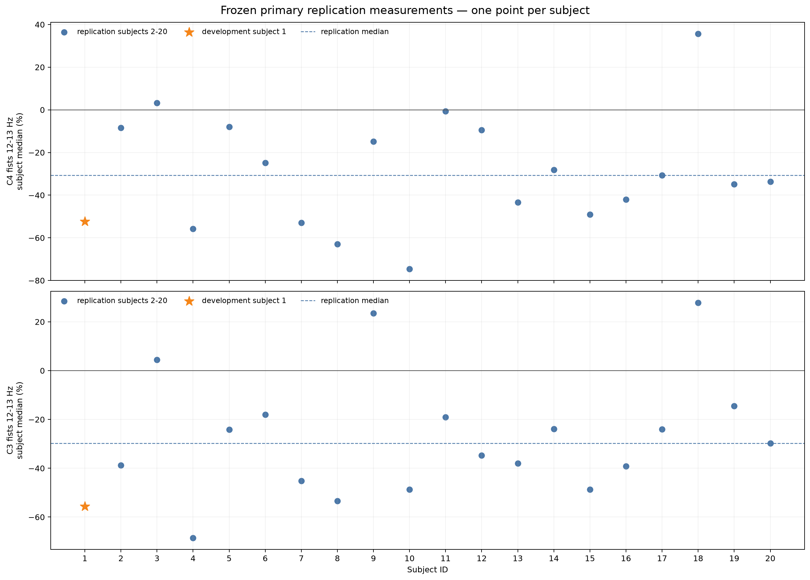
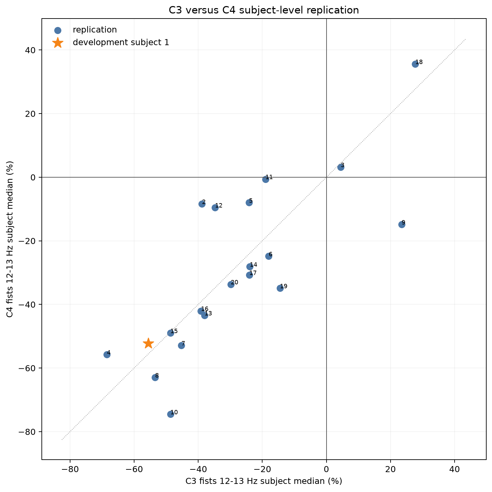
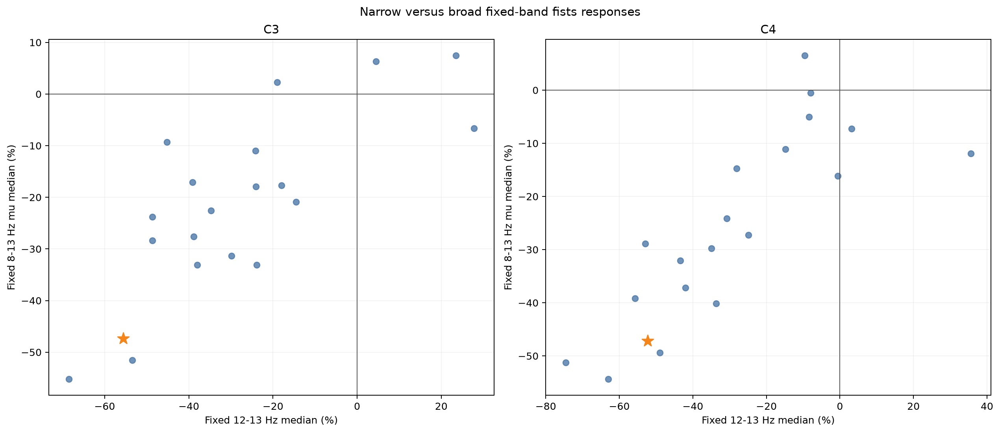
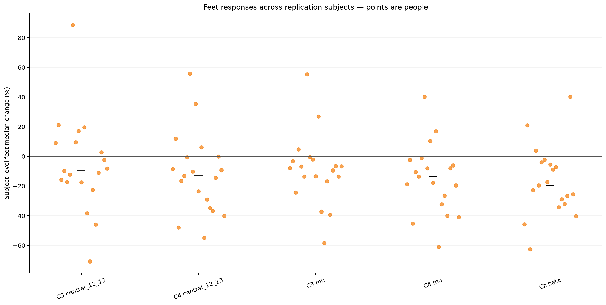
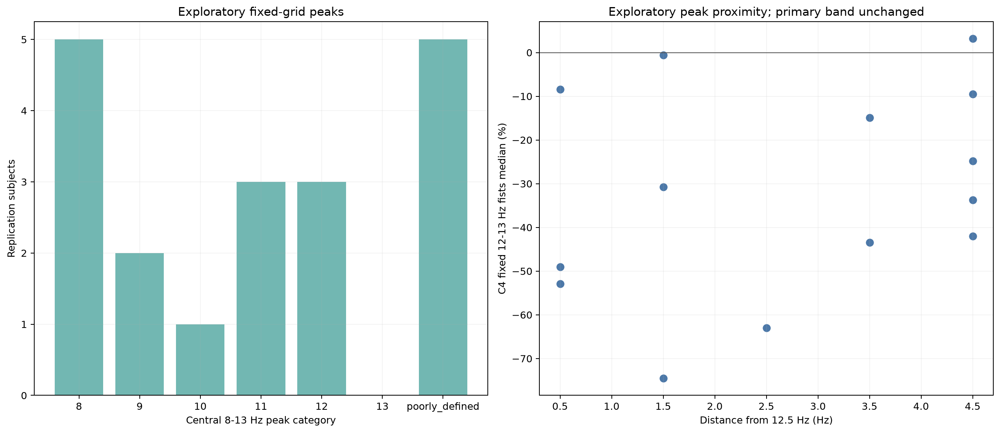

# Multi-subject replication and pipeline generalization

## Purpose and conclusion

Subject 1 was used to develop the analysis and identify two primary sensor-level
questions. This milestone freezes that methodology and asks whether the same
paired-rest 12–13 Hz both-fists direction occurs in new people. The cohort was
defined before inspecting outcomes:

- subject 1: development subject;
- subjects 2–20: 19 replication subjects;
- runs 6, 10, and 14 for every subject.

All 60 requested EDFs are technically compatible and all 20 subjects are included.
The replication analysis contains 855 trials from subjects 2–20, but its group unit
is 19 subjects—not 855 independent people. Under success criteria recorded before
spectral outcome processing, both primary findings are **strong replications**:

| Primary finding | Negative replication subjects | Median of subject medians | IQR | Subjects with ≥2/3 negative runs | Category |
| --- | ---: | ---: | ---: | ---: | --- |
| C4 fists 12–13 Hz | 17/19 (89.5%) | −30.73% | −46.23 to −8.96% | 17/19 | strong replication |
| C3 fists 12–13 Hz | 16/19 (84.2%) | −29.83% | −42.18 to −18.50% | 16/19 | strong replication |

These are group-level directional replications of a sensor-level association. They
do not establish a universal response, cortical source, causal mechanism, clinical
category, or classifier performance.

The implementation is in [`eeg_project/cohort.py`](../eeg_project/cohort.py), the
frozen cohort policy is
[`config/replication_cohort.json`](../config/replication_cohort.json), and the report
command is
[`scripts/analyze_replication_cohort.py`](../scripts/analyze_replication_cohort.py).

## Development versus replication

Development data are used to construct a method, choose parameters, inspect many
possibilities, and form hypotheses. Subject 1 served this role. Replication data ask
whether a previously specified result reappears while the method remains fixed.

Changing windows, filters, sensors, bands, or QC rules until every new person resembles
subject 1 would create confirmation bias and analysis-pipeline overfitting. Each
apparently reasonable post-hoc choice is a researcher degree of freedom. Enough such
choices can produce a convenient result even without machine learning. Replication is
scientifically stronger because new observations confront rather than redesign the
hypothesis.

Subjects 2–20 were selected by a deterministic ID rule before outcomes. No replacement
subject was added, and no person was removed for weak, positive, heterogeneous, or
visually inconvenient EEG.

## Frozen methodology and primary hypotheses

The report loads the existing versioned configurations rather than restating settings
inside the cohort script. The following remain frozen from subject 1:

- motor-imagery runs 6, 10, and 14;
- authoritative run semantics: `T0` rest, `T1` both fists, `T2` both feet;
- detected all-channel-zero-tail exclusion rule;
- 64-channel average reference;
- 1–40 Hz, 529-tap, Hamming-window `firwin`, zero-phase FIR;
- no 50 or 60 Hz notch;
- task epochs `−2…+4 s`, paired rest `0…4 s`, and no time-domain baseline;
- task analysis `1…3 s` and paired-rest reference `1.1…3.1 s`;
- Morlet centers 6–35 Hz in 1-Hz steps, `n_cycles=f/2`, and decimation 4;
- fixed mu 8–13 Hz, beta 14–30 Hz, and narrow 12–13 Hz bands;
- C3/Cz/C4 sensor hypotheses and the label-independent QC policy.

The two primary hypotheses were recorded before subjects 2–20 were processed:

1. C4 both-fists imagery tends to have lower paired-rest 12–13 Hz power.
2. C3 both-fists imagery tends to have lower paired-rest 12–13 Hz power.

Broad mu, beta, feet, and central peak frequency are secondary or exploratory. No scan
over all 64 channels and frequencies was used to create new primary hypotheses.

The official dataset contains recordings from 109 volunteers and maps runs 6, 10, and
14 to imagined hands-versus-feet activity. T1/T2 meanings depend on run family, so
their semantics are never inferred from the labels alone
([PhysioNet EEGMMIDB v1.0.0](https://physionet.org/content/eegmmidb/1.0.0/),
[`mne.datasets.eegbci.load_data`](https://mne.tools/stable/generated/mne.datasets.eegbci.load_data.html)).

## Technical audit before outcomes

The audit-only command downloaded/reused and parsed all 60 predefined files before any
replication spectrum was calculated:

```bash
python scripts/analyze_replication_cohort.py --audit-only
```

The machine-readable results are
[`cohort_audit.csv`](assets/subjects01-20_replication_cohort_audit.csv) and
[`subject_eligibility.csv`](assets/subjects01-20_replication_subject_eligibility.csv).

| Audit property | Result |
| --- | ---: |
| Requested subjects | 20/20 accounted for |
| Requested runs | 60/60 loaded and compatible |
| Sampling frequency | 160 Hz in 60/60 |
| Standardized EEG channels | 64 compatible channels in 60/60 |
| Annotation count and alternation | 30 and valid in 60/60 |
| `T0` rest annotations | 15 in 60/60 |
| `T1/T2` task count pattern | 31 runs with 8/7; 29 with 7/8 |
| Confirmed flat/non-finite sensors | 0 |
| Unique source hashes | 60 |
| Technically eligible subjects | 20/20 |

MNE deterministically standardized cosmetic EEGBCI channel formatting in every file;
this is recorded as “adaptable without scientific retuning.” The operation changes
names/positions, not measured voltage or scientific parameters
([`eegbci.standardize`](https://mne.tools/stable/generated/mne.datasets.eegbci.standardize.html)).

### Audit correction recorded transparently

The first audit policy incorrectly required subject 1's exact per-run imbalance,
`T1=7, T2=8`. Before any outcome processing, the audit showed that 31 otherwise valid
runs have the counterbalanced `8/7` order. The technical rule was corrected to require
15 `T0`, 15 total task events, each task condition appearing 7 or 8 times, and correct
alternation. This is a metadata portability correction, not outcome-driven tuning.
Each subject's actual class counts remain preserved.

### Subject-specific zero tails

Nine runs have 20,000 stored samples and the same 80-sample deterministic zero tail
seen in subject 1. Fifty-one runs contain 19,680 samples and no zero tail. The portable
rule detects and excludes an actual trailing all-channel-zero segment; it does not crop
every recording to 124.5 s. No earlier all-channel-zero sample was found, no task/rest
epoch crossed a valid boundary, and no scientific outcome influenced cropping.

## Technical eligibility and missing-data policy

| Category | Rule and action |
| --- | --- |
| Eligible | All required runs, format, sampling, standardized channels, protocol annotations, finite non-flat sensors, and usable boundaries are compatible. Process with frozen methodology. |
| Adaptable without retuning | Deterministic cosmetic normalization such as documented channel-name standardization. Record and process. |
| Technically incompatible | Missing/corrupt required run, unrecoverable semantics, incompatible sampling/channels, confirmed technical sensor failure, or insufficient valid boundaries. Record reason; do not substitute a person. |
| Scientifically unusual but technically valid | Weak, absent, positive, large, heterogeneous, or noisy-looking response that passes technical rules. Always retain. |

No selected subject or run is missing or incompatible, so no EEG value is imputed and
no partial-run group summary is needed here. The implementation nevertheless retains
actual contributing run/trial counts and records failure reasons if a later cohort
contains missing data.

Permanent rule:

> A subject cannot be excluded because their motor-imagery result is weak, reversed,
> noisy-looking but technically valid, or inconvenient for the hypothesis.

## Hierarchical data and pseudoreplication

The measured structure is nested:

```text
20 subjects
└── 3 runs per subject
    └── 15 task/rest pairs per run
        └── 64 channels
            └── frequency and time samples
```

Trials from one person share anatomy, electrode setup, reference, recording session,
strategy, and physiology. They quantify within-subject variation but are not new
people. Between-subject variation asks how person-level summaries differ. Treating
900 trials as 900 independent participants would be pseudoreplication: it would inflate
the apparent group sample size and produce unjustifiably narrow uncertainty.

The pipeline therefore first forms each subject's median from their trials. Subjects
2–20 then contribute exactly one median each to a replication feature. Subject 1 is
displayed separately and never inflates the replication count.

## Subject-level QC

The compact dashboard is
[`subject_qc_summary.csv`](assets/subjects01-20_replication_subject_qc_summary.csv).
All candidate rules remain label-independent, every statistical candidate remains in
the primary data, and sensitivity calculations operate on copies.

| QC quantity | Development subject 1 | Replication subjects 2–20 |
| --- | ---: | ---: |
| Analyzed task/rest pairs | 45 | 855 |
| Task statistical candidates | 6 | 98 |
| Paired-rest statistical candidates | 5 | 31 |
| Channel-candidate run records | 29 | 689 |
| Confirmed sensor failures | 0 | 0 |
| Permanent artifact trial exclusions | 0 | 0 |

Candidate counts vary substantially between people. They describe relative signal
unusualness, not a ranking of participant quality. No condition label or ERD magnitude
creates candidate status.

## Primary C4 replication



Seventeen of 19 replication subjects have a negative C4 fists 12–13 Hz median. The
subject-level median is −30.73%, IQR −46.23 to −8.96%, and range −74.5 to +35.6%.
Thirteen subjects have 3/3 negative run medians, four have 2/3, one has 1/3, and one
has 0/3. Thus 17/19 meet the predefined at-least-two-run support criterion.

The direction remains negative after excluding each subject's statistical task
candidates: the cohort median stays −30.73%, and all 19 individual primary directions
are preserved. Every leave-one-subject-out cohort median remains negative, between
−32.21% and −29.43%.

## Primary C3 replication

Sixteen of 19 replication subjects have a negative C3 median. The subject-level median
is −29.83%, IQR −42.18 to −18.50%, and range −68.5 to +27.7%. Twelve subjects have
3/3 negative runs, four have 2/3, one has 1/3, and two have 0/3.

QC-candidate exclusion changes the cohort median only to −30.02%; every individual
direction is preserved. Every leave-one-subject-out median remains negative, from
−32.28% to −26.99%.



Positive or mixed subjects remain visible and included. The report describes their
direction; it does not label anyone a “responder” or “non-responder.”

## Descriptive and limited inferential summaries

Descriptive analysis states what happened in these 19 replication subjects. Formal
inference asks how compatible the result is with a stated null and attempts to reason
beyond the observed sample. That requires assumptions about independence, sampling,
effect distributions, and the target population.

A one-sample t-test would rely on a mean and approximate normality. A Wilcoxon
signed-rank test uses magnitude ranks but assumes an approximately symmetric
distribution of subject-level differences; ties and exact zeros require explicit
handling. Strong EEG heterogeneity makes that symmetry assumption uncertain here.

The report therefore uses a limited one-sided exact sign test for only the two frozen
primary questions. The null is that a nonzero replication-subject median is equally
likely to be negative or positive. The sign test ignores magnitude, excludes exact
zeros, and treats subjects—not trials—as independent units. Holm adjustment controls
the family-wise error rate across C3 and C4. The test does not define replication.

| Feature | Exact sign p | Holm-adjusted p | Negative-fraction Wilson 95% interval | Subject-median bootstrap 95% interval |
| --- | ---: | ---: | ---: | ---: |
| C4 | 0.000364 | 0.000729 | 0.686–0.971 | −43.45 to −9.52% |
| C3 | 0.002213 | 0.002213 | 0.624–0.945 | −39.13 to −19.02% |

The bootstrap uses 20,000 subject-level resamples and fixed seed 20260828. These
intervals summarize cohort uncertainty under resampling; the deterministic 2–20 ID
cohort is not a random population sample, so they do not guarantee generalization to
all people. Effect direction, magnitude, heterogeneity, run support, and QC sensitivity
remain the main evidence.

## Replication criteria and conclusion

Before outcomes, strong replication required:

1. at least two thirds of replication subjects in the predicted negative direction;
2. a negative cohort median;
3. at least half the subjects with 2/3 or 3/3 supporting runs;
4. preserved cohort direction after established QC sensitivity;
5. preserved cohort direction in every leave-one-subject-out summary.

Mixed replication required at least half the subjects and a cohort median in the
predicted direction without satisfying all strong criteria. Otherwise the category
was failed replication. Statistical significance was not a category criterion.

# Replication conclusion

| Primary finding | Criteria | Conclusion |
| --- | ---: | --- |
| C4 fists 12–13 Hz reduction | 5/5 | **strong replication** |
| C3 fists 12–13 Hz reduction | 5/5 | **strong replication** |

This conclusion is not softened or strengthened using secondary outcomes.

## Was subject 1 typical?

Subject 1 is stronger than the typical replication subject:

- C4: −52.28%, outside the replication IQR and 21.55 percentage points below the
  replication median. Four replication subjects are more negative, making subject 1
  the fifth-most-negative value in the combined 20.
- C3: −55.57%, outside the replication IQR and 25.75 points below the replication
  median. Only one replication subject is more negative, making subject 1 the
  second-most-negative combined value.

Subject 1 therefore revealed a direction that replicates, but its magnitude—especially
at C3—is unusually strong. This is exactly why development data must remain visibly
separate from replication data.

## Broad mu, feet, and beta



Broad fists mu is directionally consistent but remains secondary:

| Feature | Negative subjects | Median of subject medians | IQR | Range |
| --- | ---: | ---: | ---: | ---: |
| C3 fists mu | 16/19 | −20.89% | −29.83 to −10.16% | −55.2 to +7.5% |
| C4 fists mu | 18/19 | −27.23% | −38.15 to −11.52% | −54.4 to +6.5% |

C4 broad mu has even more consistent subject direction than narrow C4, while narrow
C3/C4 generally has larger negative magnitude. This does not retroactively make broad
mu a primary hypothesis.



Feet remains heterogeneous. C3/C4 12–13 Hz subject medians range from −70.8 to +88.6%
and −54.9 to +55.8%. C3 narrow has only 12/19 negative subjects and an IQR crossing
zero; C4 has 15/19 negative but still includes strong positive values. Broad feet mu
has negative medians in 15–16/19 subjects, yet ranges extend to +35.5–55.3%. Subject
1's positive feet estimates were not universal, but cross-person heterogeneity is
clearly common.

Fists Cz beta is negative in 16/19 subjects with a cohort median of −18.10%, but the
range is −45.1 to +48.8%; only 15/19 have at least two negative runs. Feet Cz beta is
also negative in 16/19 with range −62.6 to +40.2%. Beta has more group directional
support than subject 1 suggested, but its magnitude and individual/run signs remain
heterogeneous. It stays secondary rather than being post-hoc promoted.

## Exploratory central peak frequency

The project measures the average-reference, unfiltered continuous PSD over C3/Cz/C4
using the existing 3-second Hann Welch design. It examines only fixed integer centers
8–13 Hz. A peak is called well-defined when it is at least 1 dB above the six-center
band median. This is a deliberately simple exploratory measurement, not individualized
feature optimization.



Among replication subjects:

- 14/19 have a well-defined peak and 5/19 are poorly defined;
- peak categories are 8 Hz (5), 9 Hz (2), 10 Hz (1), 11 Hz (3), 12 Hz (3), 13 Hz (0);
- subject 1's 12 Hz peak is well defined at 2.85 dB prominence.

Only three replication subjects peak at 12 Hz, yet fixed 12–13 Hz replicates strongly.
The fixed band is therefore not simply too subject-specific for replication. Still,
distance from 12.5 Hz correlates with weaker/more positive fixed-band values at
Spearman ρ=0.30 for C4 and ρ=0.48 for C3 among 14 defined-peak subjects. This is
exploratory, unadjusted, and sensitive to the peak definition. It suggests that an
individual-mu-frequency milestone may later be worthwhile, but it does not alter the
current primary measurement.

## Fixed versus individualized bands

A fixed-band replication applies the same 8–13 and 12–13 Hz definitions to everyone.
Its strength is comparability and protection against post-hoc optimization. An
individualized band may better follow personal spectral physiology, but requires rules
for peak estimation, poorly defined peaks, bandwidth, data partitioning, and avoidance
of circular selection. No individualized feature is optimized here.

## Architecture, performance, and data policy

The cohort layer orchestrates existing preprocessing, epoching, time-frequency, and
trial-quality modules. It computes all-channel time-domain QC but restricts cohort TFRs
to the frozen C3/Cz/C4 sensors, producing per-subject shapes `(45, 3, 30, 241)` for task
and `(45, 3, 30, 161)` for rest. This avoids computing irrelevant full-head outcome
searches.

No full TFR array is written or committed. Compact provenance-preserving trial and
subject summaries are tracked; reruns regenerate three-sensor TFRs in memory. The 60
authoritative EDFs occupy approximately 137 MB locally under Git-ignored `data/` and
are reused after download. This is faster and safer than a stale binary cache at the
current cohort size.

## Machine-readable artifacts

| Artifact | Unit and purpose |
| --- | --- |
| [`cohort_audit.csv`](assets/subjects01-20_replication_cohort_audit.csv) | 60 subject/run technical audits and source hashes |
| [`subject_eligibility.csv`](assets/subjects01-20_replication_subject_eligibility.csv) | 20 explicit inclusion/failure decisions |
| [`trial_spectral_measurements.csv`](assets/subjects01-20_replication_trial_spectral_measurements.csv) | 8,100 subject/run/trial/channel/band rows |
| [`subject_feature_summary.csv`](assets/subjects01-20_replication_subject_feature_summary.csv) | 240 subject-level feature rows |
| [`subject_run_summary.csv`](assets/subjects01-20_replication_subject_run_summary.csv) | 720 subject/run/feature rows |
| [`subject_qc_summary.csv`](assets/subjects01-20_replication_subject_qc_summary.csv) | 20 compact QC dashboard rows |
| [`replication_primary_features.csv`](assets/subjects01-20_replication_replication_primary_features.csv) | 40 development/replication primary rows with run support |
| [`cohort_feature_summary.csv`](assets/subjects01-20_replication_cohort_feature_summary.csv) | 12 one-value-per-replication-subject summaries |
| [`central_peak_summary.csv`](assets/subjects01-20_replication_central_peak_summary.csv) | 20 exploratory peak measurements |
| [`peak_feature_relationship.csv`](assets/subjects01-20_replication_peak_feature_relationship.csv) | 2 exploratory peak/primary associations |
| [`metadata.json`](assets/subjects01-20_replication_metadata.json) | Config hashes, all 60 source hashes, shapes, counts, and artifact inventory |

Every trial row preserves subject role, subject, run, run-trial index, task/rest event
identity, QC status, source path, and source SHA-256.

## Reproduction

From the activated environment:

```bash
python scripts/analyze_replication_cohort.py --audit-only
python scripts/analyze_replication_cohort.py
python -m unittest discover -s tests -v
```

The first run downloads about 137 MB for the selected 60 EDFs. Later runs reuse local
files. The full report regenerates in about 20 seconds after acquisition in the
verified environment. PNG bytes may be renderer-dependent across platforms; numerical
CSV/JSON output is deterministic under the recorded environment and fixed bootstrap
seed.

## Limitations

- Subjects 2–20 are a deterministic convenience cohort, not a random sample of the
  world or even necessarily of all dataset volunteers.
- Subject medians reduce pseudoreplication but do not model every hierarchical source
  of variation.
- Exact sign tests discard magnitude and rely on independence between people.
- Bootstrap intervals describe resampling uncertainty for this cohort and do not
  guarantee population coverage.
- The analysis has no demographic, behavioral-performance, task-engagement, or
  subject-specific electrode-contact metadata.
- A scalp sensor effect is not cortical source localization or causal physiology.
- Paired `T0` is an experimental interval, not a guaranteed neutral baseline.
- Fixed 12–13 Hz can miss individualized rhythms even though its direction replicates.
- Peak measurement uses three template-named sensors and a simple 1-dB rule; it is
  exploratory.
- Statistical QC candidates are retained; no ICA, SSP, regression, interpolation,
  CSP, or classification is performed.

## Decision gate

The decision made at this milestone was to expand from 20 to the full compatible
PhysioNet cohort before classification. That expansion is now complete. The method,
technical audit, independent subjects 21–109 results, and combined subjects 2–109
evidence are reported in [Full-cohort EEG replication](full_cohort_replication.md).

The larger untouched cohort again achieved strong replication at C3 and C4 while
revealing wider heterogeneity, smaller typical magnitudes, three outcome-independent
128-Hz/protocol exclusions, and a repeated exploratory relationship between central
peak distance and fixed-band magnitude. The next recommended decision is therefore a
pre-registered individualized-mu methodology study; no such analysis is performed in
this chapter.
