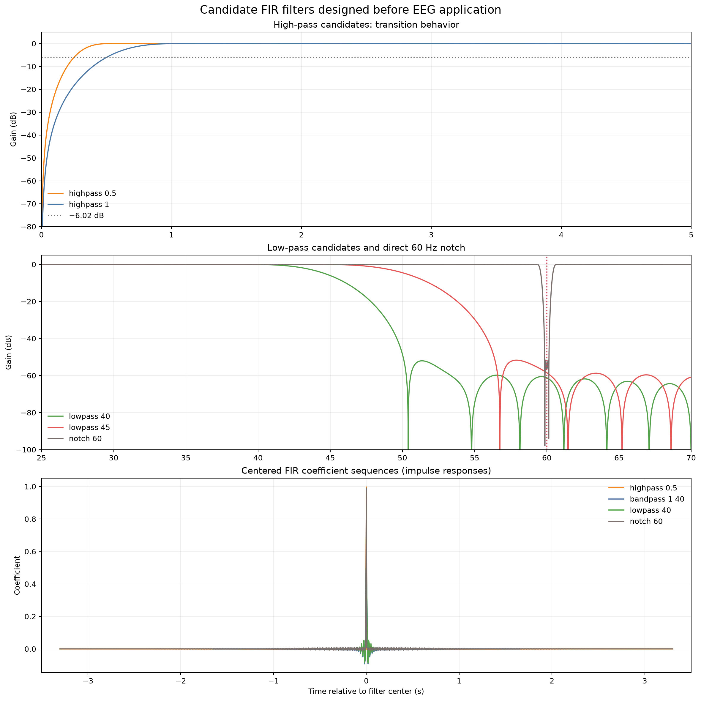
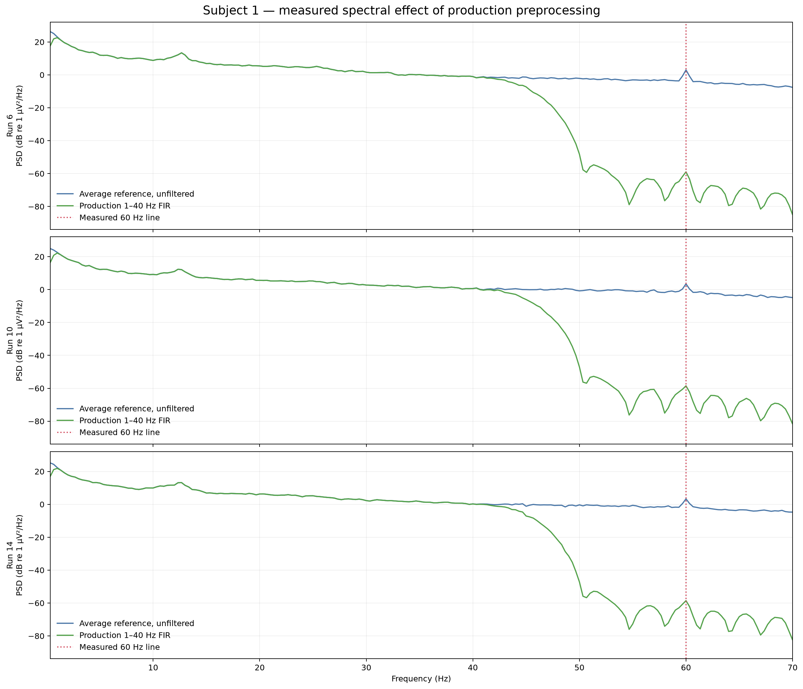
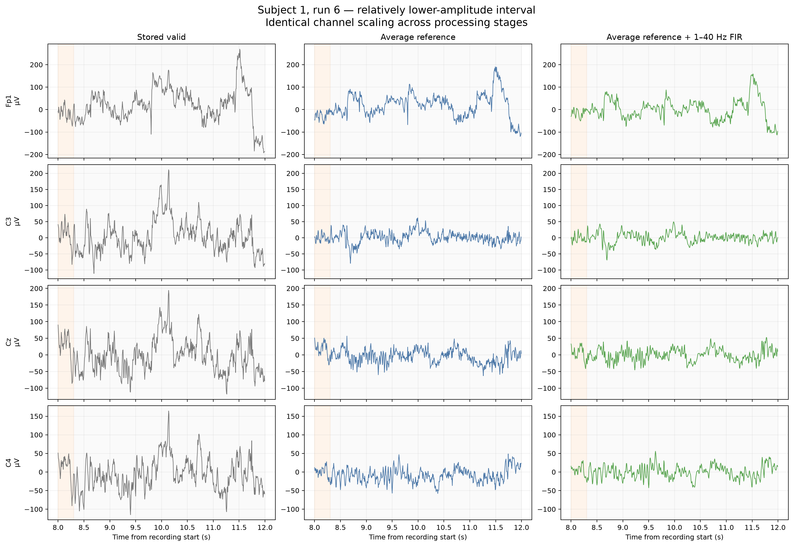
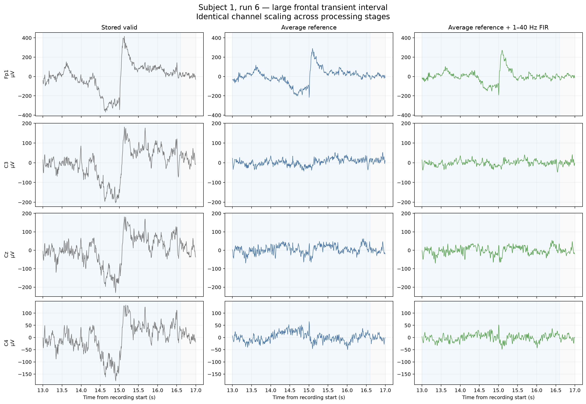
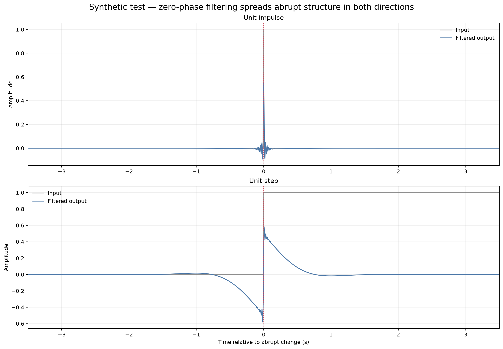

# Controlled continuous-EEG preprocessing and filter validation

[Back to the project README](../README.md)

## Purpose and scientific boundary

This milestone creates the first production-derived continuous EEG
representation for subject 1, runs 6, 10, and 14. The implementation is split
between reusable operations in
[`eeg_project/preprocessing.py`](../eeg_project/preprocessing.py), the
machine-readable policy in
[`config/preprocessing.json`](../config/preprocessing.json), and the validation
report in [`scripts/preprocess_eeg.py`](../scripts/preprocess_eeg.py).

Preprocessing changes reference and retained frequency content. It does not
identify or remove eye, muscle, movement, or electrode artifacts. This stage
itself performs no epoching, condition comparison, feature extraction, or machine learning. Raw
EDF files remain authoritative and byte-unchanged.

## What a digital filter does

A digital filter changes the contribution of frequency components to its
output. A real filter has finite transitions rather than ideal vertical walls:

- the **passband** is intended to be retained with gain near one;
- the **stopband** is intended to be strongly attenuated;
- a **transition band** connects passband and stopband;
- a **passband edge** states where the retained region ends or begins;
- attenuation is often reported as $20\log_{10}|H(f)|$ dB for amplitude gain
  $|H(f)|$.

Consequently, a “40 Hz low-pass” does not leave 39.999 Hz perfectly untouched
and delete 40.001 Hz. In the selected design, 40 Hz is the upper passband edge,
the transition extends through 50 Hz, and attenuation grows gradually between
them.

### Filter types

- A **high-pass** attenuates slow components such as baseline wander,
  electrode drift, and slow physiological activity. An aggressive edge can
  remove genuine slow responses and create temporal distortion near abrupt
  changes.
- A **low-pass** attenuates faster content such as some muscle and environmental
  noise. It also irreversibly discards any genuine activity in its stopband.
- A **band-pass** combines high- and low-pass behavior. “1–40 Hz” is shorthand,
  not a full reproducible design.
- A **notch/band-stop** targets a narrow range. It is useful when that narrow
  range must be removed while neighboring higher frequencies remain. It is
  redundant when an existing low-pass already places the line deep in its
  stopband.

## FIR, IIR, length, and phase

A finite impulse response (FIR) filter calculates a weighted finite sum of
samples. A symmetric FIR can have linear phase: all retained frequencies share
the same delay, so relative waveform shape is not distorted by frequency-
dependent delay. Sharp transitions require more coefficients, creating a
longer temporal impulse response.

An infinite impulse response (IIR) filter is recursive. It can achieve sharp
responses with fewer coefficients, but has different phase and stability
considerations. A forward-only IIR is causal but generally has nonlinear phase;
offline forward/backward IIR filtering can cancel net phase delay while
doubling the magnitude response and becoming acausal.

This project uses MNE 1.12.1 FIR filtering with `phase="zero"`. The installed
MNE documentation states that it constructs a symmetric linear-phase FIR and
compensates its delay, making the operation non-causal. It is a single
delay-compensated FIR application, not the forward/backward legacy option
`phase="zero-double"` and not IIR `filtfilt`.

Zero-phase processing is appropriate for this offline scientific analysis
because it avoids net phase delay. It uses samples from both the past and
future, so the same implementation cannot operate in real time. A future online
BCI would require a causal design and an explicit latency analysis.

## Impulse and frequency responses

The **frequency response** $H(f)$ shows gain and attenuation at every frequency.
The **impulse response** shows the output produced by one isolated impulse; for
an FIR it is the coefficient sequence itself. Its duration shows how far an
abrupt feature can influence nearby output samples.



The selected 529-sample filter spans 3.30625 s. Its centered support is about
±1.65 s. Small coefficients near the ends are still part of the mathematical
operator even when they are visually difficult to see.

## Candidate-channel decision before referencing

The earlier robust heuristic found coherent frontal candidates, isolated large
steps, and several low-correlation edge channels. It did not find clipping,
near-flat channels, or a single sensor dominating the average-reference trace.

- Repeated `Fp1`/`Fpz`/`Fp2`/`AF7`/`AF3` findings are spatially coherent and
  compatible with shared ocular or widespread activity rather than one proven
  broken electrode.
- `T10` has low median peer correlation in runs 10 and 14, but it retains normal
  variation, has modest peak-to-peak range, and no large discontinuity.
- Step candidates such as `FT7` or `T9` occur in individual runs without the
  multi-metric, repeatable evidence needed to declare the full channel invalid.
- Earlier reference sensitivity tests found a maximum single-channel influence
  of only 0.021–0.029 of the reference-trace standard deviation.

The decision is therefore:

> No channels were excluded from the average reference at this stage.

This is not a claim that every sample or channel is artifact-free. It avoids
turning an exploratory robust-z flag into an arbitrary sensor deletion. Future
trial-level evidence can reopen the decision.

## Pipeline order

| Step | Operation | Why | Important consequence |
| ---: | --- | --- | --- |
| 1 | Load PhysioNet EDF without overwriting it | Preserve authoritative evidence and annotations | Source SHA-256 is recorded before and after processing |
| 2 | Detect and exclude the all-channel zero tail | Prevent non-physiological zeros from entering the reference, padding, or filter | 20,000 samples become 19,920 valid samples / 124.5 s |
| 3 | Review candidate-channel evidence | A truly bad sensor could contaminate average reference | No channel is excluded at this stage |
| 4 | Apply 64-channel average reference to a copy | Establish the selected spatial voltage representation | Instantaneous channel mean becomes numerically zero |
| 5 | Filter the continuous valid copy | Suppress measured slow/fast ranges once, before epoch boundaries exist | Output is zero-phase 1–40 Hz FIR; annotations remain attached |
| 6 | Later extract epochs from this continuous result | Avoid independently padding/filtering many short trials | Implemented and reused by later milestones |

The measured value in step 2 is specific to subject 1. In the subjects 1–20 audit,
only 9/60 runs have that 80-sample tail; the other 51 contain 19,680 samples and no
zero tail. The reusable rule removes a trailing all-channel-zero segment only when
one is actually detected. It does not require or manufacture a crop in every file.

Average referencing and identical linear filtering commute mathematically:
filtering each channel and subtracting their filtered mean equals subtracting
the channel mean and filtering the result, apart from floating-point/boundary
implementation details. Reference is performed first because the explicit
channel review logically determines which sensors contribute to the spatial
reference, then one documented temporal operator is applied to that analysis
representation.

Cropping must precede filtering. Otherwise MNE's reflection padding and the
long impulse response would incorporate the artificial zero boundary. The
filter is applied to the continuous 124.5-second recording with
`skip_by_annotation=()` rather than separately to future epochs.

## High-pass candidate experiment

| Candidate | Length | Gain at 0.25 Hz | Gain at 0.5 Hz | Gain at 1 Hz | Median 0.333–1 Hz power retained | Interpretation |
| --- | ---: | ---: | ---: | ---: | ---: | --- |
| No high-pass, 40 Hz low-pass only | 53 samples / 0.331 s | Near 0 dB | Near 0 dB | Near 0 dB | 0.999–1.000 | Leaves the measured slow dominance essentially unchanged |
| 0.5 Hz high-pass + 40 Hz low-pass | 1,057 samples / 6.606 s | −6.06 dB | −0.03 dB | 0.02 dB | 0.852–0.859 | Gentler slow attenuation but doubles temporal support |
| 1 Hz high-pass + 40 Hz low-pass | 529 samples / 3.306 s | −18.43 dB | −6.08 dB | −0.04 dB | 0.435–0.453 | Material drift reduction with shorter support; selected |

The selected 1 Hz passband edge is appropriate for the current motor-imagery
objective because later features focus mainly on 8–30 Hz and no slow-potential
hypothesis has been defined. It is not universally best for EEG. It would be a
poor default for a study whose outcome depends on very slow cortical potentials
or baseline shifts.

## Low-pass and 60 Hz notch experiments

| Candidate | Length | Upper pass edge | Transition / stop | Gain at 45 Hz | Gain at 50 Hz | Gain at 60 Hz |
| --- | ---: | ---: | --- | ---: | ---: | ---: |
| 40 Hz low-pass | 53 samples | 40 Hz | 40–50 Hz; stop begins 50 Hz | −6.04 dB | −48.50 dB | −61.25 dB |
| 45 Hz low-pass | 47 samples | 45 Hz | 45–56.25 Hz; stop begins 56.25 Hz | −0.05 dB | −4.50 dB | −58.52 dB |
| Direct 60 Hz notch | 1,057 samples | Narrow band-stop | Default 0.3 Hz notch width plus 1 Hz total transition | Near 0 dB | Near 0 dB | −56.63 dB |

The 40 Hz design preserves the current 8–30 Hz objective, enters its stopband
before 50 Hz, and strongly suppresses the measured 60 Hz line. The 45 Hz option
also suppresses 60 Hz but retains a transition region from 45 through 56.25 Hz
for which no current scientific objective exists. The more conservative 40 Hz
edge is selected.

Measured on real EEG, the selected band-pass attenuates the 60 Hz PSD bin by
61.91–61.94 dB at the median channel. Adding a direct 60 Hz notch then provides
another 20.71–23.47 dB only to that already tiny residual, while changing the
complete production signal by merely 0.000112–0.000116 relative RMS
(approximately 0.011%). It adds a 1,057-sample/6.606-second operator and no
material benefit below 40 Hz.

The production decision is therefore **no notch**. A 50 Hz notch is also absent
because the raw spectral analysis did not measure a 50 Hz problem.

## Exact production configuration

The authoritative machine-readable values are in
[`config/preprocessing.json`](../config/preprocessing.json).

| Property | Production value |
| --- | --- |
| Valid samples | `0:19920` (Python stop-exclusive), 124.5 s |
| Channels | 64 EEG; no reference exclusions |
| Reference | 64-channel average, direct subtraction (`projection=False`) |
| High-pass passband edge | 1.0 Hz |
| Lower transition | 0–1 Hz; −6 dB midpoint near 0.5 Hz |
| Low-pass passband edge | 40.0 Hz |
| Upper transition | 40–50 Hz; −6 dB midpoint near 45 Hz |
| Method | FIR |
| Design | `firwin` |
| Window | Hamming |
| Length | 529 samples / 3.30625 s |
| Phase | `zero`: symmetric linear phase with compensated delay; acausal |
| Padding | `reflect_limited` |
| Annotation skipping | None; filter the continuous valid recording |
| Notch | None |
| Resampling | None; output remains 160 Hz |

Using an explicit length and transition bandwidth makes the production result
stable even if a future library version changes an `auto` design heuristic.

## Measured before/after effects



Median channel ratios compare the filtered result with the same
average-referenced, unfiltered samples:

| Run | 0.333–1 Hz power retained | 8–13 Hz power retained | 8–30 Hz power retained | 60 Hz attenuation | Standard deviation retained | Peak-to-peak retained |
| ---: | ---: | ---: | ---: | ---: | ---: | ---: |
| 6 | 0.4484 | 0.9981 | 0.99778 | −61.94 dB | 0.741 | 0.772 |
| 10 | 0.4526 | 0.9980 | 0.99775 | −61.91 dB | 0.799 | 0.853 |
| 14 | 0.4352 | 0.9982 | 0.99782 | −61.93 dB | 0.790 | 0.814 |

For `C3`, `Cz`, and `C4`, 8–13 Hz power retention is 0.9977–0.9988 across all
three runs. The previously observed central 12–13 Hz structure therefore
remains. Preservation here means band power is nearly unchanged; it does not
turn the feature into evidence of motor imagery.

### Controlled time-domain comparisons



The columns use identical per-channel scaling. Average reference removes a
large common spatial component; filtering then removes slow offset/drift and
fast content. It does not make the output noiseless.



For `Fp1` in 13–17 s, peak-to-peak amplitude changes from 785 µV stored to
505.8 µV after average reference and 463.7 µV after filtering. Standard
deviation changes from 139.3 to 79.6 to 63.0 µV. The transient remains clearly
visible and is reshaped. This is frequency suppression, not artifact removal or
proof of an ocular source.

## Synthetic filter-induced structure test



An impulse at time zero produces oscillatory structure before and after zero.
At a threshold of $10^{-6}$ of peak output, the response extends from −1.65 to
+1.65 s. A unit step also produces a slow negative deflection before the actual
step and a positive decay after it. This is not a bug in the implementation; it
is the expected acausal, band-limited response.

Therefore an abrupt artifact or task transition can influence nearby filtered
samples in both directions. A filtered change appearing just before an
annotation must not automatically be interpreted as anticipatory physiology.

## Annotation and epoch-boundary implications

Filtering each future short epoch independently would require padding each
epoch and would generate separate edge transients at every artificial trial
boundary. Filtering once across continuous valid EEG lets samples on both sides
of a T0/T1/T2 annotation provide real neighboring context. It does not prevent
activity or artifacts from spreading across a condition boundary; it avoids
adding an extra boundary created only by data extraction.

The completed epoch design retains `−2…+4 s` around each task onset and applies
no time-domain baseline correction. A provisional later task-analysis interval
of `1…3 s` reduces proximity to transitions but does not eliminate their
influence: the FIR support for that interval reaches approximately
`−0.65…4.65 s`. This tradeoff must be tested during event-related spectral
analysis. See [Event extraction, epoching, and trial-quality assessment](epoching.md).

Recording edges remain special. `reflect_limited` creates a limited reflected
extension for convolution, reducing an abrupt jump to zero but not creating
real EEG outside the file. Results very near 0 and 124.5 s should remain subject
to edge caution.

## What changed from raw EEG?

### Changed

- the valid range excludes the 80-sample zero tail;
- the stored voltage reference becomes a 64-channel average reference;
- frequencies below the 1 Hz pass edge and above the 40 Hz pass edge are
  attenuated according to measured transitions;
- slow offsets, overall standard deviation, peak-to-peak range, and the 60 Hz
  line decrease;
- abrupt features acquire the temporal response of the zero-phase FIR.

### Unchanged

- the three source EDF files and their SHA-256 digests;
- sampling frequency: 160 Hz;
- 64-channel count and channel order;
- channel types and microvolt/volt unit relationship;
- annotation onsets, durations, and descriptions attached to the valid copy;
- the scientific identity of artifacts—none are automatically relabeled or
  removed;
- motor-imagery class labels; epoch extraction reorganizes these samples but
  does not alter the continuous preprocessing or create model results.

## Persistence and provenance policy

No continuous `.fif` file is saved yet. Three 64×19,920 arrays are small enough
to regenerate in seconds, and saving a binary now would introduce stale-file
risk while event/epoch design is still evolving. Future code imports the same
reusable preprocessing function and the version-controlled JSON configuration.

Only small report figures, CSV metrics, and deterministic JSON provenance are
persisted under `docs/assets/`. The metadata records subject, runs, source paths
and hashes, crop, reference, exclusions, complete filter settings, software
versions, and output names. If a future workflow persists derived EEG, it must
live under ignored `outputs/` with equally explicit provenance; it must never be
confused with raw EDF.

## Artifacts

| Artifact | Purpose / expected rows |
| --- | --- |
| [`preprocessing_metrics.csv`](assets/subject01_runs06-10-14_preprocessing_metrics.csv) | 576 rows: 64 channels × 3 runs × 3 stages |
| [`filter_candidate_comparison.csv`](assets/subject01_runs06-10-14_filter_candidate_comparison.csv) | 15 rows: 5 candidates × 3 runs |
| [`filter_response.csv`](assets/subject01_runs06-10-14_filter_response.csv) | 84 selected-frequency response rows |
| [`time_window_metrics.csv`](assets/subject01_runs06-10-14_time_window_metrics.csv) | 384 rows: 64 channels × 3 stages × 2 run-6 windows |
| [`preprocessing_metadata.json`](assets/subject01_runs06-10-14_preprocessing_metadata.json) | Exact provenance and policy |

## Reproduce

From the activated environment:

```bash
python scripts/preprocess_eeg.py
```

Inspect options or validate one run outside tracked report assets:

```bash
python scripts/preprocess_eeg.py --help
python scripts/preprocess_eeg.py --runs 10 --output-dir outputs/run10_preprocessing
```

The script deliberately regenerates rather than persists the filtered
continuous arrays.

## Limitations after preprocessing

- Only one participant and three runs have been processed.
- No channel is confirmed bad; retaining all channels is a reviewed decision,
  not proof that they are perfect.
- Average reference has finite scalp-coverage and unknown acquisition-reference
  limitations.
- The 1 Hz high-pass discards slow information and can reshape large transients.
- Zero-phase output is acausal and unsuitable as-is for real-time BCI.
- Reflection padding cannot supply real data beyond recording boundaries.
- Filtering can spread abrupt artifacts across annotation boundaries.
- Eye, muscle, movement, and electrode artifacts have not been identified or
  removed.
- Continuous PSD and power retention do not demonstrate condition effects.
- Epochs now use a documented `baseline=None` policy and retain all statistical
  trial candidates. A future leakage-safe model-validation procedure has not
  been implemented.

## Sources

- MNE-Python contributors. [`mne.io.Raw.filter`](https://mne.tools/stable/generated/mne.io.Raw.html#mne.io.Raw.filter): continuous filtering, annotation skipping, and parameter behavior.
- MNE-Python contributors. [`mne.filter.create_filter`](https://mne.tools/stable/generated/mne.filter.create_filter.html): FIR construction, transitions, phase, window, and design methods.
- MNE-Python contributors. [Background information on filtering](https://mne.tools/stable/auto_tutorials/preprocessing/25_background_filtering.html): frequency/impulse response, FIR/IIR, phase, and filter-length tradeoffs.
- Widmann, A., Schröger, E., & Maess, B. (2015). [Digital filter design for electrophysiological data—A practical approach](https://doi.org/10.1016/j.jneumeth.2014.08.002). *Journal of Neuroscience Methods*, 250, 34–46.
- Tanner, D., Morgan-Short, K., & Luck, S. J. (2015). [How inappropriate high-pass filters can produce artifactual effects and incorrect conclusions in ERP studies](https://doi.org/10.1111/psyp.12437). *Psychophysiology*, 52(8), 997–1009.
- Schalk, G. (2009). [EEG Motor Movement/Imagery Dataset](https://physionet.org/content/eegmmidb/1.0.0/) (version 1.0.0). PhysioNet.
