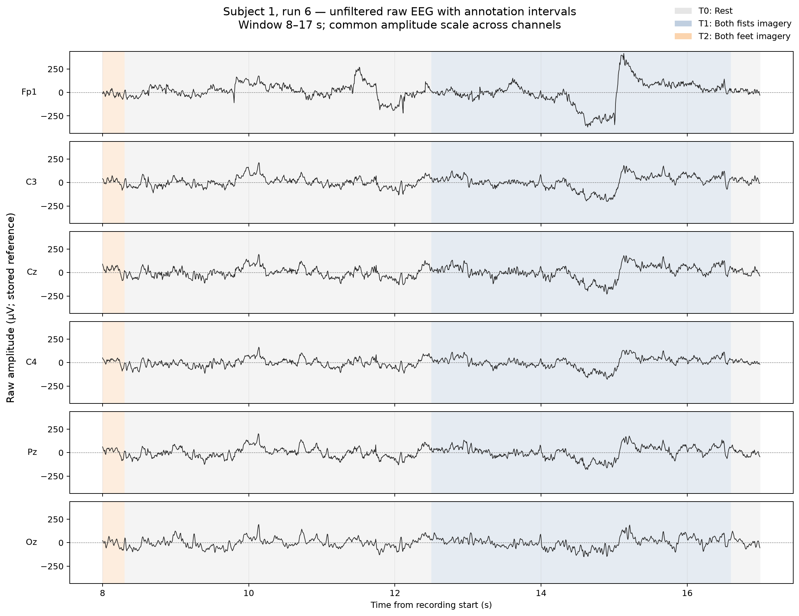
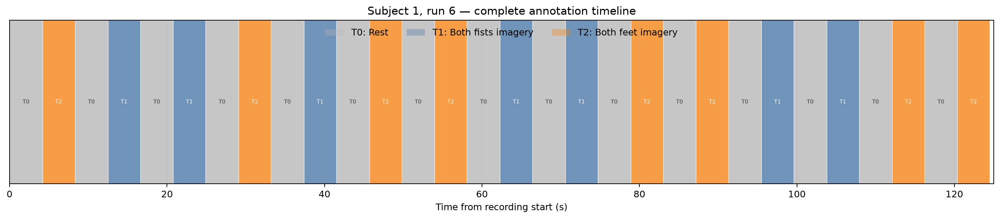
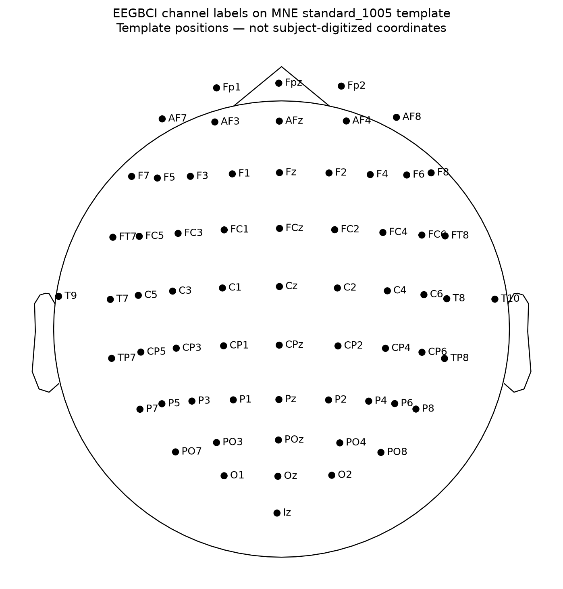

# Raw EEG visualization and annotation timing

[Back to the project README](../README.md)

## Purpose

This milestone connects the verified raw-data structure `(64 channels, 20,000 samples)` to physical time, voltage traces, scalp labels, and experimental timing. It remains exploratory: the signals shown here are unfiltered, have not been re-referenced, and have not undergone artifact rejection.

Relevant background:

- [EEG fundamentals](eeg_fundamentals.md)
- [Dataset and experimental protocol](dataset.md)
- [Raw-data inspection](data_inspection.md)
- [Reproducibility](reproducibility.md)

## Metadata inspected before plotting

The implementation was based on the actual EDF/MNE metadata rather than assumed dataset properties.

| Property | Observed result |
| --- | --- |
| Original channel labels | Labels such as `Fc3.`, `C3..`, and `Cz..` with EDF suffix punctuation |
| Standardized labels | MNE's `eegbci.standardize()` produced labels such as `FC3`, `C3`, and `Cz` |
| Original EDF unit declaration | µV for all 64 EEG channels |
| MNE internal EEG unit | V |
| Subject-digitized electrode coordinates | Not present in the EDF/MNE metadata |
| Custom MNE reference applied | No |
| Named physical reference | Not identified in the accessible metadata |
| First sample | 0 |
| Measurement/annotation origin | Matching timestamps |

All 64 standardized channel labels map to MNE's built-in `standard_1005` montage. The electrode-location figure therefore uses that template, following MNE's official EEGBCI workflow. These are standardized coordinates, not measurements of this participant's head.

## Implementation

The workflow is implemented in [`scripts/visualize_raw_eeg.py`](../scripts/visualize_raw_eeg.py).

The command-line interface supports:

- EEGBCI subjects 1–109;
- the project runs 6, 10, or 14;
- configurable start time and duration;
- configurable standardized channel names;
- a configurable output directory.

The report artifacts were generated with the defaults:

```bash
python scripts/visualize_raw_eeg.py
```

Equivalent explicit options are:

```bash
python scripts/visualize_raw_eeg.py \
  --subject 1 \
  --run 6 \
  --start 8 \
  --duration 9 \
  --channels Fp1 C3 Cz C4 Pz Oz
```

The script does not filter, detrend, baseline-correct, reject samples, or re-reference the data. Standardizing channel names and attaching a montage for the electrode figure change metadata, not voltage samples.

## Selected channels and window

The report uses six channels selected by anatomical coverage before interpreting waveform appearance:

| Channel | Reason for inclusion |
| --- | --- |
| `Fp1` | Frontal coverage and sensitivity to possible ocular/frontopolar activity |
| `C3` | Left central scalp coverage relevant to the motor-imagery task |
| `Cz` | Central midline coverage, particularly relevant to bilateral/foot representations |
| `C4` | Right central scalp coverage relevant to the motor-imagery task |
| `Pz` | Posterior midline comparison |
| `Oz` | Occipital comparison |

This is not a claim that these are the optimal classification channels. It is a readable exploratory selection that includes task-relevant central sites and broader scalp coverage.

The 8–17 s window contains:

- the final 0.3 s of a `T2` both-feet interval;
- a complete `T0` rest interval from 8.3 to 12.5 s;
- a complete `T1` both-fists interval from 12.5 to 16.6 s;
- the beginning of the next rest interval.

This nine-second view is long enough to connect continuous voltage with event boundaries without compressing the waveform into an unreadable full-run trace.

## Selected-channel raw EEG



### How to read the figure

- The **x-axis** is physical time in seconds from the start of the recording.
- Each panel is one EEG channel.
- The **y-axis** is unfiltered voltage amplitude in microvolts under the stored reference.
- The dashed horizontal line is 0 µV; values above and below it have opposite polarity relative to the reference.
- Every channel uses the same vertical scale, so amplitude differences remain visually comparable.
- Gray shading is `T0` rest, blue is `T1` both-fists imagery, and orange is `T2` both-feet imagery.
- Shading identifies the instructed experimental condition. It does not prove that every visible waveform feature was caused by that condition.

The selected window contains 1,440 samples per channel:

\[
9\ \text{s} \times 160\ \frac{\text{samples}}{\text{s}} = 1{,}440\ \text{samples}
\]

For the six plotted channels the array shape is therefore `(6, 1,440)`.

### Observations and interpretation boundaries

The observed selected-window range is approximately $-369$ to $+416\ \mu\text{V}$. `Fp1` has larger deflections than the central and posterior channels in this interval.

A large slow transient occurs roughly around 14.5–15.2 s across several channels and is strongest at frontal `Fp1`. This pattern is consistent with an ocular or other widespread artifact, but it is not sufficient to identify a blink definitively because:

- no dedicated EOG channel is present;
- the data has not undergone spatial or spectral artifact analysis;
- a raw waveform can have multiple plausible sources.

The transient occurs during a `T1` interval. That timing does not justify calling it a fists-imagery response. The annotation describes the experimental instruction; it does not provide a causal interpretation of individual voltage changes.

Broad similarities across channels may reflect shared physiological activity, a common reference contribution, volume conduction, or widespread artifact. Referencing and quantitative signal-quality analysis are required before stronger conclusions.

## Complete annotation timeline



The timeline shows the complete 125-second recording without attempting to draw 64 compressed EEG traces. It makes the alternating rest/task structure visible and shows that `T1` and `T2` order varies across trials.

The complete machine-readable table is available as [`subject01_run06_annotations.csv`](assets/subject01_run06_annotations.csv).

The first six annotations are:

| Index | Description | Condition | Onset | Duration | Sample index |
| ---: | --- | --- | ---: | ---: | ---: |
| 0 | `T0` | Rest | 0.0 s | 4.2 s | 0 |
| 1 | `T2` | Both feet imagery | 4.2 s | 4.1 s | 672 |
| 2 | `T0` | Rest | 8.3 s | 4.2 s | 1,328 |
| 3 | `T1` | Both fists imagery | 12.5 s | 4.1 s | 2,000 |
| 4 | `T0` | Rest | 16.6 s | 4.2 s | 2,656 |
| 5 | `T1` | Both fists imagery | 20.8 s | 4.1 s | 3,328 |

## Annotation time to sample index

The approximate conversion is:

\[
n \approx t_{\text{onset}} f_s
\]

For the `T1` onset at 12.5 s:

\[
n = 12.5\ \text{s} \times 160\ \text{Hz} = 2{,}000
\]

The script uses `raw.time_as_index([onset], use_rounding=True)` rather than relying only on manual multiplication. MNE can then account for its recording time base and rounding rules. In this EDF, `first_samp=0` and annotation/measurement origins align, so the MNE result agrees with direct multiplication.

Programmatic inspection found consistent durations within each description:

| Description | Observed duration(s) |
| --- | --- |
| `T0` | 4.2 s |
| `T1` | 4.1 s |
| `T2` | 4.1 s |

The difference between rest and task duration is an observed property of these annotations; it was not normalized or changed.

## Electrode-location template



The EDF contains usable electrode names but no subject-digitized coordinates. The figure uses MNE's `standard_1005` template after channel-name standardization. It communicates approximate standard scalp organization and supports principled channel selection, but it must not be treated as this participant's measured electrode geometry.

Attaching this template does not re-reference or transform the EEG values.

## Referencing state

The raw EDF signals are plotted as stored. MNE reports that no custom reference has been applied, but the accessible metadata does not identify the named physical recording reference.

No average reference was applied because this milestone aims to inspect the original stored waveforms. Re-referencing changes every channel and should follow channel-quality checks and an explicit scientific decision.

Those checks and the later average-reference decision are documented separately in [Quantitative EEG signal quality and referencing decision](signal_quality.md). The raw figure on this page remains unchanged as acquisition-reference evidence.

## Artifact concepts relevant to this figure

Patterns that raw visualization may suggest include:

- slow frontal blink-like deflections;
- opposite-polarity frontal eye-movement patterns;
- irregular high-frequency muscle activity;
- persistent mains-frequency activity;
- flat, discontinuous, or unusually noisy electrode signals;
- large widespread movement or electrode transients.

Visual inspection alone is not a validated artifact classifier. No artifact has been removed or marked as bad during this milestone.

## Report artifact policy

The three PNG figures and annotation CSV under `docs/assets/` are small, scientifically useful, linked from the public report, and reproducible from one command. They are therefore intended to be tracked in Git.

Bulk intermediate outputs remain under the ignored `outputs/` directory. Raw EDF files remain under the ignored `data/` directory.

## What this milestone establishes

- Raw voltages can be loaded and plotted with correct µV scaling.
- Physical time and sample indices align as expected at 160 Hz.
- Annotation intervals align programmatically with the continuous recording.
- All cleaned channel names map to a standard template montage.
- The physical reference and participant-specific electrode coordinates are not available in the inspected metadata.
- Candidate artifacts can be noticed, but not conclusively classified, from these figures.

## What was deliberately not done in this visualization stage

- no re-referencing;
- no filtering or notch filtering;
- no artifact removal or bad-channel marking;
- no epoch construction at this stage (implemented later in [the epoching chapter](epoching.md));
- no frequency analysis;
- no condition averaging or statistical testing;
- no feature extraction or machine learning.

## Sources

- Schalk, G. (2009). [EEG Motor Movement/Imagery Dataset](https://physionet.org/content/eegmmidb/1.0.0/) (version 1.0.0). PhysioNet.
- MNE-Python contributors. [`mne.Annotations`](https://mne.tools/stable/generated/mne.Annotations.html).
- MNE-Python contributors. [Working with sensor locations](https://mne.tools/stable/auto_tutorials/intro/40_sensor_locations.html).
- MNE-Python contributors. [EEGBCI CSP example](https://mne.tools/stable/auto_examples/decoding/decoding_csp_eeg.html): official channel standardization and `standard_1005` montage workflow.
- MNE-Python contributors. [The `Raw` data structure](https://mne.tools/stable/generated/mne.io.Raw.html).
