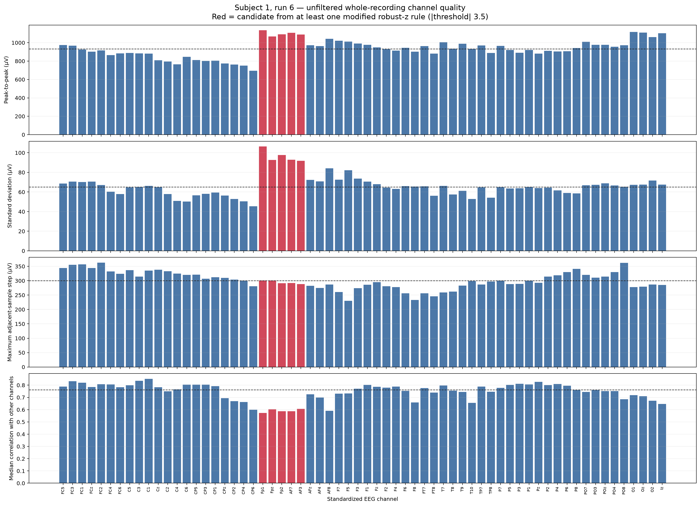
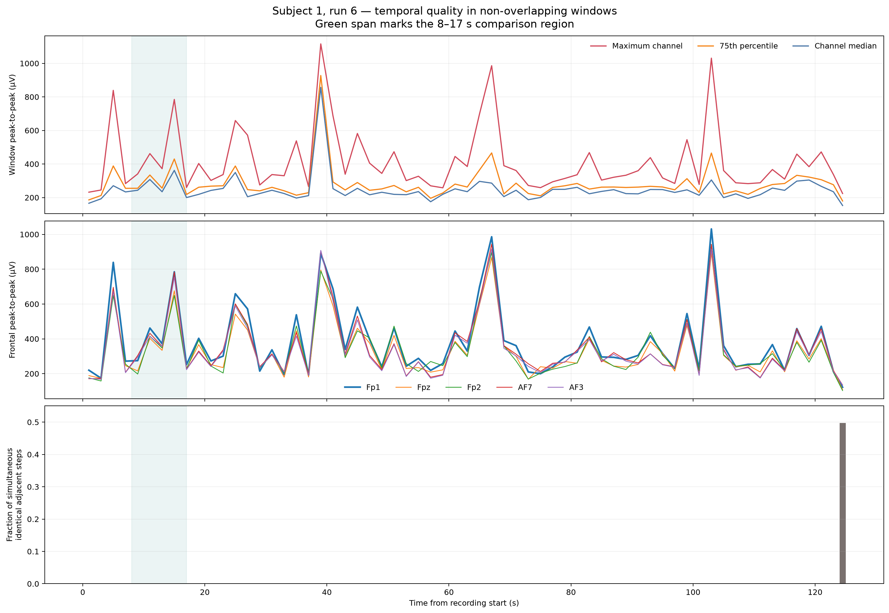
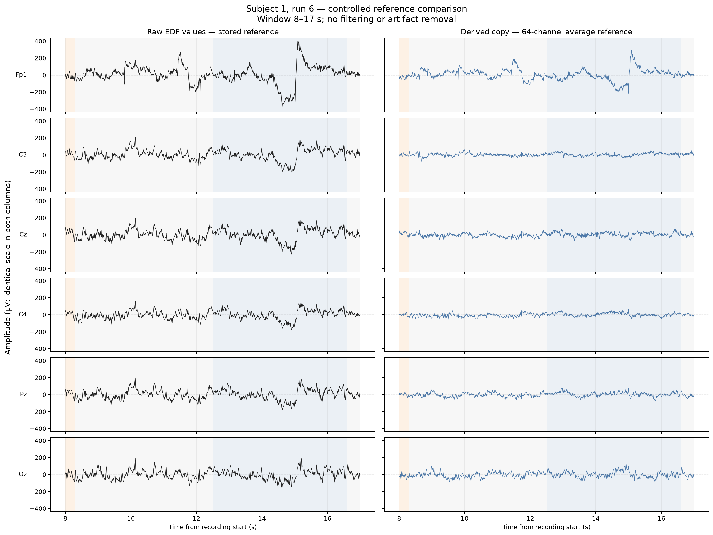

# Quantitative EEG signal quality and referencing decision

[Back to the project README](../README.md)

## Purpose and scope

This milestone asks whether the unfiltered recordings are technically usable, which channels or intervals deserve closer inspection, and which reference representation is defensible for later analysis. It does **not** automatically clean the data, declare statistical outliers to be failed electrodes, or apply frequency filters.

The executable workflow is [`scripts/assess_signal_quality.py`](../scripts/assess_signal_quality.py). It analyzes subject 1, runs 6, 10, and 14 by default.

The authoritative EDF files remain unchanged under the ignored `data/` directory. All metrics are calculated from raw EDF values as loaded by MNE. Average reference is applied only to an in-memory copy for the controlled comparison.

## From visual suspicion to quantitative evidence

A strange-looking waveform is a reason to investigate, not a diagnosis. Quantitative quality control combines complementary evidence because each statistic is incomplete.

### Peak-to-peak amplitude

For channel samples $x_1,\ldots,x_N$:

\[
x_{\mathrm{p2p}} = \max(x)-\min(x)
\]

Peak-to-peak amplitude measures the complete observed voltage span. A large span can result from an isolated transient, movement, eye activity, an electrode disturbance, or real spatially widespread signal. It is highly sensitive to the two most extreme observations. It therefore cannot, by itself, establish a bad channel or define a universal EEG rejection threshold.

All reported voltage amplitudes are in microvolts (µV). MNE internally represents EEG in volts; the script verifies numerically that the exported µV arrays equal the internal arrays multiplied by $10^6$.

### Mean, drift, oscillation, and artifact

The arithmetic mean is:

\[
\bar{x}=\frac{1}{N}\sum_{n=1}^{N}x_n
\]

It describes the average signed offset over the selected interval. A **baseline drift** is a slow change over time, whereas the mean compresses the entire interval into one number. An **oscillation** is repeated variation. An **artifact** is an unwanted physiological, environmental, or technical contribution. A drifting signal can change the mean, but these concepts are not synonyms.

### Variance and standard deviation

For this complete recording, the script uses population variance and standard deviation:

\[
\sigma^2=\frac{1}{N}\sum_{n=1}^{N}(x_n-\bar{x})^2,
\qquad
\sigma=\sqrt{\sigma^2}
\]

Variance has units of µV². Standard deviation returns to µV and describes typical variability around the mean. Unusually high variability may reflect artifacts or high-amplitude signal. Unusually low variability may indicate a constant or nearly constant technical channel. Neither direction supplies a diagnosis without temporal and spatial evidence.

### Median, MAD, and IQR

EEG can contain isolated large values, so the report also includes robust summaries:

\[
\widetilde{x}=\operatorname{median}(x),
\qquad
\mathrm{MAD}=\operatorname{median}(|x-\widetilde{x}|)
\]

\[
\mathrm{IQR}=Q_{75}-Q_{25}
\]

The median is a robust center. MAD and IQR describe central dispersion without allowing one or two extreme samples to dominate as strongly as the range or standard deviation. The script reports unscaled MAD in µV. NIST describes MAD and IQR as useful alternatives when tail values make standard deviation unstable.

### Flatness, discontinuities, and correlation

The workflow records:

- the fraction of adjacent samples with exactly identical values;
- the longest run of identical samples;
- the largest absolute adjacent-sample step;
- each channel's median Pearson correlation with the other 63 channels.

A truly flat technical channel is constant or nearly constant for a sustained interval. Quiet physiological activity still varies. Exact repeats can also occur because the EDF values are quantized at approximately 1 µV, so isolated identical steps are not treated as bad-channel evidence.

A large adjacent-sample step can expose an abrupt jump or transient. Clipping would instead produce repeated samples at a range boundary; no channel reaches the EDF physical limit in these recordings. Correlation supplies spatial context: a channel with unusually low median correlation may deserve inspection, but legitimate scalp differences, reference effects, and edge locations can also reduce correlation.

## Metadata evidence before custom metrics

The three EDF headers and MNE metadata were inspected directly.

| Property | Verified result for runs 6, 10, and 14 |
| --- | --- |
| EEG channel count | 64 |
| Existing `raw.info["bads"]` | Empty list |
| Pre-marked acquisition warnings | None exposed |
| Original standardized physical unit | µV |
| EDF physical range | −8,092 to +8,092 µV for every EEG signal |
| EDF digital range | −8,092 to +8,092 for every EEG signal |
| Approximate digitization step | 1 µV per digital unit |
| EDF prefilter text | `HP:0Hz LP:0Hz N:0Hz` |
| MNE sampling frequency | 160 Hz |
| MNE reported lowpass | 80 Hz, the Nyquist limit |
| Custom MNE reference applied | No |
| Named physical acquisition reference | Not identified |

An empty MNE bad-channel list means that the file does not provide pre-marked bad channels. It is not evidence that every channel has been validated.

The EDF prefilter text is header metadata, not proof of the true analog hardware response. No new filter has been applied in this repository.

## Candidate-channel methodology

For each metric across the 64 channels, the workflow calculates a modified robust z-score:

\[
r_i=0.6745\frac{x_i-\operatorname{median}(x)}
{\operatorname{median}(|x-\operatorname{median}(x)|)}
\]

The exploratory threshold is $|r_i|>3.5$, following the potential-outlier rule summarized by the NIST/SEMATECH handbook. Directional rules are used where appropriate:

- unusual signed mean: either direction;
- standard deviation: unusually high or low;
- peak-to-peak and maximum step: unusually high only;
- median peer correlation: unusually low only.

The threshold compares channels within one recording. It is not a physiological amplitude limit and does not establish that the cross-channel metric distribution is normal. Correlated metrics can flag the same underlying event several times. Every resulting label is therefore **statistically unusual**, never **confirmed bad**.

The script does not modify `raw.info["bads"]`, reject, interpolate, or exclude any channel.

## Channel-level results

The full 192-row table is [`subject01_runs06-10-14_channel_quality.csv`](assets/subject01_runs06-10-14_channel_quality.csv). It contains 64 channels for each of three runs, raw metrics, robust scores, candidate status, and human-readable evidence.



The dashed line in each panel is the across-channel median. Red identifies a channel flagged by at least one rule; it does not mean every red channel is unusual for the metric in every panel.

| Run | Candidate channels | Evidence summary |
| ---: | --- | --- |
| 6 | `Fp1`, `Fpz`, `Fp2`, `AF7`, `AF3` | High whole-recording standard deviation; coherent frontal grouping |
| 10 | `Fp1`, `Fpz`, `Fp2`, `AF7`, `AF3`, `AF8`, `F7`, `F5`, `FT7`, `T10` | Frontal offset/variability/span; `FT7` step; `T10` low peer correlation |
| 14 | `FC5`, `FC3`, `C5`, `Fp1`, `Fpz`, `Fp2`, `AF7`, `AF3`, `AF8`, `F5`, `T9`, `T10`, `O2`, `Iz` | Frontal offset/variability/span; several abrupt-step candidates; three low-correlation edge/posterior candidates |

These lists combine spatially coherent possible artifact patterns and isolated metrics. No channel is confirmed bad. In particular, repeated frontal findings are compatible with ocular/frontopolar sensitivity, but no dedicated EOG channel is available to verify the source.

For run 6, `Fp1` has standard deviation 106.5 µV versus the 64-channel median of 65.2 µV. Its full-run peak-to-peak amplitude is 1,135 µV versus a channel median of 933 µV, but its peak-to-peak robust score does not exceed 3.5 in that run because large shared transients raise the cross-channel distribution.

## Temporal quality

Whole-recording metrics can hide short problems. The workflow therefore divides each recording into non-overlapping 2-second windows. At 160 Hz, a complete window contains:

\[
2\ \mathrm{s}\times160\ \mathrm{samples/s}=320\ \mathrm{samples}
\]

Two seconds localizes sub-trial transients while retaining enough samples for stable descriptive amplitude estimates. It is an exploratory resolution, not a universal artifact-detection window. The last window is a documented 1-second partial window because 125 is not divisible by 2.

The full 189-row temporal table is [`subject01_runs06-10-14_temporal_quality.csv`](assets/subject01_runs06-10-14_temporal_quality.csv).



The first panel compares the median, 75th percentile, and maximum channel peak-to-peak amplitude in every window. The second shows `Fp1` and frontal neighbors without claiming that they are EOG. The final panel detects intervals where every EEG channel remains unchanged between adjacent samples.

### Quantitative revisit of the 14–16 s frontal event

In run 6, the 14–16 s window contains:

| Channel | Peak-to-peak amplitude |
| --- | ---: |
| `Fp1` | 785 µV |
| `Fpz` | 676 µV |
| `Fp2` | 649 µV |
| `AF7` | 784 µV |
| `AF3` | 754 µV |
| `C3` | 384 µV |
| `Cz` | 411 µV |
| `C4` | 311 µV |

`Fp1` is the largest channel in that window. Across its 63 temporal windows, this value has a modified robust z-score of 3.81 and ranks fifth by peak-to-peak amplitude. Larger `Fp1` windows also occur elsewhere, including 66–68 s and 102–104 s. The evidence therefore supports a localized high-amplitude frontal event but does not make the previously noticed interval unique.

The spatial and temporal pattern remains **consistent with ocular or widespread artifact**, not conclusively a blink. Its occurrence during a `T1` instruction does not establish a fists-imagery response.

### Common constant recording tail

All three runs contain exact zero-valued samples across all 64 EEG channels from sample 19,920 to 19,999, corresponding to 124.5–125.0 s. The last annotation also ends at 124.5 s.

This simultaneous 0.5-second constant segment is not plausible quiet physiology. It is consistent with file-boundary padding or an acquisition boundary, but the available metadata does not establish its cause. Later epoching and modeling must treat it as non-physiological rather than silently including it. Relative channel-outlier detection cannot discover it because every channel is affected, which demonstrates the value of temporal checks.

## Power-line interference and Nyquist frequency

Argentina's nominal grid frequency is 50 Hz. With sampling frequency $f_s=160$ Hz:

\[
f_{\mathrm{Nyquist}}=\frac{f_s}{2}=80\ \mathrm{Hz}
\]

Frequencies up to 80 Hz are representable, so 50 Hz contamination could have been present. This time-domain milestone did not infer it from amplitude. The subsequently completed [frequency-domain analysis](spectral_analysis.md) measures no meaningful 50 Hz peak but does find a strong, repeatable 60 Hz line. That result illustrates why a filter decision must follow the recording evidence rather than the analyst's present location.

## Referencing theory

### Acquisition reference

EEG is always recorded as a voltage difference, even when a stored file does not name the physical acquisition reference. If $V_i(t)$ is an electrode potential and $V_r(t)$ is the acquisition reference contribution, the stored channel is conceptually $V_i(t)-V_r(t)$.

The dataset page describes the 64-channel montage but does not identify the reference. The EDF inspected here likewise does not expose a reference label. This absence is a dataset limitation, not evidence that the data was recorded reference-free.

### Average reference

For $C$ EEG channels:

\[
\bar{V}(t)=\frac{1}{C}\sum_{j=1}^{C}V_j(t)
\]

\[
V_{i,\mathrm{new}}(t)=V_i(t)-\bar{V}(t)
\]

The instantaneous scalp-channel mean becomes the new zero estimate. Consequently, the mean across re-referenced channels is numerically zero at each sample. Every channel changes because the same time-varying average is subtracted from each.

This is an instantaneous spatial transformation, not a frequency-selective temporal filter. Sampling frequency, sample count, event timing, and the pairwise difference between any two included channels remain unchanged:

\[
(V_i-\bar{V})-(V_j-\bar{V})=V_i-V_j
\]

Average reference is imperfect when electrodes do not sample the full head uniformly. It can also spread a bad channel's contamination through the reference estimate. The original reference electrode should ideally be represented when reconstructing a sensor-space average, but its identity is unavailable here.

### Alternatives considered

- **Single electrode:** possible, but would assign special influence to an arbitrary available channel.
- **Linked mastoids:** unavailable because this montage excludes `A1` and `A2`/mastoid channels.
- **Bipolar derivations:** useful for local differences but change the channel representation and are not the intended broad multichannel sensor-space analysis.
- **REST:** estimates a reference at infinity but requires an appropriate forward/head model that this project does not currently possess.

## Referencing decision

The project selects a **64-channel average reference as the intended derived analysis reference**, conditional on completing deliberate candidate-channel review before it is applied in the preprocessing pipeline.

The reasons are:

1. the recording has 64 broadly distributed 10–10 scalp channels;
2. future motor-imagery analysis uses multichannel spatial and spectral information;
3. the original physical reference is unknown;
4. linked mastoids are unavailable, a single sensor is arbitrary, and REST lacks a forward model;
5. MNE provides an explicit, reproducible average-reference operation that excludes channels only when they have deliberately been marked bad.

This is our methodological choice, not a fact specified by PhysioNet. Its limitations—finite superior-scalp coverage, missing original reference identity/electrode, and sensitivity to bad channels—remain documented.

## Controlled before/after comparison



The figure uses the same subject, run, 8–17 s window, six channels, annotations, and amplitude scale in both columns. The left column is the raw EDF representation. The right column is an in-memory copy after subtracting the instantaneous mean of all 64 channels.

The script independently calculates the mean reference trace and verifies that MNE's result equals the explicit subtraction equation. It also verifies that the average across derived channels is numerically zero at every sample and that the original `Raw` object is unchanged.

The right column often has smaller shared deflections, especially at central channels, because a large common spatial component was subtracted. That visual change does not prove artifact removal or make the derived signal intrinsically truer. No filter, bad-channel exclusion, interpolation, or disk write occurred.

## Raw and derived data architecture

| Layer | Location/representation | Policy |
| --- | --- | --- |
| Authoritative raw data | Downloaded PhysioNet EDF under `data/` | Immutable, ignored by Git, reproducibly downloaded |
| Exploratory metrics | CSV and figures under `docs/assets/` | Small tracked report evidence, reproducibly generated |
| Derived signal | Currently an in-memory `Raw.copy()` | Regenerated from EDF; never overwrites raw data |
| Future processed files | Intended for ignored `outputs/` or a documented derived-data location | Must record every transformation and remain reproducible |

## Reproduce the milestone

From the activated project environment:

```bash
python scripts/assess_signal_quality.py
```

Inspect available options:

```bash
python scripts/assess_signal_quality.py --help
```

For example, an isolated run can be assessed without changing the report artifacts:

```bash
python scripts/assess_signal_quality.py \
  --runs 10 \
  --output-dir outputs/run10_quality
```

## Interpretation boundaries

- Statistical candidates are not confirmed bad electrodes.
- No candidate has been excluded from the average-reference comparison because none has yet been confirmed bad.
- Correlation is reference-dependent and does not identify an artifact source.
- The final zero segment is demonstrably non-varying but its exact file/acquisition cause is unknown.
- Time-domain metrics cannot determine whether 50 Hz mains contamination is important.
- Average reference is a documented analysis choice with limitations, not recovery of a physically neutral ground truth.
- This signal-quality stage itself performs no filtering, artifact correction, epoching, feature extraction, or machine learning; later completed stages are documented separately.

## Sources

- Schalk, G. (2009). [EEG Motor Movement/Imagery Dataset](https://physionet.org/content/eegmmidb/1.0.0/) (version 1.0.0). PhysioNet.
- MNE-Python contributors. [`mne.set_eeg_reference`](https://mne.tools/stable/generated/mne.set_eeg_reference.html): reference options, copying behavior, and bad-channel exclusion.
- MNE-Python contributors. [Importing EEG data](https://mne.tools/stable/auto_tutorials/io/20_reading_eeg_data.html): reference and EDF montage behavior.
- NIST/SEMATECH. [Measures of scale](https://www.itl.nist.gov/div898/handbook/eda/section3/eda356.htm): standard deviation, MAD, IQR, and robustness.
- NIST/SEMATECH. [Detection of outliers](https://www.itl.nist.gov/div898/handbook/eda/section3/eda35h.htm): modified robust z-score and the exploratory 3.5 rule.
- Junghöfer, M., Elbert, T., Tucker, D. M., & Braun, C. (1999). [The polar average reference effect](https://doi.org/10.1016/S1388-2457(99)00044-9). *Clinical Neurophysiology*, 110(6), 1149–1155.
- Argentina, Secretaría de Comercio Interior. [Resolución 90/2012](https://www.argentina.gob.ar/normativa/nacional/resoluci%C3%B3n-90-2012-202025/actualizacion): nominal 50 Hz reference frequency.
