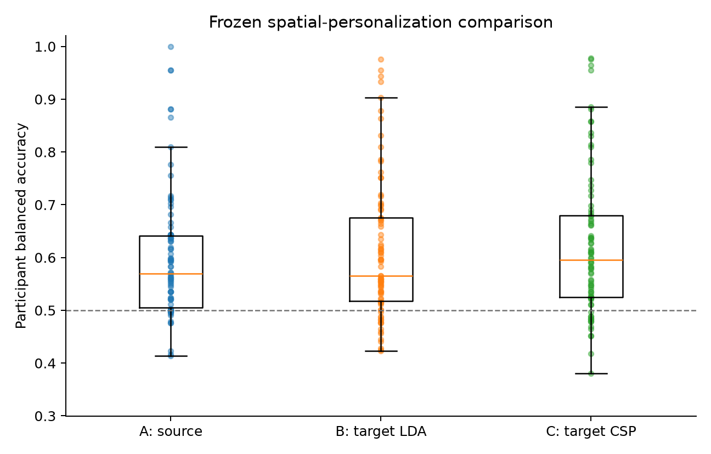
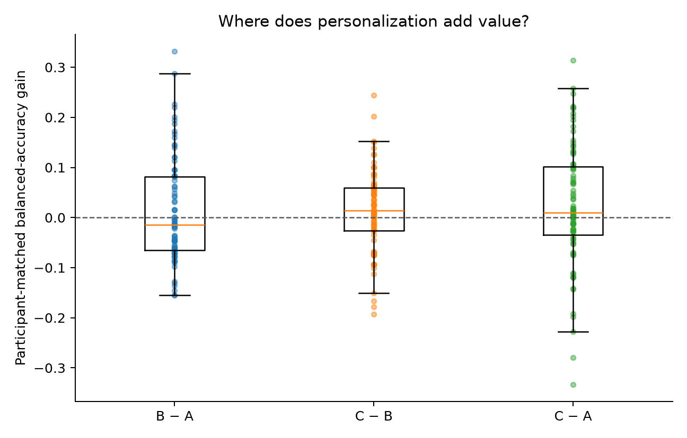
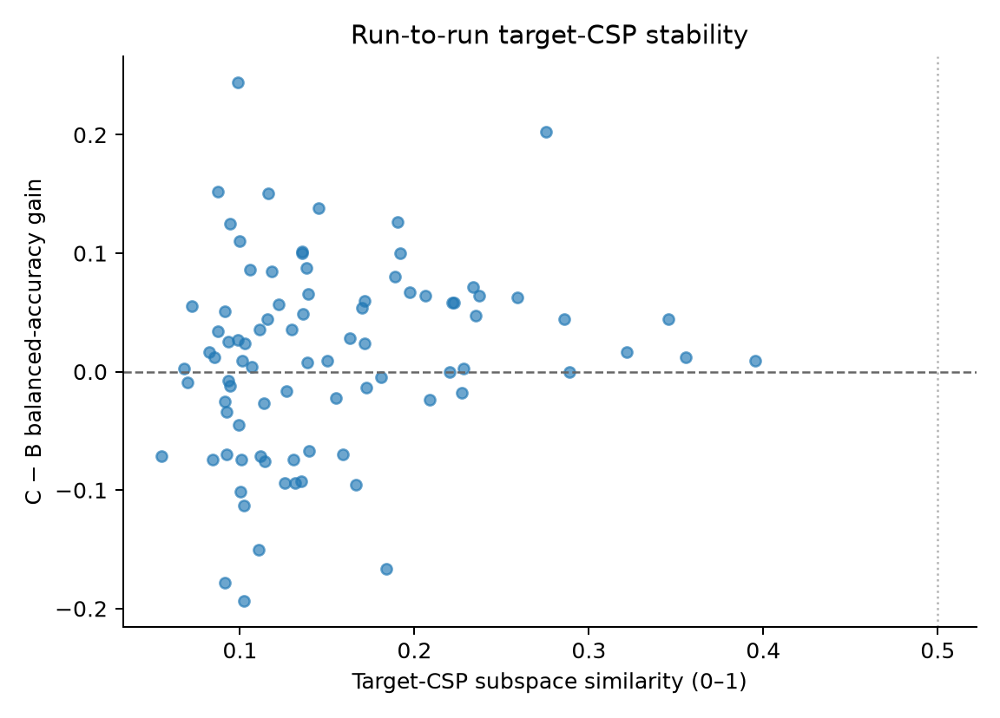

# Decision-layer versus spatial personalization

[Back to the project README](../README.md) ·
[Zero-shot decoder](cross_subject_decoding.md) ·
[Minimal decision-threshold calibration](minimal_target_calibration.md) ·
[Within-subject decoder](within_subject_decoding.md)

## Initial methodology freeze

This study begins from completed calibration commit `5d11ed1`. It preserves the
frozen zero-shot source-CSP median of 0.570, 14-label threshold-calibration median of
0.613, and historical within-subject CSP median of 0.658. It asks a new question:

> With the same 14 labeled target trials, does learning a participant-specific CSP
> spatial representation add value beyond learning only a new downstream classifier?

The complete pre-development policy is
[`config/spatial_personalization.json`](../config/spatial_personalization.json).
Subjects 1–20 develop two small methodological choices. Target-CSP outcomes for the
86 eligible subjects 21–109 remain locked until the selected method is committed.
These evaluation recordings are not broadly untouched: their physiology,
within-subject decoding, zero-shot performance, and threshold-calibration outcomes
are historical evidence. What remains protected is the new target-specific CSP
performance and spatial-stability outcome; none has been used to design this method.

## What representation adaptation changes

A decision layer acts on features already constructed by earlier transformations.
Decision-layer adaptation asks whether the source CSP coordinates are useful for a
new person but need a new class boundary. Representation adaptation instead learns
new sensor weights before constructing those features:

```text
A: source CSP → source scaler → source LDA                 (no target fitting)
B: source CSP → selected scaling → target LDA              (decision only)
C: target CSP → target scaler → target LDA                 (spatial + decision)
```

All target-supervised fits use only the calibration run. The two other runs can call
`transform` and `predict`, but cannot estimate a covariance matrix, spatial filter,
mean, scale, or class boundary. Unlabeled test EEG is equally forbidden from
alignment or adaptation.

CSP can be participant-specific because its filters solve a generalized covariance
contrast in sensor coordinates. Anatomy, cap placement, electrode coupling, and
recording state can change those covariances across people. A pooled source filter
may therefore describe a useful common contrast without being the best coordinate
system for a particular participant.

## Why 14 trials are difficult for CSP

Each calibration run contributes the first seven fists and seven feet trials in
annotation chronology. One trial has array shape `(64 channels, 320 samples)`, so a
calibration input has shape `(14, 64, 320)`. Although each trial contains many time
samples, only seven labeled trials estimate each class distribution. A 64-by-64
covariance matrix contains 2,080 distinct entries, and temporal samples within an EEG
trial are correlated rather than independent observations. The estimate can
therefore vary considerably with one short run.

Development compares only empirical covariance with Ledoit–Wolf shrinkage for four
CSP components. Shrinkage trades some data-specific detail for lower estimation
variance. This is not a new classifier search: the passband, task interval, CSP
feature definition, scaler family, and equal-prior shrinkage LDA are inherited.

For condition B, development also decides globally whether to retain the source
scaler or estimate target feature scaling from the same 14 calibration trials.
Target scaling is selected only with a median paired gain of at least 0.01 and wins
for at least 60% of development participants; otherwise source scaling remains.

## Frozen calibration and comparison geometry

For each participant the experiment repeats three scenarios:

```text
calibrate run 6  → test runs 10 and 14
calibrate run 10 → test runs 6 and 14
calibrate run 14 → test runs 6 and 10
```

All methods predict identical test-trial identities. A participant's primary score
is the unweighted mean of the six scenario/test-run balanced accuracies. Repeated
test appearances are useful matched measurements, not independent participants.
The primary contrasts are `B−A`, `C−B`, and `C−A`, each calculated within person.

A paired transition is called convincing only if the candidate median accuracy is
at least 0.60, median gain is at least +0.03, at least 60% improve, the one-sided
exact sign test is at most 0.05, both median recalls are at least 0.55 with at most
0.10 imbalance, and the QC-sensitive median paired gain is at least +0.02. These
criteria and the decision/spatial/both/insufficient interpretation rules are fixed
before development or evaluation outcomes.

## Sign- and order-invariant CSP stability

Raw CSP columns cannot be compared naively. A component can reverse sign without
changing its feature power, components can exchange order, and an equivalent basis
can rotate inside the same spatial subspace. The stability diagnostic therefore
compares the four-dimensional filter **subspaces** using principal angles. For angles
`θ₁…θ₄`, similarity is:

\[
S=\frac{1}{4}\sum_{k=1}^{4}\cos^2(\theta_k).
\]

`S = 1` means identical subspaces and `S = 0` means orthogonal subspaces. Each
participant's value averages the three pairwise calibration-run similarities. This
quantity is invariant to component sign, order, and rotations within the selected
subspace. Its relationship with accuracy is exploratory and cannot revise the
method.

At this freeze, no new personalization outcome has been calculated. Development
evidence, the final selected covariance/scaling choices, evaluation results,
limitations, reproduction commands, and the decision gate will be added only after
their respective boundaries are respected.

## Development evidence and method selection

After the initial protocol and leakage-safe implementation were committed, subjects
1–20 were evaluated as targets in 20 leave-one-subject-out source folds. The other 19
participants supplied 855 trials for A/B source CSP. Each target supplied exactly 14
balanced chronological calibration trials per scenario; its other two runs were
test-only. C used no source participant to fit its target CSP.

| Development method | Median balanced accuracy | IQR | Participants >0.50 | Median fists/feet recall |
| --- | ---: | ---: | ---: | ---: |
| A: source zero-shot | 0.568 | 0.523–0.673 | 18/20 | 0.718 / 0.696 |
| B: source CSP, source scaler, target LDA | 0.602 | 0.520–0.673 | 16/20 | 0.682 / 0.546 |
| B candidate: source CSP, target scaler, target LDA | 0.602 | 0.520–0.673 | 16/20 | 0.682 / 0.546 |
| C: empirical target CSP/scaler/LDA | 0.553 | 0.512–0.721 | 17/20 | 0.663 / 0.580 |
| C: Ledoit–Wolf target CSP/scaler/LDA | 0.602 | 0.515–0.695 | 16/20 | 0.716 / 0.490 |

Fitting a target scaler after the source scaler changed no participant score: the
paired difference was exactly zero for all 20 participants. This does not mean
scaling is universally irrelevant; in this fixed feature/LDA pipeline the second
affine standardization provided no predictive change. The simpler **retained source
scaler** is therefore selected for B.

For C, the Ledoit–Wolf-minus-empirical participant-matched difference was +0.011
(IQR −0.035 to +0.036): Ledoit–Wolf was better for 11/20, empirical for 8/20, and one
tied. The separate medians differ more (+0.049) because different participants
occupy the center of each distribution. Under the frozen paired practical-tie rule,
**Ledoit–Wolf target CSP** is selected. Four components remain fixed; no evaluation
outcome or additional candidate influenced either choice.

Development CSP stability was low. Median mean pairwise subspace similarity was
0.192 for empirical CSP and **0.114 for selected Ledoit–Wolf CSP**. Low filter-space
agreement can coexist with similar group accuracy because different run-specific
subspaces may work for different trials or participants. It nevertheless warns that
one short calibration run may not estimate a reproducible personal spatial
representation. Stability remains post-primary and cannot veto the selected method.

Machine-readable development evidence includes the [group summary](assets/spatial_personalization_development_group_summary.csv),
[method selection](assets/spatial_personalization_development_method_selection.csv),
[participant scores](assets/spatial_personalization_development_participant_scores.csv),
[fit audit](assets/spatial_personalization_development_fit_audit.csv), and
[CSP stability](assets/spatial_personalization_development_csp_stability.csv).

## Final held-out evaluation

The final source-scaler B and four-component Ledoit–Wolf C methods were frozen at
commit `5d43e46` before any evaluation target CSP was fitted. All 86 eligible
participants completed all three calibration-run scenarios. The analysis contains
3,840 unique target trials and 23,040 prediction appearances: each trial appears
under two allowed calibration contexts for each of A, B, and C.

| Method | Median (95% bootstrap CI) | IQR | >0.50 | ≥0.60 | ≥0.70 | Median fists/feet recall |
| --- | ---: | ---: | ---: | ---: | ---: | ---: |
| A: source zero-shot | 0.570 (0.549–0.597) | 0.505–0.641 | 65/86 (75.6%) | 32/86 (37.2%) | 14/86 (16.3%) | 0.762 / 0.600 |
| B: source CSP/scaler + target LDA | 0.565 (0.553–0.612) | 0.517–0.675 | 70/86 (81.4%) | 37/86 (43.0%) | 18/86 (20.9%) | 0.611 / 0.619 |
| C: target CSP/scaler/LDA | 0.596 (0.564–0.627) | 0.525–0.680 | 71/86 (82.6%) | 41/86 (47.7%) | 18/86 (20.9%) | 0.593 / 0.636 |



B corrects A's class-recall asymmetry but does not improve balanced accuracy. Its
participant-matched B−A difference is **−0.014** (IQR −0.065 to +0.082): 36 improve,
49 worsen, and one ties; the one-sided exact sign `p = 0.936`.

C is modestly better than B. The C−B difference is **+0.014** (IQR −0.026 to
+0.059): 53/86 improve, 32 worsen, and one ties (`p = 0.0147`). It nevertheless
fails two frozen requirements: the gain is below +0.03 and C's median 0.596 is below
0.60. C−A is only **+0.010** (IQR −0.035 to +0.102), with 49 improved, 35 worsened,
and two tied (`p = 0.0778`). None of the three paired transitions is convincing.



## Run sensitivity and spatial stability

C's median accuracy by calibration run was 0.583 for run 6, 0.612 for run 10, and
0.580 for run 14. The matched Friedman test was not significant (`p = 0.553`); B was
similarly insensitive in its group medians (`p = 0.898`). Yet participant-level
scenario/test-run ranges grew from median 0.138 for A to 0.246 for B and 0.290 for C.
The identity of the calibration run does not create a consistent cohort ordering,
but personalized predictions vary substantially across run contexts.

Target-CSP subspaces were uniformly unstable. Median pairwise similarity was
**0.131** (IQR 0.100–0.188), and all 86 participants fell below the pre-defined 0.50
low-stability boundary. Because this measure compares subspaces, the result cannot
be explained by arbitrary CSP component sign or order.



Higher stability related weakly to larger C−B gains (`ρ = 0.226`, unadjusted
`p = 0.036`). This post-primary association is compatible with unstable covariance
estimation limiting benefit, but does not establish causality or authorize a new
method on these outcomes.

## QC, subgroups, and historical context

The copied QC sensitivity changes the cohort median by +0.001 for B and 0.000 for C;
all 86 participants remain represented. QC-sensitive paired gains are +0.024 for C−B
and +0.025 for C−A. Retained statistical candidates therefore do not explain the
negative primary gate.

Among the 21 pre-defined poor zero-shot participants, median C−B gain is +0.027;
14 improve and seven worsen. Their C median remains 0.583, below the frozen 0.60
criterion. Baseline subgroup selection also permits regression to the mean, so this
is exploratory rather than evidence for targeted deployment.

C−B gain has no substantial relationship with historical zero-shot accuracy
(`ρ = −0.160`), C3/C4 ERD (`ρ = −0.105/−0.011`), or historical within-subject CSP
accuracy (`ρ = +0.116`; all unadjusted `p > 0.14`). The observed spatial benefit is
not clearly concentrated in participants with stronger historical physiology or
personal decoding.

The historical 14-label threshold method has the same calibration/test geometry.
C's matched difference from it is −0.003: C is better for 42/86 and threshold for
44/86, despite separate medians of 0.596 and 0.613. Target CSP therefore does not
improve on the simpler threshold result. Historical within-subject CSP remains a
different design with two complete training runs; its median is 0.658, and the
matched C-minus-within difference is −0.045 (within better for 64/86).

## Scientific interpretation and decision gate

The evidence does not support a pure decision-boundary bottleneck: B is slightly
worse than A. C provides a small and participant-inconsistent improvement over B,
but not a convincing improvement over either A or the historical threshold method.
The participant-specific CSP subspace also changes dramatically depending on which
single run supplies 14 labels.

Under the pre-frozen interpretation rule, **one-run personalization is
insufficient**. The next-step decision is **D: personalization still adds little;
stop increasing CSP complexity and reconsider the representation**. This milestone
does not implement covariance alignment, Riemannian features, additional calibration
runs, or another classifier family.

## Reproduction and verification

From the activated project environment:

```bash
python scripts/develop_spatial_personalization.py
python scripts/evaluate_spatial_personalization.py
python -m unittest tests.test_spatial_personalization_freeze tests.test_spatial_personalization tests.test_spatial_personalization_development_artifacts tests.test_spatial_personalization_final_freeze tests.test_spatial_personalization_evaluation tests.test_spatial_personalization_evaluation_artifacts -v
python -m unittest discover -s tests -v
python -m compileall -q eeg_project scripts tests
```

Evaluation reuses the 86 validated frozen-source feature checkpoints. The first pass
stores only each participant's aligned 8–30 Hz tensor under
`outputs/spatial_personalization_checkpoints/`; subsequent runs validate its config,
implementation, source-checkpoint, EDF, and array hashes before fitting the three
small target CSPs. Two consecutive checkpoint-only runs regenerated all 17 report
files byte-for-byte identically. No source model or historical outcome was refitted.

Primary machine-readable entry points are the [group summary](assets/spatial_personalization_evaluation_group_summary.csv),
[paired summary](assets/spatial_personalization_evaluation_paired_summary.csv),
[participant scores](assets/spatial_personalization_evaluation_participant_scores.csv),
[predictions](assets/spatial_personalization_evaluation_predictions.csv),
[fit audit](assets/spatial_personalization_evaluation_fit_audit.csv),
[CSP stability](assets/spatial_personalization_evaluation_csp_stability.csv), and
[metadata](assets/spatial_personalization_evaluation_metadata.json).

## Limitations

- Personalization is simulated within three short runs from one recording session,
  not tested prospectively across days, devices, or laboratories.
- Fourteen balanced trials estimate a 64-channel spatial covariance contrast; the
  uniformly low subspace stability demonstrates the practical uncertainty of that
  estimate but does not identify its source.
- Evaluation EEG and several historical outcomes were already known. Only the new
  target-CSP performance/stability method was prospectively protected.
- Repeated test appearances are dependent; all inference correctly uses one
  aggregate per participant, but the simple summaries do not model the complete
  trial/run hierarchy.
- Poor-baseline, physiology, within-subject, and stability relationships are
  exploratory, unadjusted, and cannot define subgroups or causal mechanisms.
- Historical within-subject decoding uses two complete training runs and is not a
  sample-matched comparator for one-run calibration.

## What you should understand now

- Adapting a class boundary is different from learning a new spatial coordinate
  system; the latter requires fitting class covariance from target EEG.
- A target LDA on frozen source-CSP features did not improve zero-shot accuracy,
  despite correcting class-recall imbalance.
- Target CSP added only +0.014 over target LDA and +0.010 over zero-shot—too little
  for the frozen practical criteria and no better than threshold calibration.
- Principal-angle similarity shows that the learned four-dimensional CSP space is
  highly dependent on which short run supplies calibration, not merely component
  sign or order.
- The current evidence supports reconsidering the representation rather than adding
  more CSP complexity to these already opened outcomes.
