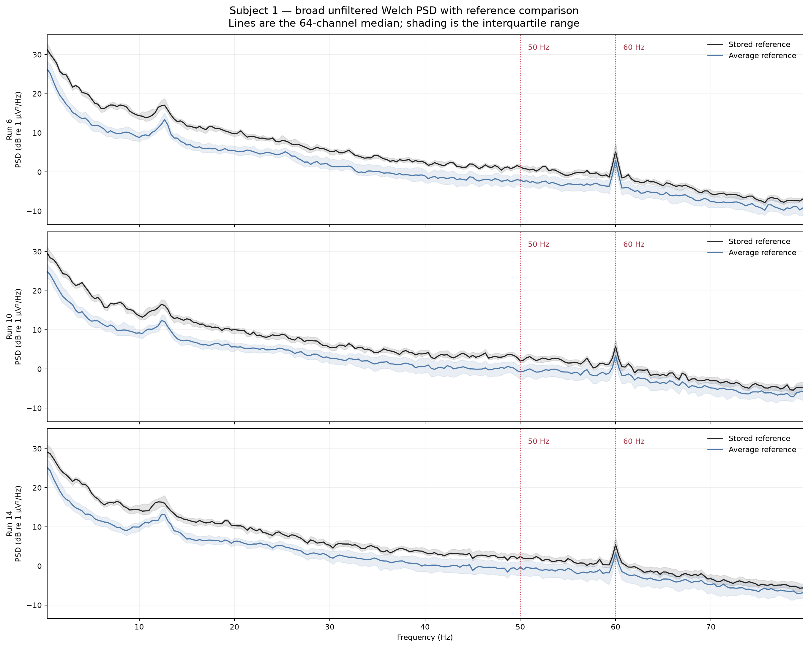
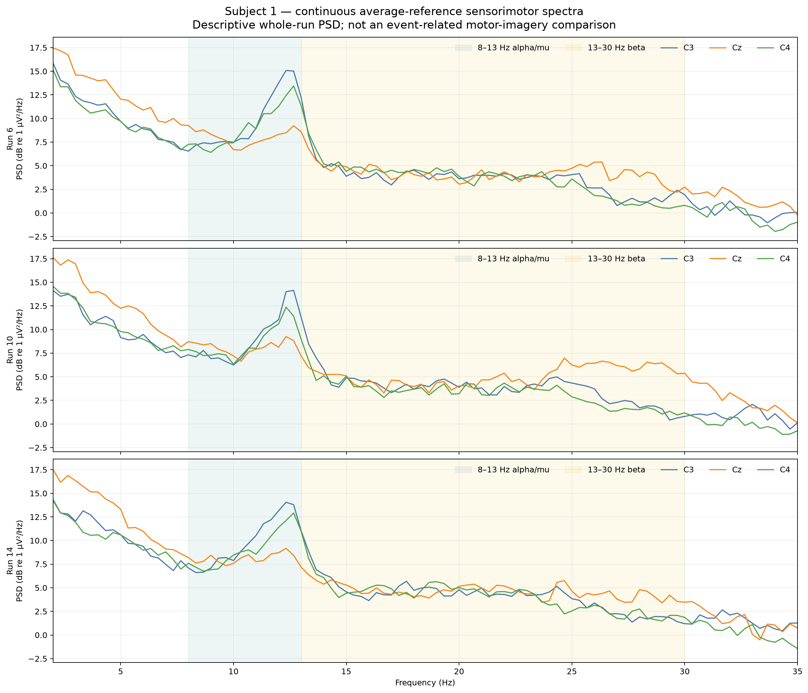
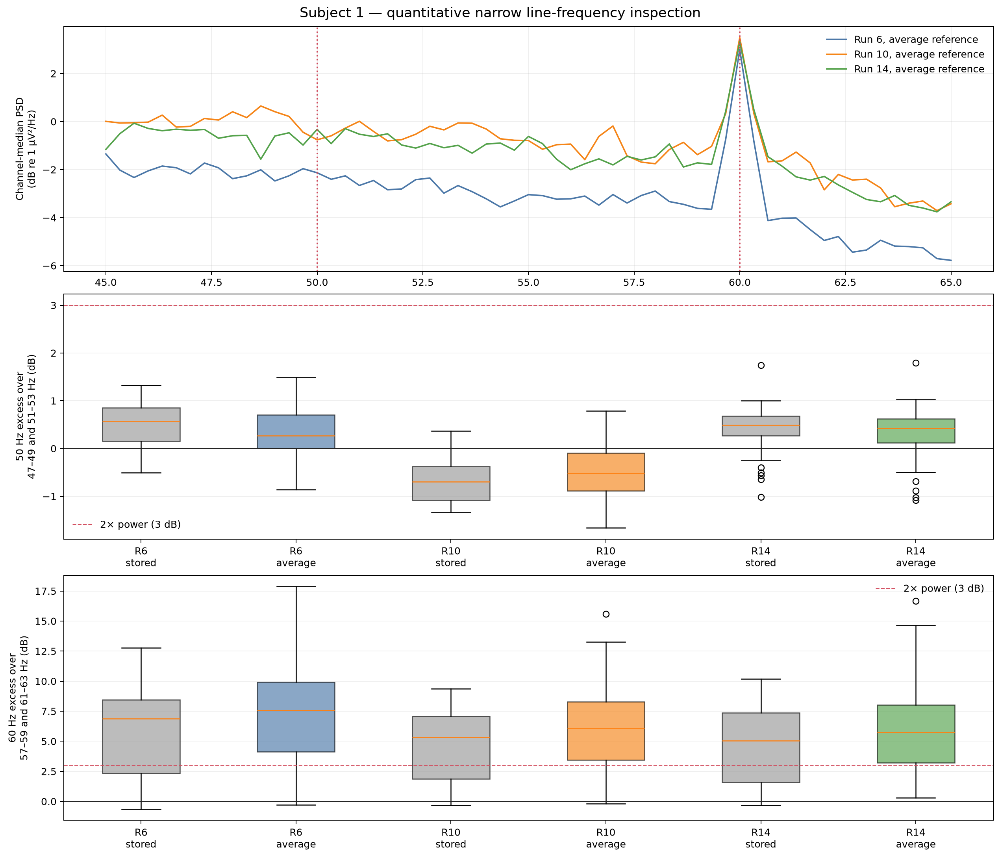

# Raw frequency-domain characterization and filter design

[Back to the project README](../README.md)

## Question and scope

This milestone asks what frequencies are present in subject 1, runs 6, 10, and
14; whether narrow electrical-line contamination is measurable; how the stored
and average references differ spectrally; and which future filters the evidence
supports. The executable analysis is
[`scripts/analyze_spectrum.py`](../scripts/analyze_spectrum.py).

This is a characterization of continuous, unfiltered EEG. It does not perform
production filtering, artifact correction, epoching, or machine learning. The
downloaded EDF files remain unchanged.

## Time and frequency describe the same signal

A raw EEG plot shows voltage as a function of time. It makes transients,
polarity, duration, and annotation timing visible. A spectrum describes how the
signal's power is distributed over frequency. It makes repeated fast and slow
structure easier to compare. These are different mathematical views of the
same sampled voltage sequence, not two different recordings.

Frequency is the reciprocal of period:

\[
f=\frac{1}{T}
\]

where $f$ is cycles per second in hertz and $T$ is seconds per cycle. A 1 Hz
oscillation repeats once per second, a 10 Hz oscillation ten times per second,
and a 50 Hz oscillation fifty times per second. Real EEG is nonstationary and
not literally a collection of permanent perfect sinusoids. Sines and cosines
are nevertheless useful basis functions: a finite sampled signal can be
represented as a weighted combination of components at discrete frequencies.

## DFT, Fourier coefficients, and FFT

For $N$ digital samples $x[n]$, the discrete Fourier transform (DFT) is

\[
X[k]=\sum_{n=0}^{N-1}x[n]\exp\left(-i\frac{2\pi kn}{N}\right).
\]

- $x[n]$ is sample $n$ in the time domain;
- $n$ indexes the $N$ input samples;
- $k$ indexes a frequency bin;
- $X[k]$ is generally a complex Fourier coefficient;
- $i$ is the imaginary unit;
- the complex exponential represents sine and cosine components.

The magnitude $|X[k]|$ describes component size. The complex angle describes
phase: where that component lies within its cycle relative to the analysis
origin. A real-valued input has conjugate-symmetric positive and negative
frequency coefficients, so a one-sided spectrum can report frequencies from
0 Hz through Nyquist.

The fast Fourier transform (FFT) is an efficient family of algorithms for
computing the DFT. It is not a different physical transform.

## Sampling, Nyquist, and aliasing

These files have sampling frequency $f_s=160$ Hz, so their Nyquist frequency is

\[
f_{\mathrm{Nyquist}}=\frac{f_s}{2}=80\ \mathrm{Hz}.
\]

Samples taken 160 times per second cannot uniquely distinguish frequencies
above 80 Hz without an appropriate acquisition anti-alias filter. Above-Nyquist
content can fold into the representable band. For example, a 90 Hz sinusoid
sampled at 160 Hz has the same sample pattern as a 70 Hz sinusoid up to phase,
because $160-90=70$ Hz. That ambiguity is aliasing. Consequently, this project
cannot use these recordings to make claims about genuine activity above 80 Hz,
and even near-Nyquist interpretation requires caution about undocumented
acquisition hardware.

## Frequency resolution

For an $N$-sample DFT at sampling frequency $f_s$, frequency-bin spacing is

\[
\Delta f=\frac{f_s}{N}\approx\frac{1}{T},
\]

where $T=N/f_s$ is segment duration. A longer segment provides more closely
spaced frequency bins but poorer temporal localization and fewer approximately
independent segments in a fixed recording. A shorter segment gives more local
estimates and more averages, but coarser frequency spacing.

Zero-padding can evaluate the transform on a denser grid. It interpolates the
spectrum; it does not create information or improve the true ability to resolve
two nearby components. This workflow performs no zero-padding.

## Magnitude, power, PSD, and decibels

Fourier amplitude or magnitude describes the size of a coefficient. Power is
proportional to squared magnitude. Squaring makes contributions non-negative
and connects spectral content to signal variance, which is particularly useful
for later motor-imagery methods based on variance differences.

A power spectral density (PSD) expresses power per unit frequency. MNE returns
EEG PSD in V²/Hz when the input data are in its internal volt units. The script
multiplies by

\[
(10^6)^2=10^{12}
\]

to report µV²/Hz. Integrating a PSD across frequency yields band power in µV².
This square is essential: converting voltage power from V² to µV² requires
$10^{12}$, not $10^6$.

Figures use

\[
P_{\mathrm{dB}}=10\log_{10}\left(\frac{P}{1\ \mu\mathrm{V}^2/\mathrm{Hz}}\right).
\]

A 3.01 dB increase is approximately twice the power. The logarithm compresses
the large PSD range so narrow and broad structure can share one axis. The CSVs
retain linear physical units, so the dB display does not replace the underlying
measurements.

## Why Welch's method was selected

A single periodogram of all 124.5 valid seconds would have fine bin spacing but
high estimate variability and no averaging over time. Welch's method instead:

1. divides the signal into overlapping finite segments;
2. removes each segment's mean (DC component);
3. multiplies each segment by a window;
4. computes a periodogram for each segment;
5. averages the periodograms at each frequency.

Abruptly cutting a finite segment is equivalent to multiplying by a rectangular
window. Discontinuity at the boundaries spreads energy into neighboring
frequencies, called spectral leakage. A Hann window tapers both segment ends and
reduces leakage, with a wider spectral main lobe as the tradeoff.

MNE 1.12.1's `psd_array_welch` defaults are not silently accepted: its API
defaults include `n_fft=256`, zero overlap, and a Hamming window. This analysis
explicitly overrides every important parameter.

| Welch property | Selected value | Reason |
| --- | ---: | --- |
| Valid duration | 124.5 s / 19,920 samples | Excludes the known invalid tail |
| Segment duration | 3.0 s | Balances resolution and repeated estimates |
| Samples per segment | 480 | $3\times160$ |
| Overlap | 240 samples / 50% | Provides 82 overlapping segments with exact coverage |
| Window | Hann | Reduces boundary leakage |
| Averaging | Arithmetic mean | Standard, explicit Welch aggregation |
| Segment DC | Removed | Prevents each segment mean from dominating 0 Hz |
| `n_fft` | 480 | Equal to segment length; no zero-padding |
| Bin spacing | 0.333333 Hz | $160/480$ |
| Computed range | 0–80 Hz | Full one-sided physically representable grid |

The 82 windows cover every valid sample: the first window has 480 samples and
each later window advances 240, so $480+81\times240=19{,}920$. A 4-second window
would improve bin spacing to 0.25 Hz, but with 50% overlap it would leave the
last 0.5 valid seconds outside a complete segment and produce fewer averages.
Three seconds also places 50 and 60 Hz exactly on frequency bins.

## Invalid-boundary handling and reference states

Each EDF contains 20,000 samples. The script detects 80 exact all-channel zero
samples at indices 19,920–19,999 (124.5–125.0 s) in every run. No earlier sample
is simultaneously zero across all 64 channels. The workflow crops a copied
in-memory view to 19,920 valid samples; it does not modify or rewrite the EDF.

Every PSD uses exactly those same samples in two representations:

1. **stored reference:** values as represented in the EDF after channel-name
   standardization;
2. **average reference:** a copied array with the instantaneous mean of all 64
   channels subtracted.

The script verifies the MNE average-reference result against the explicit
subtraction equation and verifies that the stored array remains unchanged.
No candidate channel is automatically marked bad or removed.

The average reference reduces median 1–45 Hz absolute power by 5.72, 5.31, and
4.99 dB in runs 6, 10, and 14 respectively. This is expected: reference choice
changes channel voltages and PSD. It does not mean that the removed common
component was entirely artifact.

Leave-one-channel-out tests show that the most influential single channel is
`Fp1`, but excluding it changes the reference trace's standard deviation by only
0.021–0.029 of the original reference-trace standard deviation. Leaving out the
six-channel frontal review group changes it by 0.110–0.151. The group matters,
but no single candidate dominates the 64-channel mean. The major frequency
conclusions persist under both references. Average reference therefore remains
the selected derived representation for the next preprocessing milestone,
subject to the already documented limitations and continued channel review.

## Conventional EEG bands and motor relevance

Band names are conventions whose boundaries vary across studies. They do not
map one-to-one onto mental states. This report uses adjacent bands that tile the
explicit 1–45 Hz denominator:

| Report name | Boundary |
| --- | ---: |
| Delta | 1–4 Hz |
| Theta | 4–8 Hz |
| Alpha / mu descriptive range | 8–13 Hz |
| Beta | 13–30 Hz |
| Low gamma, descriptive only | 30–45 Hz |

Mu is an alpha-range sensorimotor rhythm, often examined near central scalp
sites. Beta-range activity is also relevant to motor tasks. `C3`, `Cz`, and
`C4` are therefore useful descriptive channels because they sample left,
midline, and right central scalp regions. However, power between 8 and 30 Hz in
a whole-run PSD is not evidence of motor imagery. Demonstrating an
event-related change requires trials aligned to `T1`/`T2`, an explicit baseline
or condition contrast, and leakage-safe statistics.

## Measured spectral findings



The broad figure reports the 64-channel median and interquartile range. It omits
0 Hz and the 80 Hz endpoint from display but the calculation covers the full
0–80 Hz one-sided grid.

Verified observations are:

- PSD is largest at low frequencies and generally declines with frequency.
- The median channel's 0.333–1 Hz power is 25–33% of the combined 0.333–45 Hz
  power under the stored reference and 29–35% after average reference. This is
  evidence that a future high-pass design deserves evaluation; it is not proof
  that all slow power is artifact.
- A repeatable broad peak occurs near 12–13 Hz. It remains descriptive because
  the analysis is continuous rather than event-locked.
- A narrow 60 Hz feature is visible in all three runs. A comparable 50 Hz peak
  is not.
- Median power from 45 Hz through the last non-Nyquist bin is only about 1.6–2.6%
  of 1–45 Hz power in the stored representation and 3.3–5.1% after average
  reference. This range includes the narrow 60 Hz line and is not a statement
  that all high-frequency content is noise.

### Central sensorimotor channels



`C3` and `C4` show pronounced 12–13 Hz peaks in all three average-reference
runs; `Cz` differs in shape and retains more low-frequency power. This is
compatible with a central alpha/mu-range spectral feature, but it cannot show
event-related desynchronization or distinguish fists from feet.

### 50 and 60 Hz tests

For each channel, run, and reference, the metric compares the exact line bin to
the median PSD in two flanking ranges:

\[
E_f=10\log_{10}\left(
\frac{\mathrm{PSD}(f)}{\operatorname{median}(\mathrm{PSD}(f-3{:}f-1),
\mathrm{PSD}(f+1{:}f+3))}
\right).
\]

This local ratio is simple and interpretable: 3 dB means approximately twice
the neighboring power. It is a descriptive screening metric, not a universal
line-noise significance test.



| Run | Reference | 50 Hz median excess | Channels >3 dB | 60 Hz median excess | Channels >3 dB |
| ---: | --- | ---: | ---: | ---: | ---: |
| 6 | Stored | 0.57 dB | 0/64 | 6.87 dB | 44/64 |
| 6 | Average | 0.26 dB | 0/64 | 7.57 dB | 51/64 |
| 10 | Stored | −0.69 dB | 0/64 | 5.33 dB | 42/64 |
| 10 | Average | −0.52 dB | 0/64 | 6.06 dB | 49/64 |
| 14 | Stored | 0.49 dB | 0/64 | 5.06 dB | 42/64 |
| 14 | Average | 0.42 dB | 0/64 | 5.74 dB | 49/64 |

Argentina's present 50 Hz electrical grid is irrelevant evidence by itself for
these previously recorded files. The data contain no meaningful stable 50 Hz
peak by this metric, so a 50 Hz notch is not justified. They do contain a strong,
stable, broadly distributed 60 Hz line. Its exact physical source is not proven
by PSD alone; describing it as measured 60 Hz line contamination is safer than
inventing an acquisition explanation.

### Absolute and relative band power

Absolute band power is the PSD integral in µV². Relative power is defined here
only as

\[
\text{relative power}_{a:b}=
\frac{\int_a^b P(f)\,df}{\int_1^{45} P(f)\,df}.
\]

It describes composition within 1–45 Hz and discards absolute scale. A channel
can have a large relative alpha value while having low absolute power, so both
columns are retained in the CSV.

Median relative powers across the 64 average-reference channels are:

| Run | Delta | Theta | Alpha/mu | Beta | Low gamma, descriptive |
| ---: | ---: | ---: | ---: | ---: | ---: |
| 6 | 0.500 | 0.137 | 0.154 | 0.162 | 0.035 |
| 10 | 0.499 | 0.145 | 0.136 | 0.163 | 0.046 |
| 14 | 0.450 | 0.144 | 0.171 | 0.180 | 0.043 |

The five adjacent integrals reproduce each channel's 1–45 Hz denominator to
floating-point precision. These whole-run summaries mix rest, both task
conditions, transients, and other artifacts; they are not condition effects.

## Filter concepts that informed controlled preprocessing

- A **high-pass** preserves frequencies above its transition and attenuates
  slower components.
- A **low-pass** preserves lower frequencies and attenuates faster components.
- A **band-pass** combines lower and upper limits.
- A **band-stop/notch** attenuates a narrow frequency region.
- The **passband** is the intentionally retained region; the **stopband** is the
  strongly attenuated region; the **transition band** connects them.
- Filter order or FIR filter length controls how rapidly attenuation can change,
  but sharper transitions generally require a longer temporal response.
- A finite impulse response (FIR) filter can provide exactly linear phase and is
  often transparent to design. An infinite impulse response (IIR) filter can be
  computationally compact but has different phase and stability properties.
- A causal filter shifts phase. Forward-and-reverse or symmetric zero-phase
  processing can cancel net phase shift, but it is acausal and effectively uses
  future samples; it also changes the effective filter response.
- Every finite recording and epoch has boundaries. Filtering near an edge uses
  incomplete surrounding context and can create edge artifacts. Padding and
  filtering continuous data before epoch extraction reduce, but do not erase,
  this concern.

Therefore, “filtered 1–40 Hz” is incomplete. A reproducible specification also
needs filter type, passband edge(s), transition bandwidth(s), stopband
attenuation or design rule, filter length/order, phase convention, padding,
software/version, and whether filtering occurred before or after epoching.

## Preprocessing proposal and subsequent resolution

This table records the proposal made from raw spectra. The subsequent
[controlled preprocessing milestone](preprocessing.md) tested the candidates
and finalized the unresolved decisions.

| Operation | Proposed setting | Evidence from these recordings | Risk/tradeoff | Decision |
| --- | --- | --- | --- | --- |
| Invalid-tail exclusion | Stop before sample 19,920 / 124.5 s | Last 80 samples are zero across every channel and all runs | Removes a file-boundary interval, not physiological data; provenance remains unknown | Mandatory |
| Derived reference | 64-channel average reference after explicit channel review | Major spectral conclusions survive both references; largest single-channel reference sensitivity is only 0.021–0.029 | Changes absolute power and can spread contamination; finite scalp coverage | Selected, with review |
| High-pass | Evaluate a 1 Hz passband edge with a documented transition below it | Substantial 0.333–1 Hz and delta power; slow time-domain transients are present | Can remove genuine slow potentials, distort epoch baselines, ring around transients, and create edge effects | Finalized: 1 Hz pass edge, 1 Hz transition |
| Low-pass | Evaluate a 40 Hz passband edge with transition/stopband established before 50 Hz | Primary later feature question is 8–30 Hz; little aggregate power lies above 45 Hz; measured 60 Hz line should be attenuated | Removes potentially useful >40 Hz content and may require a long transition design | Finalized: 40 Hz pass edge, 10 Hz transition |
| 50 Hz notch | None | Median excess −0.69 to 0.57 dB; 0/64 channels exceed 3 dB in every run/reference | An unnecessary notch alters neighboring frequencies and lengthens the processing chain | Do not apply |
| 60 Hz notch | Evaluate only if preserving frequencies near/above 50 Hz, or if the validated 40 Hz low-pass leaves material residual | Median excess 5.06–7.57 dB; 42–51/64 channels exceed 3 dB | Redundant with a sufficient low-pass; notch can ring and removes a narrow real-data band | Tested and rejected after ~61.9 dB low-pass attenuation |
| 8–30 Hz band-pass | Do not use as the sole general preprocessing representation | Mu/beta are the later motor-relevant feature ranges | Would discard information needed for QC and alternative analyses and make preprocessing equal to one feature hypothesis | Later feature-analysis option |

The completed validation selected a 529-sample (3.30625 s), zero-phase,
Hamming-window `firwin` FIR with reflection padding and no notch. It preserves
approximately 99.78% of median 8–30 Hz power while reducing median 0.333–1 Hz
power to 43.5–45.3%. See the preprocessing chapter for the exact response,
synthetic transient test, real-data comparison, and limitations.

## Machine-readable and visual artifacts

| Artifact | Rows / purpose |
| --- | --- |
| [`channel_psd_summary.csv`](assets/subject01_runs06-10-14_channel_psd_summary.csv) | 384 rows: 64 channels × 3 runs × 2 references |
| [`band_power.csv`](assets/subject01_runs06-10-14_band_power.csv) | 1,920 rows: 384 channel/reference cases × 5 bands |
| [`line_frequency_analysis.csv`](assets/subject01_runs06-10-14_line_frequency_analysis.csv) | 768 rows: 384 cases × 50/60 Hz |
| [`reference_effects.csv`](assets/subject01_runs06-10-14_reference_effects.csv) | 192 channel/run rows |
| [`psd_curves.csv`](assets/subject01_runs06-10-14_psd_curves.csv) | 1,434 plotted-frequency/run/reference rows |
| Broad PSD PNG | Reference-sensitive whole-scalp summary |
| Sensorimotor PSD PNG | Continuous C3/Cz/C4 descriptive spectra |
| Line-frequency PNG | 50/60 Hz shape and channel distributions |

A topographic band-power figure was deliberately omitted. At this stage it
would use template rather than subject-digitized positions and could encourage
spatial or motor-condition interpretation unsupported by whole-run band power.

## Reproduce

From the activated project environment:

```bash
python scripts/analyze_spectrum.py
```

Inspect options or write an isolated run outside tracked report assets:

```bash
python scripts/analyze_spectrum.py --help
python scripts/analyze_spectrum.py --runs 10 --output-dir outputs/run10_spectrum
```

Custom segment settings are accepted only when complete Welch windows cover the
entire valid interval exactly. Custom line frequencies must fall strictly below
Nyquist and lie on an exact configured DFT bin.

## Interpretation boundaries

- Results describe one participant and three short runs.
- Whole-run Welch averaging hides changes over time and mixes experimental
  conditions with rest.
- Overlapping Welch segments reduce variance but are not independent trials.
- Reference choice changes every channel's absolute spectrum.
- Relative band powers depend on the chosen 1–45 Hz denominator and boundaries.
- Narrow peaks do not identify their physical source; broad or band-limited
  power does not identify a cognitive state.
- A 12–13 Hz central peak is not evidence of event-related desynchronization.
- The analysis has not tested artifact rejection, filter response, or
  classification performance.
- The EDF header does not establish the true acquisition hardware response, so
  near-Nyquist interpretation remains limited.

## Sources

- Welch, P. D. (1967). [The use of fast Fourier transform for the estimation of power spectra](https://doi.org/10.1109/TAU.1967.1161901). *IEEE Transactions on Audio and Electroacoustics*, 15(2), 70–73.
- MNE-Python contributors. [`mne.time_frequency.psd_array_welch`](https://mne.tools/stable/generated/mne.time_frequency.psd_array_welch.html): PSD units, explicit parameters, averaging, and output shapes.
- MNE-Python contributors. [The `Spectrum` and `EpochsSpectrum` classes](https://mne.tools/stable/auto_tutorials/time-freq/10_spectrum_class.html): spectrum estimation and units.
- SciPy contributors. [`scipy.signal.welch`](https://docs.scipy.org/doc/scipy/reference/generated/scipy.signal.welch.html): segmentation, overlap, windowing, scaling, and Welch estimation.
- Schalk, G., McFarland, D. J., Hinterberger, T., Birbaumer, N., & Wolpaw, J. R. (2004). [BCI2000: a general-purpose brain-computer interface system](https://doi.org/10.1109/TBME.2004.827072). *IEEE Transactions on Biomedical Engineering*, 51(6), 1034–1043.
- Schalk, G. (2009). [EEG Motor Movement/Imagery Dataset](https://physionet.org/content/eegmmidb/1.0.0/) (version 1.0.0). PhysioNet.
