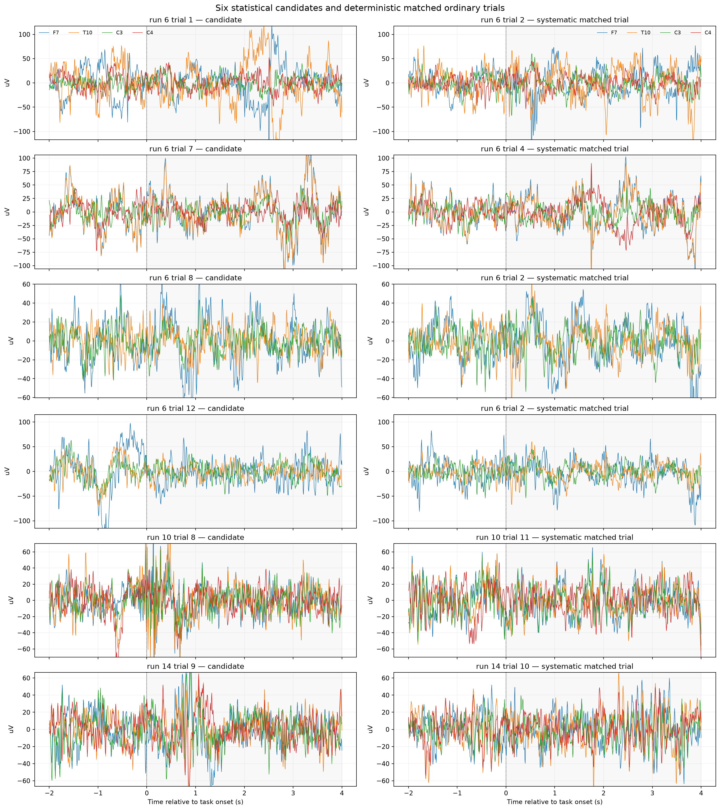
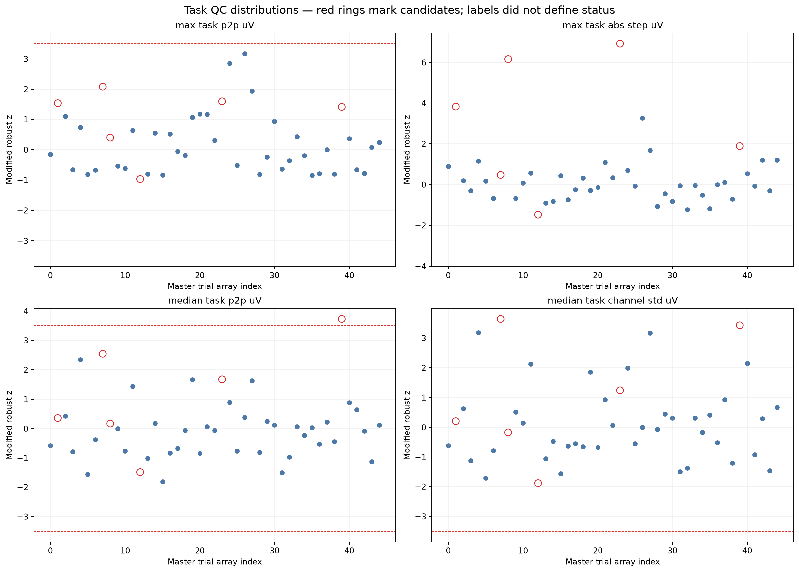
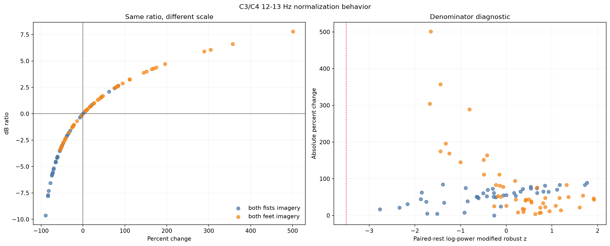
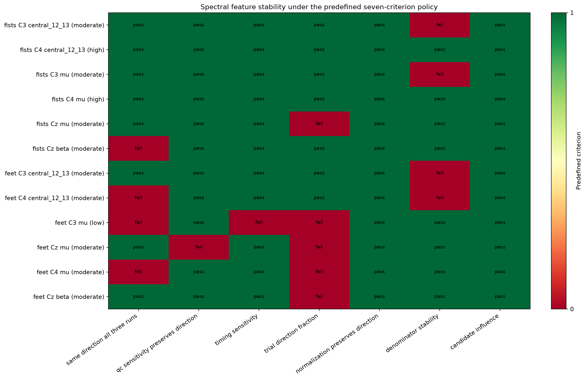

# Artifact policy and spectral feature stability

## Purpose and result in one paragraph

This milestone asks whether the subject-1 paired-rest spectral measurements survive
reasonable, label-independent quality and analysis choices. It does **not** search for
a rejection rule that increases fists-versus-feet separation. All 45 master task
epochs and their 45 immediately preceding `T0` references remain present. Six task
epochs remain statistical QC candidates, five paired-rest intervals are independently
flagged for review, and no trial or channel is permanently rejected. Under seven
criteria fixed before computing the report, C4 both-fists 12–13 Hz is high stability
(7/7); C3 both-fists 12–13 Hz is moderate (6/7) because its magnitude is associated
with reference-power rank. These are subject-specific sensor-level observations, not
a biomarker or proof that motor imagery has been detected.

The reusable implementation is in
[`eeg_project/trial_quality.py`](../eeg_project/trial_quality.py), the frozen policy is
[`config/trial_quality.json`](../config/trial_quality.json), and the report command is
[`scripts/analyze_trial_quality.py`](../scripts/analyze_trial_quality.py).

## Detecting, identifying, rejecting, and correcting are different decisions

| Term | Meaning | Consequence |
| --- | --- | --- |
| Artifact candidate | A signal, channel, or trial is statistically or visually unusual. | Flag for review; no physical cause or required action follows automatically. |
| Artifact identification | Independent evidence supports a likely physical source such as eye activity, muscle, motion, electrical interference, or electrode failure. | Enables a source-specific decision, but uncertainty must still be recorded. |
| Trial rejection | The entire epoch is removed because it is not scientifically usable under a predefined rule. | Loses every channel and every feature in that trial. It changes sample size and may bias conditions if applied circularly. |
| Channel rejection | A sensor is marked unusable for some defined interval or recording. | Downstream methods exclude that sensor unless it is repaired. This needs evidence of sensor failure, not merely a transient seen at that sensor. |
| Channel interpolation | A rejected sensor is estimated from surrounding sensors and their geometry. | Preserves array shape but replaces measured data with an estimate. MNE's EEG implementation can use spherical splines; interpolation is appropriate for a genuinely bad sensor, not a blink shared across sensors. |
| Artifact correction | A modeled artifact contribution is subtracted or projected out while retaining the trial. | Alters all affected samples/channels and can also remove neural signal if the model or component selection is wrong. ICA, SSP, and EOG regression are examples. |

Calling all of these actions “cleaning” hides their very different assumptions and
risks. A robust z-score can detect an unusual trial; it cannot identify a blink. A
frontal topography can be compatible with ocular activity; without dedicated EOG or
another source-specific validation, it still does not confirm that cause.

## Evidence available before this report

The consolidated machine-readable table is
[`artifact_evidence.csv`](assets/subject01_runs06-10-14_artifact_evidence.csv).

| Observation | Possible explanation | Evidence strength | Current decision |
| --- | --- | --- | --- |
| Every channel is exactly zero from 124.5–125.0 s in runs 6, 10, and 14. | Recording/file boundary padding. | Strong evidence that the segment is invalid and non-physiological; exact origin unknown. | Crop this segment from copied analysis data before filtering. |
| Run 6 has a coherent high-variability frontal group: Fp1, Fpz, Fp2, AF7, AF3. | Ocular activity or another widespread frontal source. | Moderate pattern compatibility; no EOG confirmation. | Retain and document. |
| Run 6 at 14–16 s includes an Fp1 transient near 785 µV peak-to-peak and large frontal neighbors. | Blink, eye movement, movement, or electrode transient. | Strong evidence of unusual signal; weak source identification. | Retain; do not apply an unvalidated correction. |
| Earlier whole-run robust metrics identified 5, 10, and 14 channel candidates in runs 6, 10, and 14. | Run-relative variability or sensor behavior. | Statistical evidence only; no consistently failed sensor. | Retain all channels; do not interpolate. |
| Six of 45 task epochs exceed a compact scalar robust rule. | Transient, broad variability, or the tail of the ordinary distribution. | Reproducible candidate identities; source-specific evidence varies. | Retain primary, flag provenance, test copied exclusions. |
| Removing the six task candidates preserves the central C3/C4 fists direction. | The main direction is not created by these flagged tasks. | Strong sensitivity evidence, but it says nothing about physical artifact identity. | Use only as a robustness result, never as a QC-labeling rule. |

## Label-independent quality policy

QC receives signal metrics and provenance, not the fists/feet label. Condition labels
enter only after candidate status is fixed, when scientific summaries are calculated.
The rule uses the compact metrics already justified during epoching:

- maximum and median-across-channel peak-to-peak amplitude;
- frontal maximum peak-to-peak amplitude;
- maximum absolute adjacent-sample step;
- minimum and median-across-channel standard deviation.

The modified robust z-score is

\[
z_i^* = 0.6745\frac{x_i-\operatorname{median}(x)}
{\operatorname{median}(|x-\operatorname{median}(x)|)}.
\]

A high metric with (z^*>3.5), or a flatness-like minimum-standard-deviation
metric with (z^*<-3.5), is a statistical candidate. Channel-specific peak-to-peak
scores are supporting localization evidence and do not independently create 64
simultaneous rejection tests. A stronger-review category is fixed as an absolute
robust score of at least 6, or at least two independent scalar flags. It is still a
review category, not automatic rejection.

### Absolute and relative thresholds

An absolute rule such as peak-to-peak (>X\ \mu V) has a physically readable scale,
but (X) depends on amplifier range, reference, montage, population, and task. A
relative robust rule adapts to this recording and is less dominated by a few extreme
values, but only identifies recording-relative outliers. It can miss a globally poor
recording, and robust estimates from 45 trials remain uncertain.

The project therefore reports absolute amplitudes as review evidence while using the
predefined robust score for candidate status. Deterministic invalidity, such as the
all-channel constant boundary, remains an absolute structural exclusion. This mixed
policy does not tune either threshold to obtain a convenient number of retained
trials.

## Six candidate trials and systematic controls

Controls are not hand-picked clean exemplars. For each candidate, the script chooses
the non-flagged trial in the same run and condition with minimum Euclidean distance
over a robust-scaled six-metric QC vector; trial index breaks exact ties. The complete
values, nearest-template-neighbor correlations, paired-rest metrics, and C3/C4
12–13 Hz values are in
[`candidate_trial_review.csv`](assets/subject01_runs06-10-14_candidate_trial_review.csv).
The spectral values are sensitivity context only and never evidence for artifact
status.



| Run, trial | Condition, event | Principal signal evidence | Spatial/coherence evidence | Paired rest | Interpretation and decision |
| --- | --- | --- | --- | --- | --- |
| 6, 1 | fists, 12.5 s | max task p2p 463.7 µV; frontal max 463.7 µV; max step 136.6 µV, robust z 3.82 | F7/T10; median correlations with four nearest sensors 0.850/0.879 | not flagged | Frontal-compatible transient, source unconfirmed; retain. |
| 6, 7 | fists, 62.3 s | median task-channel SD 27.0 µV, robust z 3.64 | posterior PO7/PO3/PO4/PO8/O1/Iz; local correlations 0.831–0.935 | not flagged | Spatially coherent posterior variability, not a failed isolated sensor; retain. |
| 6, 8 | fists, 70.6 s | max step 172.4 µV, robust z 6.16 | largest task p2p at P2, local correlation 0.933 | flagged for high median variability | Strong statistical review evidence on both sides; source unconfirmed; retain primary and test sensitivity. |
| 6, 12 | fists, 103.8 s | precontext p2p 688.7 µV, robust z 3.70; task max only 181.8 µV | task representative PO7, local correlation 0.877 | flagged; it contains the same immediately preceding context anomaly | Pre-task/reference anomaly rather than evidence of task-period failure; retain and diagnose reference. |
| 10, 8 | feet, 70.6 s | precontext p2p 762.9 µV; task step 183.9 µV, robust z 6.92 | C5/CP5/F5/FT7/TP7, local correlations 0.536–0.764 | not flagged by the separate full-rest rule | Strong abrupt task evidence, source unconfirmed; retain primary and test sensitivity. |
| 14, 9 | feet, 78.9 s | median task p2p 185.2 µV, robust z 3.73 | widespread central/posterior set; local correlations 0.747–0.958 | not flagged | Broad coherent variability, not isolated electrode failure; retain. |

Run 6 trial 8 and run 10 trial 8 meet the stronger-review rule. The four others
remain ordinary statistical candidates. Matched controls are run 6 trials 2, 4, 2,
and 2; run 10 trial 11; and run 14 trial 10. Reuse of a nearest control is allowed
because matching is a deterministic comparison, not sampling without replacement.



## Paired-rest quality and denominator stability

The normalized measurement is a pair, not a task trial alone. Five `T0` references
are statistical candidates under the same compact 0–4 s side metrics:

- run 6 trials 8 and 12, which overlap task-candidate pairs;
- run 10 trials 1 and 7, which are reference-only candidates;
- run 14 trial 14, which is a reference-only candidate.

All remain present. The exact task/rest metrics and pair identities are in
[`paired_reference_quality.csv`](assets/subject01_runs06-10-14_paired_reference_quality.csv).
This distinction matters because an extreme ratio may be task-driven, reference-driven,
or a combination.

Percent change and dB encode the same positive power ratio (r=P_{task}/P_{rest}):

\[
100(r-1), \qquad 10\log_{10}(r).
\]

If (P_{rest}) becomes small, percent change can grow without bound in the positive
direction. dB also responds to the ratio but compresses multiplicative extremes and
treats reciprocal ratios symmetrically: a halving is about −3.01 dB and a doubling is
+3.01 dB. dB is not automatically “correct”; comparing the two tests whether the
scientific direction depends on presentation scale.



Percent and dB medians have the same direction for all 12 predefined features. No
central feet reference crosses the strong low-reference robust threshold of −3.5.
Nevertheless, feet C3/C4 12–13 Hz absolute percent magnitude is associated with
inverse reference rank (ρ=0.628/0.613), so relatively lower rest power contributes to
their variability. The largest C3 feet value is +501.0% (reference z=−1.65, task
z=+1.02); the largest C4 value is +289.0% (reference z=−0.81, task z=+0.95). Thus the
large feet ratios are not explained by a single near-zero denominator; moderate
reference and task shifts combine, while denominator rank still matters.

The C3 fists association is ρ=−0.795 for absolute percent magnitude versus inverse
reference. Its sign means larger absolute reductions tend to accompany *higher*, not
lower, reference ranks in these trials. It therefore fails the deliberately
two-sided “no strong denominator association” criterion, but it is not evidence of
small-denominator explosion.

## Aggregation and stability criteria

The mean uses every magnitude and is pulled strongly by extreme positive ratios. The
median depends on order and resists isolated extremes. The 20%-per-tail trimmed mean
is an intermediate, predefined check. For the principal fists results:

| Feature | Mean | Median | 20% trimmed mean | Median dB |
| --- | ---: | ---: | ---: | ---: |
| C3 12–13 Hz | −43.92% | −55.57% | −51.08% | −3.524 dB |
| C4 12–13 Hz | −33.27% | −52.28% | −47.35% | −3.213 dB |
| C3 mu | −32.28% | −47.33% | −39.32% | −2.784 dB |
| C4 mu | −27.10% | −47.19% | −42.37% | −2.773 dB |

All three summaries preserve the negative conclusion; magnitude differs because the
trial distributions are skewed.

Seven grading criteria were recorded in configuration before this report was run:

1. the primary direction occurs in all three run medians;
2. direction survives exclusion of all six candidates and the stronger-review subset;
3. at least 10 of 12 predefined timing combinations preserve direction;
4. at least two thirds of individual trials have the primary direction;
5. percent and dB medians preserve direction;
6. |Spearman ρ| between absolute percent magnitude and inverse reference power is below 0.5;
7. the maximum single-candidate median shift is at most 10 percentage points.

High requires 7/7, moderate 5–6/7, and low at most 4/7. These are transparent
exploratory stability grades, not hypothesis tests and not (p<0.05) claims.



## Numerical feature-stability findings

| Feature | Median and trial direction | Runs | Key sensitivities | Grade and scientific status |
| --- | --- | --- | --- | --- |
| fists C3 12–13 | −55.57%; 19/21 negative | −55.57, −24.31, −61.36% | 12/12 timings; −50.43% without six; max candidate influence 2.57 pp; denominator-association criterion fails | 6/7 moderate; possible candidate with strong directional evidence and a denominator caveat |
| fists C4 12–13 | −52.28%; 15/21 negative | −51.15, −54.56, −52.28% | 12/12; unchanged without six; max influence 0.57 pp | 7/7 high; strongest scientific candidate |
| fists C3 mu | −47.33%; 18/21 negative | −49.54, −0.67, −52.34% | 12/12; −37.69% without six; denominator criterion fails | 6/7 moderate; possible broad-band candidate |
| fists C4 mu | −47.19%; 17/21 negative | −47.19, −10.47, −52.79% | 12/12; unchanged without six; max influence 1.23 pp | 7/7 high, but run 10 magnitude is weak |
| fists Cz beta | −24.81%; 14/21 negative | +8.19, −21.57, −32.89% | direction fails one run; aggregation remains negative | 6/7 moderate grade, but not a strong hypothesis because run direction is mixed |
| feet C3 12–13 | +30.29%; 16/24 positive | +82.37, +1.57, +21.18% | denominator association ρ=0.628 | 6/7 moderate; possible only, high variability |
| feet C4 12–13 | +22.31%; 16/24 positive | +43.43, −6.92, +22.31% | fails run and denominator criteria | 5/7 moderate; not currently feature-worthy |
| feet C3 mu | +22.40%; 15/24 positive | +41.38, −1.14, +3.83% | only 8/12 timings and 62.5% trial direction | 4/7 low; unstable |
| feet Cz/C4 mu | +2.25/+3.79% | small/mixed | only 50%/58.3% trials positive; Cz flips after QC and first-pair exclusions | 5/7 moderate by count, but effect direction is fragile and magnitude near zero |
| feet Cz beta | +15.18%; 15/24 positive | +14.73, +27.57, +15.18% | only 62.5% trials positive | 6/7 moderate; exploratory, not strong |

The maximum leave-one-candidate median shift among the predefined features is 6.11
percentage points (feet Cz mu), below the 10-point dominance threshold. No principal
result is driven by one candidate epoch. Excluding the first task/rest pair per run
changes fists C3/C4 12–13 Hz from −55.57/−52.28% to −58.07/−52.82%. It does not alter
the principal conclusion. In contrast, feet Cz mu changes from +2.25% to −3.90%, one
more reason not to treat it as established.

The full table is [`feature_stability.csv`](assets/subject01_runs06-10-14_feature_stability.csv);
candidate effects are in
[`candidate_influence.csv`](assets/subject01_runs06-10-14_candidate_influence.csv),
and trial-level numerator/reference diagnostics are in
[`rest_pair_influence.csv`](assets/subject01_runs06-10-14_rest_pair_influence.csv).

## Artifact correction options and ICA decision

ICA models the channel matrix as linear mixtures of latent components. Some component
time courses and scalp maps may be compatible with blinks, horizontal eye movements,
heartbeat, or muscle, and selected components can be removed before reconstructing
channels. Identification is not automatic: removing an incorrectly interpreted
component can remove neural signal. MNE also notes that ICA fitting is sensitive to
slow drift and that rank after average reference must be considered. Dedicated EOG
or ECG signals make component scoring more defensible ([MNE ICA documentation](https://mne.tools/stable/generated/mne.preprocessing.ICA.html),
[MNE ICA tutorial](https://mne.tools/stable/auto_tutorials/preprocessing/40_artifact_correction_ica.html)).

SSP estimates a low-dimensional spatial subspace from artifact examples and projects
that subspace out. It does not claim statistical independence, but it can still remove
brain signal that overlaps the projected pattern ([MNE SSP implementation notes](https://mne.tools/stable/documentation/implementation.html#signal-space-projection-ssp)).
Regression estimates how dedicated artifact channels, commonly EOG, contribute to EEG
and subtracts that fitted contribution. This dataset has no dedicated EOG, weakening
the central predictor and validation mechanism ([MNE EOG regression documentation](https://mne.tools/stable/generated/mne.preprocessing.EOGRegression.html)).
Interpolation estimates a channel from spatial neighbors after that sensor has been
identified as bad; it is not a method for removing transient eye activity
([MNE bad-channel interpolation example](https://mne.tools/stable/auto_examples/preprocessing/interpolate_bad_channels.html)).

**Decision: defer ICA.** The data provide only 3 × 124.5 s from one participant, no
dedicated EOG, no confirmed bad sensor, and uncertain candidate sources. The principal
C4 finding is already insensitive to candidate exclusion. An ICA decomposition could
be computed numerically, but selecting components would currently require substantial
subjective judgment with limited validation. If future multi-subject QC shows a
repeated artifact that materially changes the planned measurement, ICA should be its
own preregistered, copy-preserving milestone with component diagnostics and
before/after sensitivity—not a silent preprocessing addition.

## Final reusable artifact and trial policy

| Situation | Action | Reason |
| --- | --- | --- |
| Recording-boundary invalidity, such as the common all-channel constant tail | Exclude deterministically from copied continuous analysis data and record exact samples. | Structural invalidity is established independently of labels or desired effects. |
| Confirmed persistently failed/flat sensor | Mark bad; exclude from estimation or interpolate on a copy with documented geometry and before/after checks. | Interpolation replaces a sensor and needs evidence of sensor failure. None is currently confirmed. |
| Statistical task or rest candidate at |z*| > 3.5 | Retain in primary data, flag complete provenance, inspect, and test copied sensitivity subsets. | Outlier status does not identify a physical artifact or prove unusability. |
| Strong statistical review candidate (|z*| ≥ 6 or at least two scalar flags) | Prioritize manual/source-specific review; retain primary unless independent evidence establishes a rejection rule. | Stronger unusualness is still not source identification. |
| Suspected ocular, movement, or muscle transient without source confirmation | Retain and document; no automatic ICA/SSP/regression/rejection. | Correction could remove neural signal and no EOG validates ocular attribution. |
| Unusual isolated trial of unknown origin | Retain primary and quantify influence. | Outcome-based rejection would be circular. |
| Low paired-rest denominator candidate | Retain and flag; inspect task and reference separately; report percent and dB sensitivity. | A low denominator affects the ratio but does not by itself invalidate the recorded task. |
| Confirmed technical trial failure under a future predefined rule | Exclude only on a copied analysis set with reason, counts, class balance, and provenance. | Preserves the immutable master representation and audit trail. |

The permanent anti-circularity rule is:

> Quality-control decisions must not be based on whether they improve condition
> separation or classification accuracy.

## Future feature selection and leakage

A scientific hypothesis-driven feature is chosen from prior physiology and a
documented analysis history, such as this project's independently observed 12–13 Hz
sensor-level structure. A data-driven feature is chosen because it separates these 45
labels well. If the same 45 labels both select a feature and evaluate a future
classifier, evaluation has already influenced the representation: apparent
performance is optimistically biased. Any future data-driven feature selection,
artifact parameter tuning, or normalization tuning must occur inside each training
fold, never once on all trials before cross-validation.

Even the best subject-1 feature may fail for another participant because sensor
placement relative to cortical folding, individual rhythms, imagery strategy,
attention, anatomy, and recording quality differ. Forty-five trials from one person
cannot establish between-person generalization.

## Decision gate

**A. Expand to additional subjects.** C4 fists 12–13 Hz is meaningfully stable and C3
has a repeatable direction, so current artifact evidence does not justify an ICA
detour. However, feet behavior, broad-band magnitudes, and some denominator relations
are variable, and every observation is from one participant. A fixed, unchanged
subject-level pipeline applied to additional participants is more scientifically
informative than training a serious classifier on 45 trials now. This is the next
recommended milestone; classification and CSP remain deferred.

### Decision outcome

The recommended expansion is now complete for subjects 2–20. All 19 replication
subjects were technically eligible. The fixed primary direction occurs in 17/19 at
C4 and 16/19 at C3, and both findings meet all five predefined strong-replication
criteria. The full result is documented in [Multi-subject replication and pipeline
generalization](multi_subject_replication.md). Its next decision is to expand the
same fixed analysis to the full compatible cohort before classification.

## Reproduction and artifacts

From the activated project environment:

```bash
python scripts/analyze_trial_quality.py --subject 1 --runs 6 10 14
python -m unittest discover -s tests -v
```

The command regenerates the detailed trial table, paired-reference table, candidate
review, normalization table, timing grid, influence tables, stability table, four
figures, and sorted-key metadata JSON under `docs/assets/`. Trial rows preserve subject,
run, run-trial index, condition, event identity/time, QC status, source path, and EDF
hash where applicable. Full Morlet arrays are held in memory and not persisted.

## Limitations

- Stability categories are transparent project rules, not population statistics.
- Robust thresholds are estimated from only 45 pairs and can miss globally poor data.
- Standard-template electrode positions, not participant-digitized positions, define
  the four-nearest-channel coherence review.
- Zero-lag neighbor correlation is descriptive and cannot identify artifact sources.
- Paired rest is an active experimental interval immediately before imagery, not a
  guaranteed neutral baseline.
- Percent and dB compare the same ratio and therefore do not create independent
  biological evidence.
- The combined FIR/Morlet temporal support remains approximately ±2.044 s, so timing
  variants are not fully independent observations.
- All results are one-person sensor-level descriptions with no causal interpretation.
