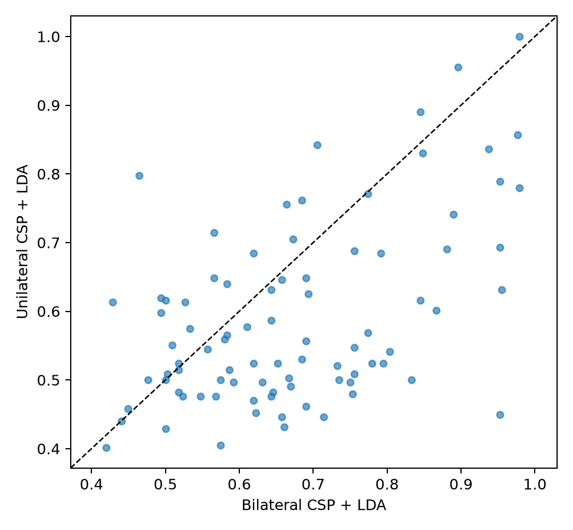

# Frozen-Architecture Generalization to Unilateral Motor Imagery

## Pre-outcome freeze

This post-decoder extension is a `GENERALIZATION_REPLICATION`, not a revision of
the historical bilateral decoder. It asks whether the already accepted
participant-specific architecture transfers without redesign from both-fists versus
both-feet imagery to left-fist versus right-fist imagery. No unilateral classifier
outcome may select a band, epoch, channel set, CSP parameter, classifier, or cohort.

The frozen policy is [`config/unilateral_motor_imagery_generalization.json`](../config/unilateral_motor_imagery_generalization.json).
It inherits the exact final bilateral configuration and its 86 technically eligible
evaluation participants. The new task uses only EEGMMIDB imagery runs 4, 8, and 12:
within each run `T1` is left-fist imagery and `T2` is right-fist imagery; `T0` remains
excluded rest. Physical-execution and bilateral runs are rejected by the new task
mapping rather than silently relabeled.

Retained trials follow the historical recording-boundary correction: a run may retain
either 7/8 target trials or 7/7 target trials when the frozen −2 to +4 s storage
window deterministically crosses the recording boundary for its final event. One
authoritative source (`S104R08`) instead contains seven `T1` and six `T2` annotations;
its final `T1` also crosses the storage boundary, leaving a verified 6/6 retained
pattern. Both target classes remain present. These are technical-validity rules, not
unilateral outcome-based exclusions; the +1 to +3 s feature interval and every
decoder setting remain unchanged.

## Frozen architecture

The primary pipeline is the accepted bilateral `csp_4_empirical` CSP + shrinkage-LDA
pipeline: the existing 1–40 Hz average-referenced continuous representation, a copied
8–30 Hz continuous FIR feature view, 64 EEG channels, +1 to +3 s task intervals,
four CSP log-average-power features, fold-local standardization, and fold-local equal-
prior shrinkage LDA. The comparator is the accepted `spectral_baseline_6`: C3/Cz/C4
2-second Hann log-PSD features in 8–13 and 14–30 Hz, then the same fold-local scaler
and LDA. Every participant has leave-one-run-out folds (4/8/12), and every learned
stage sees only the other two runs.

The later Riemannian implementation is deliberately omitted: its frozen accepted
configuration is a cross-subject tangent-space model, not the same participant-
specific fold-local architecture. Adapting it would be a new design rather than a
frozen-architecture test.

## Planned outcomes and reporting

The primary endpoint is each participant's unweighted mean of three held-out-run
balanced accuracies for CSP+LDA. Secondary metrics are accuracy, macro F1, ROC AUC,
class recalls, and confusion counts. Participant—not fold—is the inferential unit.
Pre-specified comparisons are CSP versus the sensor baseline and matched unilateral
versus frozen bilateral CSP, using participant bootstrap intervals and paired
Wilcoxon tests with Holm correction.

## Acquisition and technical validation

The 258 required cohort EDFs were acquired only through `mne.datasets.eegbci.load_data`
from PhysioNet EEGMMIDB 1.0.0; none is tracked by Git. A smoke file for subject 1
was also retained locally, so 261 unilateral EDFs were present at continuation
recovery. The final cohort pass reused the already validated 258 files, checking
filename identity, EDF readability, 64 channels, 160 Hz, `T0`/`T1`/`T2` annotations,
and SHA-256 before analysis. The source manifest is embedded in the generated
[provenance](assets/unilateral_motor_imagery_generalization_provenance.json).

The 7/7 recording-boundary case and the `S104R08` 7/6 annotation case were found
before any successful cohort artifacts existed. The latter's final `T1` crosses the
same frozen storage boundary, leaving 6/6. Both source-verified patterns were added
as technical validity rules; no participant was removed and no classifier outcome
changed the model.

## Final methods and leakage protection

The exact historical 86-subject cohort (21–109 except 88, 92, and 100) was retained.
Primary data comprised 3,837 valid trials per model: 75 participants contributed 45
trials and 11 deterministic boundary-limited records contributed 42. Each pipeline
has 258 participant-local held-out folds. Fit audits record every training and test
trial key and confirm that the held-out run was absent from CSP (when used), scaler,
and LDA fitting. Every retained trial has exactly one out-of-run prediction; no
execution run or `T0` rest event appears in the result rows.

## Results

Frozen CSP+LDA had median participant balanced accuracy **0.549** (IQR 0.497–0.649;
mean 0.590, SD 0.132, range 0.402–1.000; N=86, 258 folds). Fifty-eight participants
were above chance, 23 below, and five tied (one-sided exact sign *p*=0.0000633).
Median left/right recall was 0.583/0.609; aggregate confusion counts were
1103/828 and 748/1158 for correct/incorrect left and incorrect/correct right.

The frozen spectral-LDA baseline had median 0.548 (IQR 0.476–0.606; mean 0.544,
SD 0.100, range 0.286–0.869; N=86, 258 folds), with median left/right recall
0.545/0.571. CSP minus baseline had median +0.042 balanced-accuracy points
(bootstrap 95% interval +0.022 to +0.068; Wilcoxon *W*=1134, raw and Holm-adjusted
*p*=0.00369; 58 positive, 26 negative, 2 tied differences).

Matched historical bilateral CSP remained higher (median 0.658). The
unilateral-minus-bilateral median difference was −0.071 (bootstrap 95% interval
−0.131 to −0.027; *W*=699.5, raw *p*=0.00000129, Holm-adjusted *p*=0.00000258).
Thus the frozen architecture transfers above chance to unilateral imagery but is
harder on this matched same-corpus cross-run evaluation; this does not identify a
causal neural explanation.

Fold heterogeneity was material: CSP's median within-participant range was 0.174
(IQR 0.080–0.250; maximum 0.438), while 32/86 participants exceeded chance in all
three folds. Held-out-run medians were 0.554 (run 4), 0.536 (run 8), and 0.576
(run 12), reported descriptively only.

## Interpretation, limitations, and reproduction

The frozen architecture generalized in the limited above-chance sense, and CSP
retained a modest advantage over the sensor baseline. Heterogeneity, fold dependence,
and lower matched performance than bilateral CSP mean it is not yet a robust
unilateral BCI solution. This is offline, same-corpus, cross-run evidence with few
trials per fold—not longitudinal, clinical, online, or causal evidence. The
Riemannian omission remains the pre-outcome architecture-scope decision. Historical
bilateral files and identities were hash-validated, never recomputed or changed.

Run `python scripts/evaluate_unilateral_motor_imagery_generalization.py` after the
official source files are available. The [summary](assets/unilateral_motor_imagery_generalization_summary.json),
[scores](assets/unilateral_motor_imagery_generalization_subject_scores.csv),
[folds](assets/unilateral_motor_imagery_generalization_fold_scores.csv),
[predictions](assets/unilateral_motor_imagery_generalization_predictions.csv),
[fit audit](assets/unilateral_motor_imagery_generalization_fit_audit.csv), and
[provenance](assets/unilateral_motor_imagery_generalization_provenance.json) are the
authoritative report inputs.

