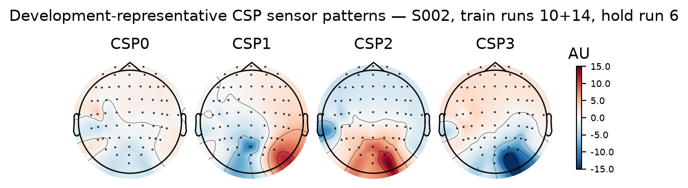
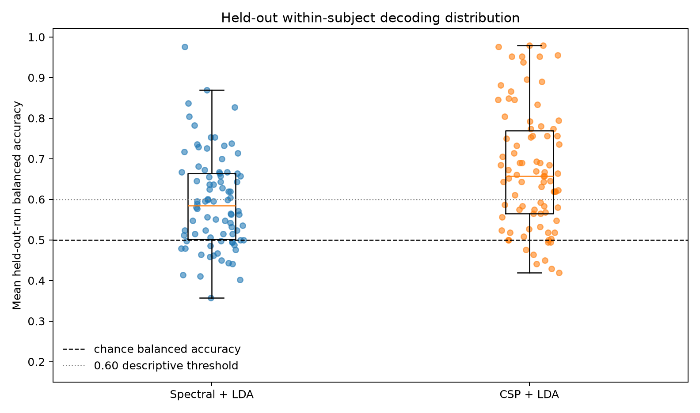
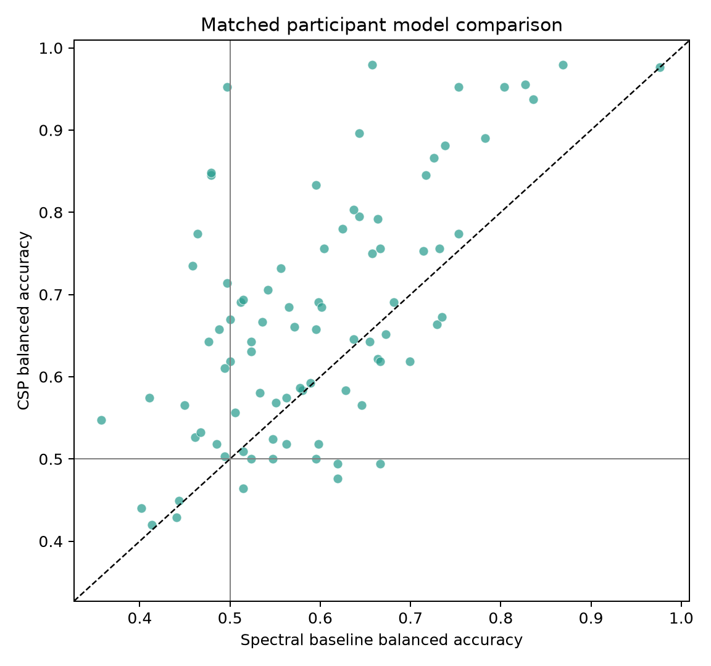
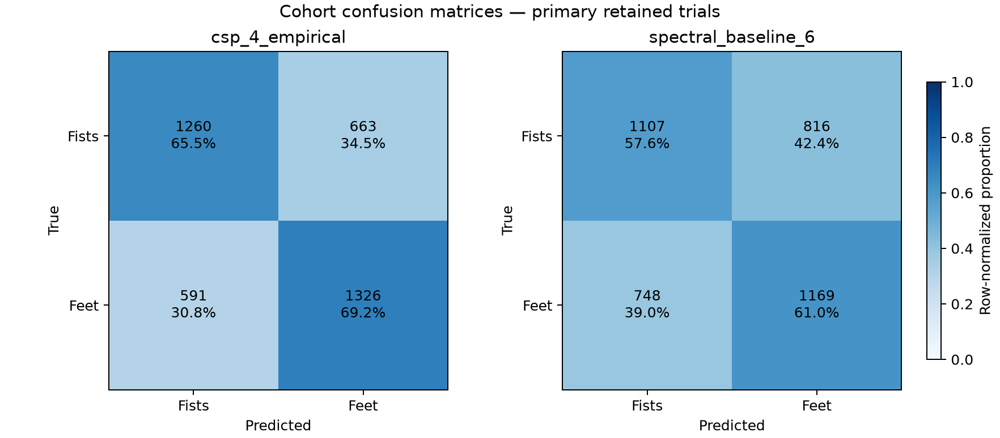
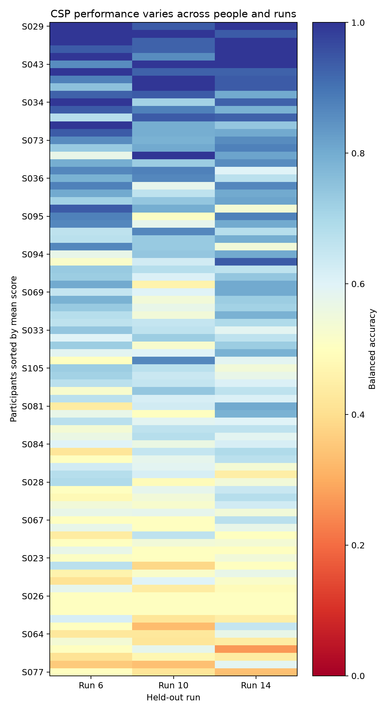
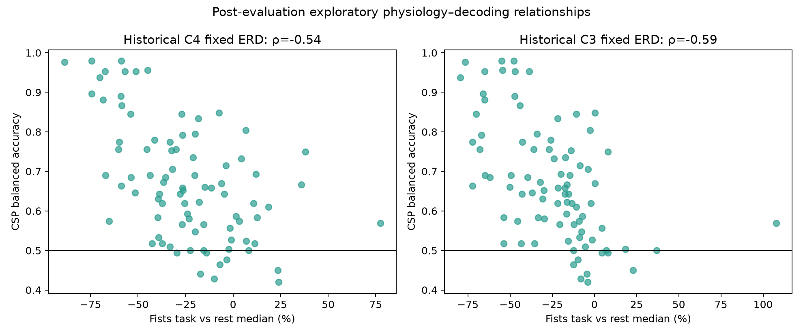

# Leakage-safe within-subject motor-imagery decoding

[Back to the project README](../README.md)

## Initial classifier-study freeze

This predictive study starts from completed physiological-methodology commit
`4dcbc16`. The fixed 12–13 Hz both-fists reductions remain validated sensor-level
findings, and the prospective individualized-frequency study remains a negative
result. Neither is redefined here.

The new question is:

> For one participant, can models trained on two runs distinguish both-fists from
> both-feet imagery in the unseen third run?

The machine-readable initial policy is
[`config/within_subject_decoding.json`](../config/within_subject_decoding.json). It
was written before any classifier accuracy was calculated. Subjects 1–20 form the
decoder-method development cohort. Subjects 21–109 form the requested evaluation
cohort, with subjects 88, 92, and 100 retaining their existing outcome-independent
160-Hz/annotation incompatibility; the expected eligible evaluation count is 86.

These evaluation recordings are not untouched EEG in a broad sense: their fixed-band
physiology, QC, spectra, and some individualized-frequency outcomes are already
known. What remains prospectively protected is the **new classifier performance**.
Evaluation-subject accuracy cannot select features, hyperparameters, or success
rules.

## What classification means here

One observation is one technically valid motor-imagery trial:

```text
trial EEG → numerical feature vector X → classifier → predicted label
                                              target y = fists or feet
```

A **feature** is a number offered to the model, such as task-period C3 mu power or a
CSP component's log power. The **label** is the known class used during training:
both fists or both feet. `T0` is excluded because the prediction target has exactly
two imagery classes.

**Training** estimates feature transformations and model parameters from labeled
examples. **Prediction** applies those frozen parameters to a trial whose label was
not available during fitting. A **decision boundary** divides feature space into the
regions assigned to each class. **Generalization** means the learned boundary still
works on genuinely held-out data rather than remembering peculiarities of its
training recordings.

## Physiology is not prediction

The replicated physiological statement is:

```text
both-fists imagery often has lower C3/C4 12–13 Hz power than paired rest
```

The decoding question is different:

```text
given one unknown task trial, is it fists or feet?
```

A feature can show a large fists-versus-rest effect yet classify fists versus feet
poorly if feet shows a similar effect or the trial distributions overlap. Conversely,
a classifier can exploit a predictive multichannel pattern without yielding a simple
biological explanation. Accuracy therefore does not prove a cortical mechanism,
source location, or causal interpretation.

## Development, training, and testing at two levels

Across participants, subjects 1–20 are **method-development data**: their results may
choose between the five predefined candidates. Eligible subjects 21–109 are
**method-evaluation data** and remain sealed until a final configuration is committed.

Within each participant, leave-one-run-out cross-validation creates three folds:

| Fold | Training runs | Test run |
| --- | --- | ---: |
| A | 10 and 14 | 6 |
| B | 6 and 14 | 10 |
| C | 6 and 10 | 14 |

A **fold** is one such training/test partition. Each task trial receives exactly one
**out-of-fold prediction**, from the model that never saw its run. Three folds avoid
depending on one arbitrary held-out run and expose run-to-run changes.

Random trial splitting is permanently forbidden for the primary study. Trials in one
run share temporal context, acquisition state, artifacts, and electrode conditions.
Mixing those trials across train and test could reward recognition of run-specific
structure rather than generalization. Official scikit-learn guidance likewise treats
fitting on test information as leakage and recommends composing learned transforms
inside a pipeline ([scikit-learn common pitfalls](https://scikit-learn.org/stable/common_pitfalls.html)).

## Metrics and observational unit

Ordinary accuracy is

\[
\mathrm{accuracy}=\frac{\mathrm{correct\ predictions}}{\mathrm{all\ predictions}}.
\]

Runs contain either 7/8 or 8/7 fists/feet trials, so the primary fold metric is
balanced accuracy:

\[
\mathrm{balanced\ accuracy}=\frac{1}{2}
\left(\frac{\mathrm{correct\ fists}}{\mathrm{all\ fists}}+
      \frac{\mathrm{correct\ feet}}{\mathrm{all\ feet}}\right).
\]

It is the mean recall of the two classes, so a constant majority-class prediction
has balanced accuracy 0.50 even when ordinary accuracy is slightly above 0.50
([scikit-learn metric definition](https://scikit-learn.org/stable/modules/generated/sklearn.metrics.balanced_accuracy_score.html)).
The subject score is the unweighted mean of the three fold balanced accuracies, so
every run contributes equally. Group conclusions use one score per participant—not
thousands of trials as if they were independent people.

Secondary metrics are ordinary accuracy, macro F1, ROC AUC, class recalls, and the
confusion matrix. **Recall** asks what fraction of a true class was recovered.
**Precision** asks what fraction of predictions for a class were correct. **F1** is
the harmonic mean of precision and recall. A confusion matrix retains all four
counts: true fists/feet crossed with predicted fists/feet. One scalar cannot reveal
whether a decoder ignores one class.

## Simple spectral baseline

The baseline asks how far an intentionally small, interpretable representation can
go. On the fixed +1 to +3 s task interval, one 2-second Hann Welch spectrum is
calculated from the existing 1–40 Hz average-referenced epoch. Candidate features are
mean log PSD at C3, Cz, and C4 in:

- broad mu (8–13 Hz) and beta (14–30 Hz): six features; or
- those six plus narrow 12–13 Hz: nine features.

This is task-only prediction; it does not require the paired T0 denominator used by
the physiological ERD analysis. Welch computation is fixed mathematics and may be
applied before the split. Standardization and LDA are learned and therefore fit only
on the two training runs.

## Covariance, CSP, and log-power features

For two channel signals \(X\) and \(Y\), covariance describes whether deviations
from their means tend to vary together:

\[
\operatorname{cov}(X,Y)=\frac{1}{N-1}\sum_t
(X_t-\bar X)(Y_t-\bar Y).
\]

All channel pairs form a covariance matrix. EEG is spatially multivariate, so motor
imagery may alter a pattern of joint channel variation rather than one channel alone.

Common Spatial Patterns (CSP) learns sensor weights \(w\) whose projected signal
\(w^T X\) has high variance for one class relative to the other. Conceptually, an
extreme component maximizes

\[
\frac{w^T C_{\mathrm{fists}}w}{w^T C_{\mathrm{feet}}w},
\]

where \(w\) is one spatial-filter vector and each \(C\) is a class covariance matrix.
The opposite extreme emphasizes feet-relative variance. MNE receives arrays shaped
`(trials, channels, time)` and returns average-power features shaped
`(trials, components)` ([MNE CSP documentation](https://mne.tools/stable/generated/mne.decoding.CSP.html)).

Variance is closely related to band-limited signal power. Taking its logarithm makes
multiplicative power ratios additive and reduces scale skew, giving LDA a small
feature vector. CSP is explicitly **supervised** because class labels determine its
covariance contrast. Consequently, `CSP.fit` may see only training-run data and
labels; the held-out run may call only `transform`.

The CSP input is a derived, continuously filtered 8–30 Hz copy of the historical
1–40 Hz run. A 133-sample, zero-phase Hamming/`firwin` FIR is applied to the continuous
copy before extracting +1 to +3 s. This avoids filtering tiny analysis snippets and
never overwrites the main preprocessed representation.

With roughly 30 training trials and 64 sensors, empirical covariance can be noisy or
poorly conditioned. **Shrinkage** pulls an empirical estimate toward a simpler target
and can reduce estimation variance. Development therefore compares empirical CSP
covariance with Ledoit–Wolf shrinkage, plus four versus six components. Using all 64
components would hand LDA far more noisy degrees of freedom than these data support.

A CSP **filter** is the sensor-weight vector used to construct a component. A CSP
**pattern** describes how that component projects back into sensor measurements.
Patterns can aid sensor-space interpretation, but are not cortical-source or brain-
activation maps. Since CSP is fitted independently in every subject and fold, sign,
order, and scale ambiguities make naive cross-subject averaging invalid.

## LDA and fold-local learning

Linear Discriminant Analysis estimates class means and a shared within-class
covariance, then constructs a linear decision boundary. It is common in small-sample
classical BCI because it is fast and needs relatively few parameters. The frozen LDA
uses equal class priors, the `lsqr` solver, and automatic Ledoit–Wolf shrinkage;
scikit-learn documents that shrinkage is supported with `lsqr` and helps when samples
are few relative to features
([LDA API](https://scikit-learn.org/stable/modules/generated/sklearn.discriminant_analysis.LinearDiscriminantAnalysis.html)).

Every fold has this order:

```text
two training runs
→ fit CSP when applicable
→ transform training features
→ fit StandardScaler on training features
→ fit LDA on training features and labels
→ transform held-out run with already-fitted CSP/scaler
→ predict held-out run and save its decision scores
```

The scaler's mean and variance, CSP covariance contrast, and LDA coefficients are all
model parameters. Fitting any one of them on all three runs would leak test-run
information.

## Frozen candidate family and selection

Development is limited to five candidates:

| Candidate | Features | CSP covariance | Components |
| --- | --- | --- | ---: |
| `spectral_baseline_6` | C3/Cz/C4 mu + beta log PSD | — | — |
| `spectral_baseline_9` | above plus fixed 12–13 Hz | — | — |
| `csp_4_empirical` | continuous 8–30 Hz CSP log power | empirical | 4 |
| `csp_4_ledoit_wolf` | continuous 8–30 Hz CSP log power | Ledoit–Wolf | 4 |
| `csp_6_ledoit_wolf` | continuous 8–30 Hz CSP log power | Ledoit–Wolf | 6 |

Each candidate produces one mean three-fold balanced accuracy per development
participant. Within each family, the highest cohort median wins; candidates within
0.01 follow the frozen simplicity/regularization preference in the configuration.
One baseline and one CSP decoder will then be frozen globally. Evaluation subjects
may fit those models to their own training runs, but may not tune their hyperparameters.

## Quality policy, inference, and success criteria

Primary decoding includes every technically valid task trial. A copied sensitivity
analysis excludes only the already defined, label-independent statistical QC
candidates. Source epochs remain unchanged. Misclassification is never evidence for
deleting a trial.

The limited group test is a one-sided exact sign test of participant scores above
0.50, excluding exact ties. It asks whether above-chance subject scores outnumber
below-chance scores; it does not prove useful decoding for every person. Effect size,
distribution, class balance, run robustness, QC sensitivity, and CSP-versus-baseline
differences remain primary interpretive evidence. A fixed-seed participant bootstrap
will describe uncertainty around the median. Real-data permutations are not planned
because every scientifically valid permutation would have to refit CSP, scaler, and
LDA in all folds; full-pipeline label permutation is instead required in synthetic
tests.

Before development outcomes, the evaluation categories are already fixed. “Useful”
requires CSP median ≥0.60, ≥65% of participants above 0.50, ≥55% with at least two
above-chance folds, median recall ≥0.55 for each class, ≤0.10 class-recall imbalance,
QC median loss no worse than 0.02, CSP-minus-baseline median no worse than −0.02, and
every leave-one-subject-out median ≥0.58. “Mixed” requires median ≥0.55, ≥55% above
chance, both recalls ≥0.50, imbalance ≤0.15, and QC loss no worse than 0.03. Anything
else is “no convincing decoding.” Separate frozen thresholds grade CSP's added value
over the baseline.

At this initial freeze, no subjects 1–20 decoder outcome and no subjects 21–109
classifier performance has been calculated.

## Development-cohort evidence

After the initial freeze and reusable implementation commits, the five candidates
were evaluated only in subjects 1–20. Every score below is the unweighted mean of
three held-out-run balanced accuracies for one participant; no participant receives
extra weight for trials or unusually high performance.

| Development candidate | Median balanced accuracy | IQR | Subjects >0.50 | Subjects with ≥2/3 folds >0.50 | Median fold range |
| --- | ---: | ---: | ---: | ---: | ---: |
| `spectral_baseline_6` | **0.570** | 0.493–0.694 | 15/20 | 14/20 | 0.152 |
| `spectral_baseline_9` | 0.554 | 0.479–0.732 | 14/20 | 11/20 | 0.174 |
| `csp_4_empirical` | **0.676** | 0.575–0.788 | 18/20 | 16/20 | 0.170 |
| `csp_4_ledoit_wolf` | 0.658 | 0.594–0.759 | 17/20 | 16/20 | 0.161 |
| `csp_6_ledoit_wolf` | 0.655 | 0.535–0.773 | 16/20 | 15/20 | 0.201 |

The six-feature spectral baseline exceeds the nine-feature candidate by 0.016 in
median balanced accuracy, so `spectral_baseline_6` is selected. The four-component
empirical CSP exceeds the four-component Ledoit–Wolf candidate by 0.018 and the
six-component candidate by 0.021. Both gaps exceed the pre-frozen 0.01 practical-tie
window, so `csp_4_empirical` is selected. The result does not establish that
regularization is generally harmful; it selects one global configuration for this
specific small development study.

The primary candidate ranking retains all technically valid trials. In a copied QC
sensitivity, the selected baseline median is 0.572 (+0.002 relative to primary) and
the selected CSP median is 0.646 (−0.030). Candidate deletion therefore does not
uniformly improve performance and is not used to change the selected method.

The full development evidence is preserved in the
[candidate summary](assets/within_subject_decoder_development_candidate_summary.csv),
[subject scores](assets/within_subject_decoder_development_subject_scores.csv),
[fold scores](assets/within_subject_decoder_development_fold_scores.csv), and
[metadata](assets/within_subject_decoder_development_metadata.json). The metadata
states explicitly that evaluation-subject classifier outcomes were not calculated.



The figure is not the best-looking subject. Subject 2 was selected because its
primary CSP score exactly equals the 20-person median, with subject ID as a frozen
tie-breaker; the plotted fold always trains on runs 10/14 and holds out run 6. The
patterns are fold-specific sensor projections. Their posterior structure is a useful
warning against narrating every CSP component as a motor-cortex activation map.

At this point, subjects 21–109 classifier outcomes remain unopened. The selected
six-feature spectral-LDA and four-component empirical-CSP-LDA methods must be written
to a final machine-readable configuration and committed before evaluation begins.

## Final decoder-method freeze before evaluation

The final machine-readable method is
[`config/within_subject_decoding_final.json`](../config/within_subject_decoding_final.json).
It locks the selected feature definitions, exact continuous CSP filter, four empirical
CSP components, MNE log-average-power behavior, fold-local scaler, equal-prior
shrinkage LDA, folds, metrics, subject aggregation, QC sensitivity, group inference,
success categories, and post-evaluation-only explorations. It also hashes the initial
policy, core decoder implementation, synthetic leakage tests, and every development
artifact.

The final primary flow is:

```text
held-out run selected
→ derive train indices from the other two runs
→ fit empirical CSP on training labels only (CSP model only)
→ fit StandardScaler on training features only
→ fit equal-prior lsqr/auto-shrinkage LDA on training labels only
→ transform and predict the held-out run
→ repeat until every trial has one out-of-run prediction
→ average the three run balanced accuracies for one subject score
```

The evaluation will compare the selected spectral and CSP models on the identical 86
eligible participants and identical trials. Primary and copied QC-sensitive pipelines
are both fully refitted; removing a QC candidate from the test set also removes it
from training whenever it occurs in a training run. Formal tests and exploratory
ERD/peak associations cannot choose or revise the decoder.

At this final freeze, no classifier outcome for subjects 21–109 has been inspected.

## Outcome-independent technical validation correction

The first evaluation attempt stopped at subject 34 before any cohort summary was
calculated. Thirteen earlier subjects had compact checkpoints, but their accuracy was
not inspected to revise the method. The failure was an overly narrow code assertion:
it required every run to retain 15 trials with 7/8 class counts.

The historical epoching policy already documents that subject 34's last task event
at 119 s cannot support the stored −2 to +4 s window. It is therefore excluded for a
deterministic recording-boundary reason, leaving 14 valid trials—7 fists and 7 feet—
in each run. The tracked full-cohort artifacts show the same 42-trial structure for
subjects 34, 37, 41, 51, 64, 72, 73, 74, 76, and 102. All remain technically eligible.

The corrective policy
[`config/within_subject_decoding_correction.json`](../config/within_subject_decoding_correction.json)
permits only the two historically verified retained patterns: 7/8 or balanced 7/7
per run, always with both target classes. It changes no preprocessing, features, CSP,
scaling, LDA, fold, metric, QC rule, eligibility decision, or success threshold. The
first checkpoints are automatically invalid because the active configuration hash
changed. This correction is committed before evaluation restarts.

## Held-out evaluation result

Evaluation resumed from the corrected freeze and completed all **86** eligible
participants. The 258 source EDF files, active configuration hash, frozen decoder
core hash, and subject identity were validated before each compact checkpoint could
be reused. No evaluation outcome changed a feature, model, fold, metric, eligibility
rule, QC rule, inference procedure, or success threshold.

Each model produced one out-of-run prediction for every retained task trial: 3,840
predictions per model. The subject remains the group observational unit.

| Frozen model | Median balanced accuracy | Bootstrap 95% CI for median | IQR | Subjects >0.50 | Subjects with ≥2/3 folds >0.50 |
| --- | ---: | ---: | ---: | ---: | ---: |
| Six-feature spectral-LDA baseline | 0.585 | 0.548–0.619 | 0.501–0.664 | 64/86 (74.4%) | 62/86 (72.1%) |
| Four-component empirical-CSP-LDA | **0.658** | **0.619–0.690** | **0.565–0.769** | **75/86 (87.2%)** | **70/86 (81.4%)** |

The one-sided, participant-level exact sign test against 0.50 gives
`p = 4.55 × 10⁻15` for CSP (75 above, 8 below, 3 ties) and
`p = 7.92 × 10⁻7` for the secondary baseline (64 above, 20 below, 2 ties).
These pre-specified tests support a group tendency; they do not establish useful
decoding for every participant.



## Matched CSP-versus-baseline evidence

The participant-matched CSP-minus-baseline difference has median **+0.086** balanced-
accuracy points (IQR +0.001 to +0.152). CSP is better for 64/86 participants, the
baseline is better for 21/86, and one is tied. The pre-specified two-sided paired
Wilcoxon test gives `p = 1.23 × 10⁻7`. The copied QC comparison has median +0.088.
Together these results satisfy the frozen **clear added value** category; this is
evidence for the selected CSP representation in this experiment, not for CSP in all
EEG settings.



## Class errors, run variation, and QC sensitivity

Across all primary CSP predictions, fists recall is 65.5% (1,260/1,923) and feet
recall is 69.2% (1,326/1,917). The participant-level median recalls are both 0.667,
so the result is not driven by predicting only one condition. The spectral baseline
has pooled fists/feet recalls of 57.6% and 61.0%.



CSP performance is heterogeneous: participant scores range from 0.420 to 0.979, and
11/86 are at or below 0.50. None of those 11 has two above-chance folds, so their low
subject score is not merely one isolated bad run. Median CSP fold accuracy is 0.670
for runs 6 and 14 but 0.621 for run 10; the median within-participant three-fold
range is 0.147. This supports a real run/state-reliability limitation alongside the
positive cohort result.



The primary analysis retains the 599 pre-existing statistical QC candidates. The
fully refitted exclusion sensitivity leaves 3,241 trials and changes the CSP cohort
median from 0.658 to 0.656 (−0.002); the median paired participant change is +0.003.
Candidate trials are not disproportionately misclassified (67.8% ordinary accuracy
versus 67.3% for non-flagged trials). QC deletion therefore does not explain or
rescue the main result.

## Post-evaluation historical joins

Only after the primary predictive result was finalized did the report join historical
physiology. Missing measurements remain missing: 17/86 participants have no valid
historical central peak frequency, and two of the 45 overlapping held-out IMF-study
participants have an unavailable IMF estimate. They are represented by blank fields,
not coerced to numbers or treated as exclusions from the classifier evaluation.

Exploratorily, stronger negative historical fixed-band fists ERD is associated with
higher CSP accuracy (Spearman ρ = −0.54 at C4 and −0.59 at C3; unadjusted two-sided
`p = 1.07 × 10⁻7` and `2.45 × 10⁻9`). Historical central peak frequency has
ρ = +0.38 among the 69 available values; IMF peak frequency has ρ = +0.07 among 43.
The IMF three-fold peak span has ρ = −0.46 among 43. These are post-evaluation,
unadjusted descriptive relationships: they can motivate a new frozen study but do
not revise, validate, or biologically explain the classifier.



## Frozen decision and next scientific step

The CSP decoder satisfies every pre-specified **useful decoding signal** criterion,
and its matched advantage satisfies **clear added value**. Performance nevertheless
varies substantially across participants and runs. The evidence-based decision gate
is therefore **B**: study why some participants and runs decode reliably while others
do not before increasing model complexity. Cross-subject decoding and deep learning
remain outside this completed milestone.

The compact [group summary](assets/within_subject_decoder_evaluation_group_summary.csv),
[matched model summary](assets/within_subject_decoder_evaluation_model_comparison_summary.csv),
[predictions](assets/within_subject_decoder_evaluation_predictions.csv),
[fit audit](assets/within_subject_decoder_evaluation_fit_audit.csv), and
[metadata](assets/within_subject_decoder_evaluation_metadata.json) preserve the
reported evidence and verification state.

## Subsequent reliability analysis

The planned post-hoc follow-up is now complete. It reused the fixed predictions and
found 55/86 participants above chance in all three runs and 70/86 in at least two.
Run 10 remained descriptively lower, but neither the matched omnibus test nor any
Holm-adjusted run contrast was significant. Class recall, existing QC burden, and a
frozen label-independent covariance-shift measure did not materially explain the
weak cases. These diagnostics do not revise any classifier result or claim in this
chapter. See [Within-subject decoding reliability and run
heterogeneity](decoding_reliability.md) for the complete method, evidence, and next
decision gate.

## Limitations

- Each participant contributes only three short runs and about 42–45 target trials;
  within-person estimates therefore remain noisy.
- Leave-one-run-out evaluation tests transfer across runs recorded in one dataset
  session, not transfer to a new day, device, laboratory, or unseen participant.
- Evaluation EEG had prior physiological inspection even though classifier outcomes
  and success rules were protected prospectively.
- The exact sign and Wilcoxon tests use independent participants as units but do not
  model the nested trial/run hierarchy or make this convenience cohort population-
  representative.
- CSP patterns are predictive sensor mixtures, not source-localized neural mechanisms.
- Historical physiology associations were inspected after decoding and are
  exploratory, multiple, and unadjusted.

## What you should understand now

- Every reported trial prediction comes from a model that excluded its entire run;
  CSP, scaling, and LDA were all fitted on the other two runs only.
- CSP materially improves the frozen spectral baseline at the participant level,
  while balanced fists/feet recall rules out a majority-class shortcut.
- A positive cohort median coexists with meaningful participant and run
  heterogeneity; the method is useful but not universally reliable.
- QC sensitivity and immutable historical-source checks support robustness without
  converting statistical candidates into retrospective exclusions.
- Exploratory ERD/peak joins may generate hypotheses, but cannot alter the completed
  primary predictive claim.
